<!-- Auto-converted from Lark doc YkAcd2SXco7HyZxusSIcOJG3nRh on 2026-05-11 -->
<!-- Source: https://transsioner.feishu.cn/docx/YkAcd2SXco7HyZxusSIcOJG3nRh -->

## 文档信息

| 项目 | 内容 |
| --- | --- |
| 产品名称 | PMS 项目管理系统 |
| 版本号 | V1.0 |
| 原型设计 | https://pms-2026.vercel.app/ |
| 文档状态 | 初稿 |
| 创建日期 | 2026-04-08 |
| 最后更新 | 2026-04-08 |

---

> 📋 本文档定义了PMS项目管理系统V1.0版本的功能需求，涵盖工作台、项目空间、一级计划管理、路标视图、配置中心、权限中心及计划分享等核心模块。

## 一、产品概述

### 1.1 产品定位

PMS（Project Management System）是一套面向手机研发团队的项目管理平台，支持整机产品项目、产品项目（tOS版本）、技术项目和能力建设项目四种项目类型的全生命周期管理。

### 1.2 目标用户

| 角色 | 说明 |
| --- | --- |
| SPM（高级项目经理） | 负责整体项目计划制定与跟踪 |
| TPM（技术项目经理） | 负责技术方案推进与里程碑管理 |
| 产品经理 | 负责需求定义与市场计划 |
| 开发代表 / 软件SE | 负责开发任务执行与进度更新 |
| 测试工程师 | 负责测试计划与质量跟踪 |
| 管理层 | 负责项目组合视图与决策 |

### 1.3 V1.0 范围

> **V1.0 包含：** 工作台（项目列表+工作跟踪）、项目空间（基本信息+一级计划）、项目路标视图、一级计划配置、权限中心、一级计划分享

> x **V1.0 不包含：** 二级计划管理、计划总览、转维模块、二级计划配置、转维材料配置、人力资源管道

---

## 二、系统架构

### 2.0 业务全景图

下图展示了 PMS V1.0 的完整业务架构，从系统入口到各功能模块的层级关系。实色边框模块为 V1.0 范围，灰色虚线模块为后续版本规划。

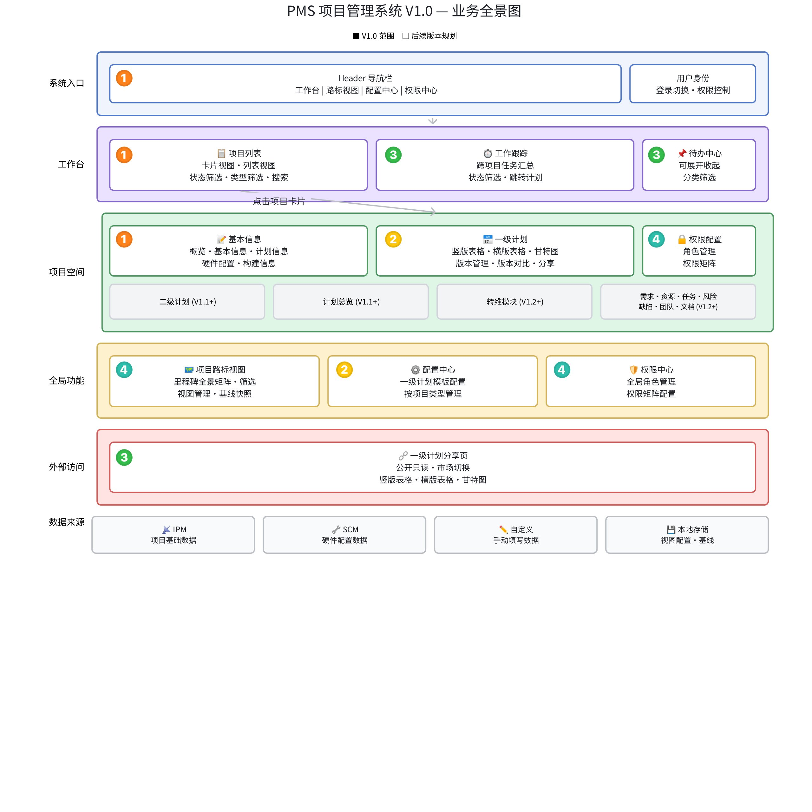

### 2.1 设计语言

系统采用 **紫色科技玻璃拟态（Purple Tech Glassmorphism）** 设计风格：

- **主色调**：Indigo Purple (#4338ca / #6366f1)
- **玻璃效果**：背景模糊 + 半透明白色底层
- **微动画**：所有交互元素带 cubic-bezier 缓动过渡
- **阴影层级**：5级阴影体系（xs → xl）+ 紫色发光效果

---

## 三、功能模块详述

### 3.1 工作台

工作台是用户登录系统后的首页，通过顶部内嵌 Tab 切换"项目列表"和"工作跟踪"两个子视图。Tab 切换器与筛选工具栏在同一行。

**@user****补充项目同步的时机和项目的范围  **

IPM上暂时无法区分哪些项目归属于软工，整体策略如下：

1. PMS建立创建项目入口，通过创建项目入口关联IPM的项目数据信息。
1. 项目创建入口指定项目负责人，则项目负责人具备PMS-对应项目的管理员权限

**@user****IPM软件域计划数据**

**@user****老的项目里程碑计划**

将2025年创建的整机产品项目+tOS16.1、tOS16.2、tOS16.3、tOS17.0、tOS17.1的里程碑计划进行数据迁移。

#### 3.1.1 项目列表（卡片视图）1️⃣

**功能描述：** 以卡片形式展示当前用户可见的所有项目。**工具栏（从左到右）：**

- Tab 切换器：项目列表 / 工作跟踪
- 分隔线
- 状态筛选：全部 / 待立项 / 进行中 / 已完成/维护/暂停/已取消（带数量统计胶囊）
- 类型筛选：全部 / 整机产品项目 / 软件产品项目 / 技术项目 / 能力项目（胶囊切换）
- 搜索框：按项目名称模糊搜索
- 视图切换：卡片 ⟷ 列表**项目卡片信息：**
- 权限：系统级"管理组"成员可见全部项目卡片；其他用户仅可见其所在项目成员列表中的项目。

| 字段 | 说明 |
| --- | --- |
| 项目名称 | 整机项目显示市场名（如 NOTE 50 Pro），副标题显示内部编号 |
| 项目类型标签 | 紫色=整机产品、蓝色=产品、橙色=技术、绿色=能力建设 |
| 项目状态 | 进行中/待立项/已完成等，颜色标签区分 |
| 进度条 | 紫色渐变进度条，显示百分比 |
| SPM | 项目 SPM 姓名 |
| 更新时间 | 最后更新的相对时间 |

**右侧待办中心：**

- 可展开/收起的侧边栏（默认展开，宽 320px，高 同屏幕高度）
- 任务按时间倒序排列
- 点击待办项可跳转到对应项目的具体计划

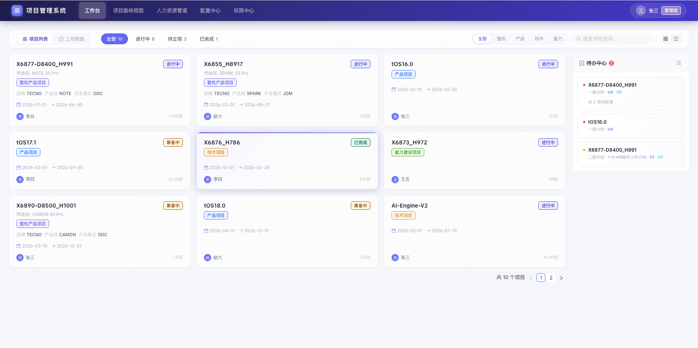

#### 3.1.2 项目列表（列表视图）1️⃣

**功能描述：** 点击右侧卡片和列表的切换按钮可以切换以表格形式展示项目列表，信息密度更高。**表格列：** 项目名称、类型、状态、进度、计划开始、计划结束、SPM、更新时间

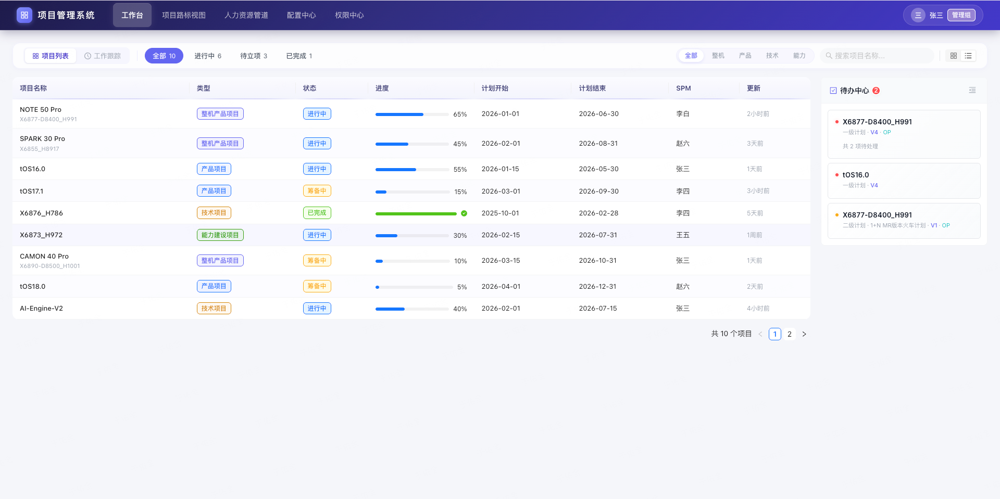

#### 3.1.3 工作跟踪 3️⃣

**功能描述：** 在工作台顶部通过 Tab 切换进入，汇总当前登录用户在各项目中所负责或创建的工作项。V1.0 主要展示计划相关任务（一级计划 / 二级计划），后续版本扩展到需求、风险、问题等工作项类型。

##### 3.1.3.1 统计卡片

页面顶部显示 5 张统计卡片，实时统计当前用户的工作项数量：

| 卡片 | 颜色 | 说明 |
| --- | --- | --- |
| 全部 | 紫色（品牌色） | 当前用户相关的所有工作项总数 |
| 待办 | 橙色 | 状态为"待办"或"进行中"的工作项 |
| 逾期 | 红色 | 状态为"逾期"的工作项 |
| 已完成 | 绿色 | 状态为"已完成"的工作项 |
| 其他 | 灰色 | 状态为"已关闭"等非标准状态的工作项 |

##### 3.1.3.2 筛选工具栏

统计卡片下方为筛选区域，左右两部分：**左侧 — 分类快筛 Tab：**

- 全部 / 待办 / 逾期 / 已完成 / 我创建，每个标签后显示对应数量
- 点击切换后表格实时刷新
- "我创建"标签筛选 `createdBy === 当前用户` 的工作项（不限状态）**右侧 — 精确筛选控件：**
- **搜索**：模糊搜索工作项名称、归属项目、责任人
- **归属项目**：Select 下拉，选项为当前用户涉及的所有项目
- **工作项类型**：Select 下拉，选项为需求 / 任务 / 风险 / 问题（V1.0 主要为"任务"类型）
- **状态**：Select 下拉，选项为待办 / 进行中 / 逾期 / 已完成所有筛选条件为 AND 关系，可组合使用。

##### 3.1.3.3 数据表格

| 列名 | 宽度 | 说明 |
| --- | --- | --- |
| 类型 | 80px | 彩色 Tag 标签，颜色按类型区分（需求=蓝、任务=绿、风险=橙、问题=红） |
| 名称 | 自适应 | 工作项名称，逾期项以红色文字显示 |
| 状态 | 90px | 彩色 Tag（待办=灰、进行中=Processing 蓝、逾期=红、已完成=绿、已关闭=灰） |
| 停留时长 | 100px | 工作项在当前状态的停留天数，逾期项以红色加粗显示 |
| 责任人 | 80px | 责任人姓名（可扩展为头像 + 姓名） |
| 计划开始时间 | 120px | 计划开始日期，YYYY-MM-DD 格式 |
| 计划完成时间 | 120px | 计划完成日期；逾期项红色加粗、临期项（≤3 天）橙色加粗 |
| 实际开始时间 | 120px | 实际开工日期。未填写时显示 "-"（浅灰）；通过「实际时间」操作录入 |
| 实际完成时间 | 120px | 实际完工日期。未填写时显示 "-"（浅灰）；填写后绿色加粗显示，作为完成态视觉确认 |
| 归属项目 | 180px | 来源项目名称，过长截断显示省略号 |
| 操作 | 140px | 「查看详情」+「实际时间」（仅类型为"任务"且关联了一级 / 二级计划的行显示） |
| 分页 | — | 底部分页栏，每页 10 条，显示总条数 |

**实际时间字段填写规则（按工作项状态）：**

| 状态 | 实际开始时间 | 实际完成时间 |
| --- | --- | --- |
| 待办 | "-"（未开工） | "-"（未完成） |
| 进行中 | 已填写（开工日期） | "-"（未完成） |
| 逾期 | 已填写（开工日期） | "-"（未完成） |
| 已完成 | 已填写 | 已填写（绿色加粗） |

**行级样式：**

- **逾期工作项**：行背景色 `#fff2f0`（浅红），名称红色文字
- **临期工作项**（计划完成 ≤3 天内）：行背景色 `#fffbe6`（浅黄）
- 正常项：白色底色

##### 3.1.3.4 操作按钮

**查看详情：**

- 点击后跳转到该工作项所属项目的项目空间
- 如果是一级 / 二级计划任务，自动导航到计划模块并定位到对应计划层级 + 计划类型 Tab
- 如果是其他类型，跳转到项目基本信息页

**实际时间：**

- 仅对来源为一级计划或二级计划的任务显示
- 点击弹出"修改实际时间"Modal，包含：
	- 任务信息展示（任务名、归属项目、计划来源）
	- **实际开始时间** DatePicker —— 默认填入该行已有的 actualStartDate（首次填写为空）
	- **实际完成时间** DatePicker —— 默认填入该行已有的 actualEndDate（首次填写为空）
	- 保存 / 取消按钮
- 保存后立即更新工作跟踪列表中该行的实际开始 / 实际完成单元格，并向项目空间计划同步该任务的实际日期

**修改实际时间弹窗截图：**


##### 3.1.3.5 数据范围

- 仅展示当前登录用户为**责任人**或**创建者**的工作项
- 跨项目聚合：同一用户在多个项目中的任务统一展示在同一列表
- V1.0 主要为计划相关任务（一级计划 / 二级计划的里程碑和活动）

**工作跟踪全局视图截图（含实际开始 / 实际完成两列）：**

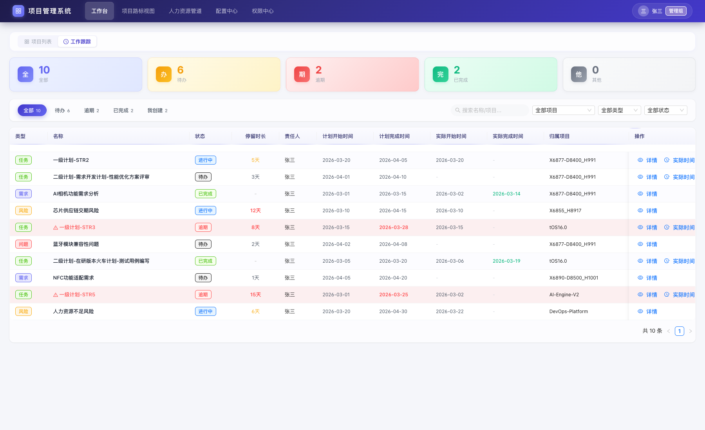

---

#### 3.1.4 待办中心 1️⃣

**功能描述：** 工作台右侧常驻的可折叠面板，集中展示当前登录用户在所有可见项目中、且属于「修订中」版本的计划相关待办。已发布版本不产生待办。

**数据来源与去重：**

- 仅扫描各项目「修订中」版本的任务（V4 修订版等），已发布版本任务不进入待办列表。
- 按 `项目 + 计划级别 + 计划类型 + 版本` 聚合：同一组的多条任务合并为一条代表项，显示「共 N 项待处理」。
- 仅展示 `responsible === 当前登录用户` 的待办；系统级「管理组」成员不会因为旁路 RBAC 而看到他人的待办，待办过滤始终基于责任人字段。

**信息层次（自上而下）：**

- 主标题：项目名称
- 副标题：计划级别（一级计划 / 二级计划）+ 计划类型（如 `1+N MR版本火车计划`）+ 版本号 + 市场标签（仅整机产品项目显示）
- 合并计数：当聚合后包含 ≥2 条任务时显示「共 N 项待处理」（仅 1 条时不显示该行）

**点击行为（精确跳转）：**

1. 跳转到该项目的 `项目空间 → 计划`
1. 自动切换到对应的版本（修订中版本对应的 versionId）
1. 切换到对应的计划级别（一级 / 二级）
1. 二级计划同时切到对应的 planTabKey
1. 整机产品项目按 todo.market 切到对应市场 Tab
1. 在表格中将责任人为当前用户的行高亮 2 秒并 scrollIntoView 至视野中心

**截图：** 工作台右侧待办中心面板（默认展开 320px 宽，sticky 跟随滚动）

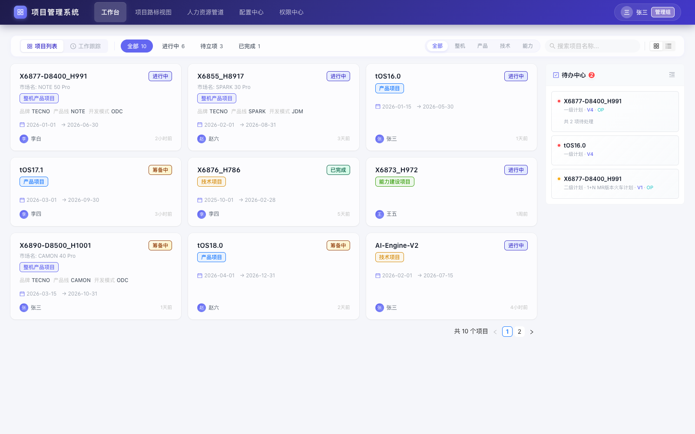

#### 3.1.5 新增项目 1️⃣

**功能描述：** 工作台「项目列表」工具栏右侧的「+ 新增项目」按钮，用于将外部系统中的项目纳入 PMS 并指定 PMS 专属字段（项目类型、项目责任人）。点击按钮弹出 Modal，提交后新项目直接进入「基础信息」页。

**入口与可见性：**

- 入口位于工作台「项目列表」工具栏最右侧（卡片/列表视图切换器之后），与 1px 灰色分隔条一同显示。
- 仅当当前登录用户属于系统级**「管理组」**时按钮可见，其他用户看不到入口。

**表单字段：**

| 字段 | 控件 | 说明 |
| --- | --- | --- |
| 项目名 | 下拉单选 + 模糊搜索 | 候选项从外部系统获取（每条仅含项目名 + 业务 ID `bid`）。已存在于 PMS 的同名项目会自动从候选中排除，防止重复导入。 |
| 项目类型 | 下拉单选 | 四选一：整机产品项目 / 产品项目 / 技术项目 / 能力建设项目。外部系统不区分项目类型，故必须由当前用户在 PMS 内显式指定。 |
| 项目责任人 | 下拉多选 | 从系统全量人员中手动选择，至少 1 人。**不默认回填**外部项目配置的 SPM，需由管理员显式确认。 |

三个字段均必填；任一未填则点击「创建」时 Antd 表单会在对应字段下展示校验提示，提交不继续。

**提交后行为（一次性事务）：**

1. 通过外部 `bid` 拉取该项目补充信息（产品线 / 品牌 / Android 版本 / 芯片平台 / 计划起止时间等）。
1. 在 PMS 中创建新项目记录：状态默认「筹备中」、进度 0、健康度「正常」、责任人取首位选中人员、SPM 取外部系统数据。
1. 将项目责任人写入该项目的「项目成员可见性映射」——责任人立即能在工作台看到该项目卡片，无需刷新。
1. 在权限中心初始化该项目的角色权限快照：「**系统管理员**」角色成员设为本次选中的项目责任人；其他固定角色（产品经理 / 项目经理 / 开发代表 ...）继承系统默认配置。
1. 自动跳转至新项目的「项目空间 → 基础信息」页，弹出成功提示：「项目创建成功」。

**与权限中心的联动：**

- 创建项目时设置的「项目责任人」是该项目权限中心**项目级**「系统管理员」的初始成员，**仅作用于该项目**，不影响其他项目的角色配置（per-project 隔离）。
- 创建完成后，可在该项目的「权限配置 → 角色人员配置」中继续调整任何角色的人员名单，详见 3.6.2。
- 全局「管理组」成员对所有项目自动拥有完整权限，不依赖项目级「系统管理员」配置。

**截图：** 工作台工具栏「+ 新增项目」按钮 + Modal 弹层（项目责任人需手动选择，至少 1 人）

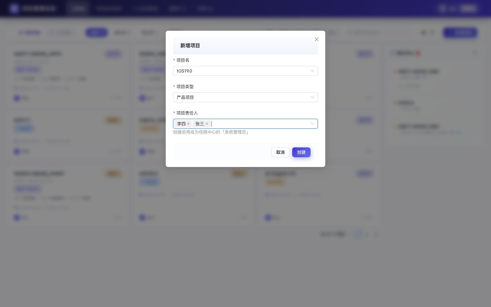

### 3.2 项目空间

**功能描述：** 点击工作台中的项目卡片进入该项目的项目空间。页面由左侧导航栏 + 右侧内容区组成。

#### 3.2.1 项目空间侧边栏 1️⃣

| 菜单项 | 图标 | V1.0 状态 | 说明 |
| --- | --- | --- | --- |
| 基础信息 | ⚙️ | ✅ 可用 | 项目元数据展示与编辑 |
| 概况 | 📄 | 🚫 不可点击 | 项目概况总览（V1.1+） |
| 需求 | 📄 | 🚫 不可点击 | 需求管理（V1.1+） |
| 计划 | 📅 | ✅ 可用 | 一级计划管理（V1.0 仅一级计划） |
| 资源 | 👥 | 🚫 不可点击 | 资源分配管理（V1.2+） |
| 任务 | ☑️ | 🚫 不可点击 | 任务跟踪管理（V1.2+） |
| 风险 | ⚠️ | 🚫 不可点击 | 风险登记与跟踪（V1.2+） |
| 缺陷 | 🐛 | 🚫 不可点击 | 缺陷管理（V1.2+） |
| 团队 | 👥 | 🚫 不可点击 | 团队成员管理（V1.2+） |
| 项目文档 | 📁 | 🚫 不可点击 | 项目文档库（V1.2+） |
| 权限配置 | 🔒 | ✅ 可用 | 项目级角色权限配置 |

> 💡 V1.0 仅"基础信息""计划""权限配置"三个菜单可点击，其余显示为灰色不可点击，hover 提示"该模块将在后续版本开放"。

#### 3.2.2 基本信息页面 1️⃣

进入项目空间后默认展示基本信息页面。右侧有固定锚点导航栏，可快速跳转各区块。数据源和表格效果图参考：[项目管理平台基础数据信息](https://transsioner.feishu.cn/wiki/QhBJw9NdYickhxkCllNcwaFCnwg)

##### 编辑机制

- 有编辑权限的用户，区块右上角显示"编辑"按钮
- 点击后进入编辑模式：可编辑字段变为输入控件，背景变浅黄色
- 编辑完成后点"保存"或"取消"退出编辑模式

##### 各项目类型区块总览

| 区块 | 整机产品项目 | 软件产品项目 | 技术项目 | 能力建设项目 |
| --- | --- | --- | --- | --- |
| ① 项目概览卡片 | ✅ | ✅ | ✅ | ✅ |
| ② 基本信息 | ✅ 含PPM/SPM/TPM | ✅ 含版本五大员 | ✅ 含团队+描述 | ✅ 含团队+描述 |
| ③ 计划信息 | ✅ 按市场Tab | ✅ | ✅ | ✅ |
| ④ 硬件配置 | ✅ 按市场Tab | ❌ | ❌ | ❌ |
| ⑤ 构建信息 | ✅ 按市场Tab | ✅ | ✅ | ❌ |

---

##### ① 项目概览卡片（全部类型通用）

深紫色渐变头部卡片，横向排列状态摘要。

| 字段 | 数据来源 | 来源字段 | SCM名称 | 填写方式 | 可编辑 | 适用范围 | 备注 |
| --- | --- | --- | --- | --- | --- | --- | --- |
| 项目分类 | IPM | 项目分类 | NA | 单选 | 可修改 | 全部 | 整机产品/软件产品/技术/能力建设 |
| 项目状态 | IPM | NA | NA | 单选 | 可修改 | 全部 | 各类型枚举不同 |
| 健康状态 | 自定义 | NA | NA | 单选 | 可修改 | 全部 | 正常/低风险/中风险/高风险 |
| 当前节点 | 自定义 | NA | NA | 单选 | 可修改 | 整机/产品/技术 | 概念启动/STR1~STR6 |

> 📋 **项目状态枚举值：**
>
> - **软件产品项目：** 待立项/进行中/已完成/维护期/暂停/已取消
> - **整机产品项目：** 待立项/进行中/已上市/维护期/暂停/已取消
> - **技术项目/能力建设项目：** 待立项/进行中/已完成/暂停/已取消

---

##### 整机产品项目 — ② 基本信息

| 字段 | 数据来源 | 来源字段 | SCM名称 | 填写方式 | 可编辑 | 备注 |
| --- | --- | --- | --- | --- | --- | --- |
| 项目名 | IPM | 项目名 | 整机名 | NA | 只读 | &nbsp; |
| 主板名 | IPM | 主板名 | 主板名 | NA | 只读 | &nbsp; |
| Bom | SCM | Bom | Bom | 单行文本 | 只读 | &nbsp; |
| 市场名 | IPM | 市场名 | 市场名称 | 单行文本 | 只读 | &nbsp; |
| 产品类型 | 自定义 | NA | NA | 单选 | 可修改 | 新品/换代 |
| tOS版本 | IPM | OS版本 | NA | 单选 | 只读 | &nbsp; |
| 开发模式 | 自定义 | NA | NA | 单选 | 可修改 | ODC/JDM/自研 |
| 品牌 | IPM | 品牌 | 适用品牌 | 单选 | 只读 | &nbsp; |
| 产品线 | IPM | 产品线 | 适用产品线 | 单选 | 只读 | &nbsp; |
| 版本类型 | SCM | 适用版本 | 适用版本 | 单选 | 只读 | Full/Slim/Go |
| 市场 | SCM | 适用市场 | 适用市场 | 多选 | 只读 | &nbsp; |
| 项目等级 | IPM | 项目等级 | NA | 单选 | 只读 | A/B/S |
| PPM | 自定义 | NA | NA | 人员选择 | 可修改 | &nbsp; |
| SPM | 自定义 | NA | NA | 人员选择 | 可修改 | &nbsp; |
| TPM | 自定义 | NA | NA | 人员选择 | 可修改 | &nbsp; |

##### 整机产品项目 — ③ 计划信息（市场Tab内）

| 字段 | 数据来源 | 来源字段 | SCM名称 | 填写方式 | 可编辑 | 备注 |
| --- | --- | --- | --- | --- | --- | --- |
| 计划开始时间 | IPM | 计划开始时间 | NA | 时间 | 只读 | &nbsp; |
| 计划结束时间 | IPM | 计划结束时间 | NA | 时间 | 只读 | &nbsp; |
| 开发周期 | 自定义 | NA | NA | — | 只读 | 自动计算 |
| 上市时间 | 自定义 | NA | NA | 时间 | 只读 | 取里程碑的上市时间 |
| 里程碑计划 | 自定义 | NA | NA | — | 只读 | 横排表格视图 |

##### 整机产品项目 — ④ 硬件配置（市场Tab内）

| 字段 | 数据来源 | 来源字段 | SCM名称 | 填写方式 | 可编辑 |
| --- | --- | --- | --- | --- | --- |
| 芯片平台 | SCM | 芯片平台 | 芯片平台 | 单选 | 只读 |
| 芯片型号 | SCM | 芯片型号 | 芯片型号 | 单行文本 | 只读 |
| 安卓版本 | IPM | 安卓版本 | 操作系统 | 多行文本 | 只读 |
| 内存 | SCM | 内存大小 | 内存大小 | 多行文本 | 只读 |
| 屏幕 | SCM | 屏幕详情 | 屏幕详情 | 多行文本 | 只读 |
| 屏幕形态 | SCM | 屏幕形态 | 屏幕形态 | 单选 | 只读 |
| 屏幕类型 | SCM | 屏幕类型 | 屏幕类型 | 单选 | 只读 |
| 前摄像头 | SCM | 前摄像头 | 前摄像头 | 多行文本 | 只读 |
| 后摄像头 | SCM | 后摄像头 | 后摄像头 | 多行文本 | 只读 |
| 网络模式 | SCM | 最高网络模式 | 最高网络模式 | 多选 | 只读 |
| kernel版本 | SCM | kernel版本 | kernel版本 | 单选 | 只读 |
| 灯效 | SCM | 灯效 | 灯效 | 单选 | 只读 |
| 人脸 | SCM | 人脸 | 人脸 | 单选 | 只读 |
| 音效 | SCM | 音效 | 音效 | 单选 | 只读 |
| SIM卡 | SCM | SIM卡 | SIM卡 | 单选 | 只读 |
| 马达 | SCM | 马达 | 马达 | 单选 | 只读 |
| 指纹 | SCM | 指纹 | 指纹 | 单选 | 只读 |
| 红外 | SCM | 红外 | 红外 | 单选 | 只读 |

##### 整机产品项目 — ⑤ 构建信息（市场Tab内）

| 字段 | 数据来源 | 来源字段 | SCM名称 | 填写方式 | 可编辑 | 备注 |
| --- | --- | --- | --- | --- | --- | --- |
| 分支信息 | 自定义 | NA | NA | 多行文本 | 可修改 | 分支名 |
| Jenkins构建 | 自定义 | NA | NA | 多行文本 | 可修改 | URL可点击 |
| 版本地址 | 自定义 | NA | NA | 多行文本 | 可修改 | URL可点击 |

---

##### 产品项目 — ② 基本信息

| 字段 | 数据来源 | 来源字段 | SCM名称 | 填写方式 | 可编辑 |
| --- | --- | --- | --- | --- | --- |
| 项目名称 | IPM | 项目名 | NA | NA | 只读 |
| 品牌 | IPM | 品牌 | 适用品牌 | 单选 | 只读 |
| 产品线 | IPM | 产品线 | 适用产品线 | 单选 | 只读 |
| 版本类型 | SCM | 适用版本 | 适用版本 | 单选 | 只读 |
| 芯片平台 | SCM | 芯片平台 | 芯片平台 | 单选 | 只读 |
| 开发模式 | 自定义 | NA | NA | 单选 | 可修改 |

##### 产品项目 — ② 版本五大员

| 角色 | 数据来源 | 填写方式 | 可编辑 |
| --- | --- | --- | --- |
| 版本规划代表 | 自定义 | 人员选择 | 可修改 |
| 版本经理 | 自定义 | 人员选择 | 可修改 |
| 版本SE | 自定义 | 人员选择 | 可修改 |
| 版本测试代表 | 自定义 | 人员选择 | 可修改 |
| 版本质量代表 | 自定义 | 人员选择 | 可修改 |

##### 产品项目 — ③ 计划信息

| 字段 | 数据来源 | 来源字段 | SCM名称 | 填写方式 | 可编辑 |
| --- | --- | --- | --- | --- | --- |
| 计划开始时间 | IPM | 计划开始时间 | NA | 时间 | 只读 |
| 计划结束时间 | IPM | 计划结束时间 | NA | 时间 | 只读 |
| 开发周期 | 自定义 | NA | NA | — | 只读 |
| 健康状态 | 自定义 | NA | NA | — | 只读 |
| 里程碑计划 | 自定义 | NA | NA | — | 只读 |

##### 产品项目 — ⑤ 构建信息

| 字段 | 数据来源 | 来源字段 | SCM名称 | 填写方式 | 可编辑 |
| --- | --- | --- | --- | --- | --- |
| 分支信息 | 自定义 | NA | NA | 多行文本 | 可修改 |
| Jenkins构建 | 自定义 | NA | NA | 多行文本 | 可修改 |
| 版本地址 | 自定义 | NA | NA | 多行文本 | 可修改 |

---

##### 技术项目 — ② 基本信息

| 字段 | 数据来源 | 来源字段 | SCM名称 | 填写方式 | 可编辑 |
| --- | --- | --- | --- | --- | --- |
| 项目名称 | IPM | 项目名 | NA | NA | 只读 |
| 项目分类 | IPM | 项目分类 | NA | — | 只读 |
| 项目状态 | IPM | NA | NA | 单选 | 只读 |
| 健康状态 | 自定义 | NA | NA | 单选 | 可修改 |
| 项目组成员 | 自定义 | NA | NA | 人员多选 | 可修改 |
| 项目描述 | 自定义 | NA | NA | 多行文本 | 可修改 |

##### 技术项目 — ③ 计划信息

与产品项目相同：计划开始时间、计划结束时间、开发周期、健康状态、里程碑计划。

##### 技术项目 — ⑤ 构建信息

**与产品项目相同：分支信息、Jenkins构建、版本地址。**

##### 能力建设项目 — ② 基本信息

| 字段 | 数据来源 | 来源字段 | SCM名称 | 填写方式 | 可编辑 |
| --- | --- | --- | --- | --- | --- |
| 项目名称 | IPM | 项目名 | NA | NA | 只读 |
| 项目分类 | IPM | 项目分类 | NA | — | 只读 |
| 项目状态 | IPM | NA | NA | 单选 | 只读 |
| 健康状态 | 自定义 | NA | NA | 单选 | 可修改 |
| 项目组成员 | 自定义 | NA | NA | 人员多选 | 可修改 |
| 项目描述 | 自定义 | NA | NA | 多行文本 | 可修改 |

##### 能力建设项目 — ③ 计划信息

与产品项目相同：计划开始时间、计划结束时间、开发周期、健康状态、里程碑计划。

> 🎁 能力建设项目**无硬件配置**和**无构建信息**区块，也不显示"当前节点"字段。

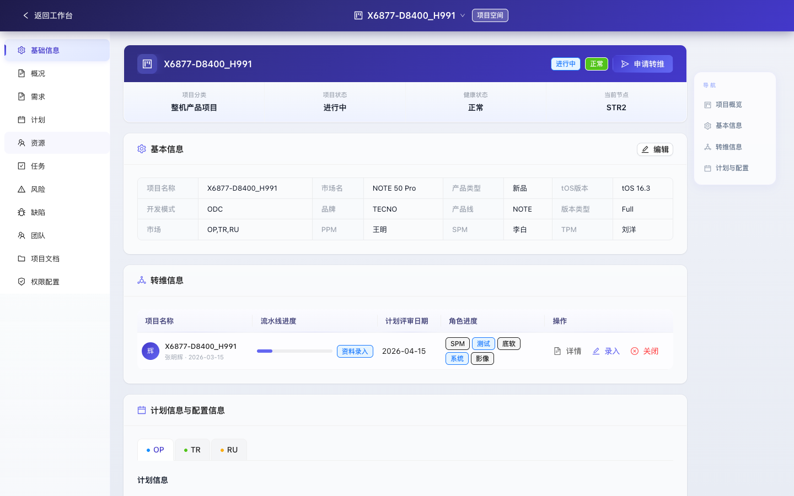

---

### 3.3 一级计划管理

**功能描述：** 在项目空间的"计划"模块中，管理项目一级计划。支持三种视图模式、版本管理、分享功能。

#### 3.3.1 版本管理 2️⃣

**版本状态：**

- **已发布**：只读版本，但实际开始/实际完成日期可点击编辑
- **修订版**：完全可编辑的草稿版本，自动进入编辑模式**版本操作：**

| 操作 | 触发条件 | 行为 |
| --- | --- | --- |
| 创建修订 | 无修订版存在时显示 | 基于最新已发布版本克隆任务数据，创建新版本号（V+1），自动切换到修订版 |
| 发布 | 修订版选中时显示 | 将修订版状态改为"已发布"，需先通过所有约束校验 |
| 版本对比 | 任意版本选中时均显示（含修订中） | 选择两个版本进行差异对比（新增/删除/修改/未变更） |
| 分享 | 已发布版本存在时显示 | 复制公开分享链接到剪贴板 |

> 🔒 **权限说明：** "创建修订""发布"操作受 `plan:一级计划-编辑` 权限控制，无权限时按钮 disabled 并 Tooltip 提示"无一级计划编辑权限"。系统级"管理组"成员旁路此校验。

#### 3.3.2 飞书通知机制 3️⃣

**功能描述：** 一级计划的任务变更和到期状态自动通过飞书通知对应的责任人，减少人工跟踪成本。包含两个触发场景。**场景 A — 发布修订版时的变更通知：**

- **触发时机**：用户点击"发布"按钮将修订版切换为"已发布"状态
- **检测逻辑**：对比本次发布的任务与上一已发布版本快照，识别新增任务（id 不存在于 baseline）和修改任务
- **修改判定字段**：仅以下关键字段的变化触发通知
	- 任务名称（taskName）
	- 计划开始（planStartDate）
	- 计划完成（planEndDate）
	- 责任人（responsible）
	- 前置任务（predecessor）
- **不触发通知的字段**：状态、进度、实际开始/完成/工期 —— 这些属于执行态，不属于计划变更
- **聚合规则**：同一责任人的多条变更合并为一条飞书消息，避免打扰
- **UI 反馈**：右上角弹出蓝色 `notification.info` 汇总提示，详细消息内容在浏览器控制台输出
- **消息示例**：

> bell 您好 张三，一级计划 V3 已发布，您负责的任务变更如下：【新增 1 条】• 2.3 STR4（2026-02-16 ~ 2026-03-01）【修改 1 条】• 1.1 概念启动- 任务名称: 概念启动 → 概念启动(已修改)- 计划完成: 2026-01-07 → 2026-01-10

**发布变更通知截图：**

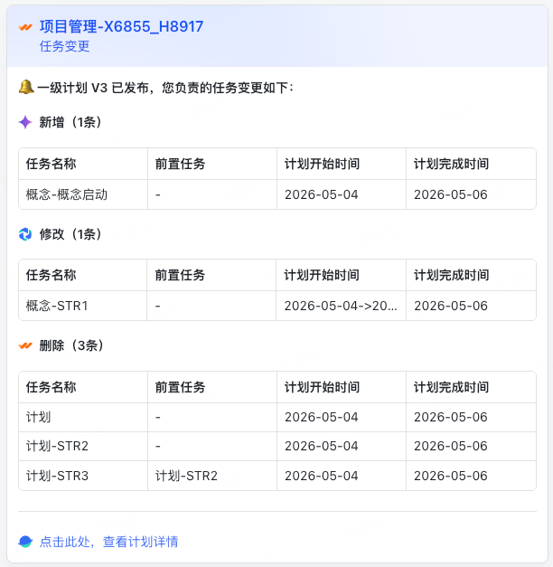

```json
{
    "config": {
        "update_multi": true
    },
    "i18n_elements": {
        "zh_cn": [
            {
                "tag": "markdown",
                "content": "**🔔 一级计划 V3 已发布，您负责的任务变更如下：** ",
                "text_align": "left",
                "text_size": "normal"
            },
            {
                "tag": "markdown",
                "content": "**新增（1条）**",
                "text_align": "left",
                "text_size": "normal",
                "icon": {
                    "tag": "standard_icon",
                    "token": "ai-common_colorful",
                    "color": "green"
                }
            },
            {
                "tag": "table",
                "columns": [
                    {
                        "data_type": "text",
                        "name": "name",
                        "display_name": "任务名称",
                        "horizontal_align": "left",
                        "width": "auto"
                    },
                    {
                        "data_type": "text",
                        "name": "font",
                        "display_name": "前置任务",
                        "horizontal_align": "left",
                        "width": "auto"
                    },
                    {
                        "data_type": "text",
                        "name": "start_time",
                        "display_name": "计划开始时间",
                        "horizontal_align": "left",
                        "width": "auto"
                    },
                    {
                        "data_type": "text",
                        "name": "end_time",
                        "display_name": "计划完成时间",
                        "horizontal_align": "left",
                        "width": "auto"
                    }
                ],
                "rows": [
                    {
                        "name": "概念-概念启动",
                        "font": "-",
                        "start_time": "2026-05-04",
                        "end_time": "2026-05-06"
                    }
                ],
                "row_height": "low",
                "header_style": {
                    "background_style": "none",
                    "bold": true,
                    "lines": 1
                },
                "page_size": 5
            },
            {
                "tag": "markdown",
                "content": "**修改（1条）**",
                "text_align": "left",
                "text_size": "normal",
                "icon": {
                    "tag": "standard_icon",
                    "token": "apaas_colorful",
                    "color": "green"
                }
            },
            {
                "tag": "table",
                "columns": [
                    {
                        "data_type": "text",
                        "name": "name",
                        "display_name": "任务名称",
                        "horizontal_align": "left",
                        "width": "auto"
                    },
                    {
                        "data_type": "text",
                        "name": "font",
                        "display_name": "前置任务",
                        "horizontal_align": "left",
                        "width": "auto"
                    },
                    {
                        "data_type": "text",
                        "name": "start_time",
                        "display_name": "计划开始时间",
                        "horizontal_align": "left",
                        "width": "auto"
                    },
                    {
                        "data_type": "text",
                        "name": "end_time",
                        "display_name": "计划完成时间",
                        "horizontal_align": "left",
                        "width": "auto"
                    }
                ],
                "rows": [
                    {
                        "name": "概念-STR1",
                        "font": "-",
                        "start_time": "2026-05-04->2026-05-05",
                        "end_time": "2026-05-06"
                    }
                ],
                "row_height": "low",
                "header_style": {
                    "background_style": "none",
                    "bold": true,
                    "lines": 1
                },
                "page_size": 5
            },
            {
                "tag": "markdown",
                "content": "**删除（3条）**",
                "text_align": "left",
                "text_size": "normal",
                "icon": {
                    "tag": "standard_icon",
                    "token": "approval_colorful",
                    "color": "green"
                }
            },
            {
                "tag": "table",
                "columns": [
                    {
                        "data_type": "text",
                        "name": "name",
                        "display_name": "任务名称",
                        "horizontal_align": "left",
                        "width": "auto"
                    },
                    {
                        "data_type": "text",
                        "name": "font",
                        "display_name": "前置任务",
                        "horizontal_align": "left",
                        "width": "auto"
                    },
                    {
                        "data_type": "text",
                        "name": "start_time",
                        "display_name": "计划开始时间",
                        "horizontal_align": "left",
                        "width": "auto"
                    },
                    {
                        "data_type": "text",
                        "name": "end_time",
                        "display_name": "计划完成时间",
                        "horizontal_align": "left",
                        "width": "auto"
                    }
                ],
                "rows": [
                    {
                        "name": "计划",
                        "font": "-",
                        "start_time": "2026-05-04",
                        "end_time": "2026-05-06"
                    },
                    {
                        "name": "计划-STR2",
                        "font": "-",
                        "start_time": "2026-05-04",
                        "end_time": "2026-05-06"
                    },
                    {
                        "name": "计划-STR3",
                        "font": "计划-STR2",
                        "start_time": "2026-05-04",
                        "end_time": "2026-05-06"
                    }
                ],
                "row_height": "low",
                "header_style": {
                    "background_style": "none",
                    "bold": true,
                    "lines": 1
                },
                "page_size": 5
            },
            {
                "tag": "hr"
            },
            {
                "tag": "column_set",
                "horizontal_spacing": "8px",
                "horizontal_align": "left",
                "columns": [
                    {
                        "tag": "column",
                        "width": "weighted",
                        "elements": [
                            {
                                "tag": "markdown",
                                "content": "<a href=''>点击此处，查看计划详情</a>",
                                "text_align": "left",
                                "text_size": "normal",
                                "icon": {
                                    "tag": "standard_icon",
                                    "token": "larkcommunity_colorful",
                                    "color": "green"
                                }
                            }
                        ],
                        "vertical_align": "top",
                        "vertical_spacing": "8px",
                        "weight": 1
                    }
                ],
                "margin": "16px 0px 0px 0px"
            }
        ]
    },
    "i18n_header": {
        "zh_cn": {
            "title": {
                "tag": "plain_text",
                "content": "项目管理-X6855_H8917"
            },
            "subtitle": {
                "tag": "plain_text",
                "content": "任务变更"
            },
            "template": "blue",
            "ud_icon": {
                "tag": "standard_icon",
                "token": "approval_colorful"
            }
        }
    }
}

```

**场景 B — 任务到期/逾期提醒：**

- **触发时机（生产环境）**：后端每日定时任务（例如凌晨 0 点）扫描所有项目的一级计划最新已发布版本
- **触发时机（前端 mock）**：用户进入项目空间某项目的**一级计划 Tab** 时即时触发一次；同一项目在同一 session 内不重复触发
- **扫描对象**：最新已发布版本的**叶子任务**（有 parentId 的里程碑/活动节点，阶段节点不参与）
- **筛选条件**：
	- 实际完成时间（actualEndDate）为空 —— 仅通知未完成的任务
	- 计划完成时间（planEndDate）已设置且可解析
- **通知规则**：
	- 距离计划完成 ≤ 2 天（今天/明天/后天）→ "即将到期"
	- 已过计划完成时间 → "已逾期"（按天数递增）
- **聚合规则**：同一责任人的多条合并为一条
- **UI 反馈**：右上角弹出黄色 `notification.warning` 汇总提示
- **任务到期消息示例**：

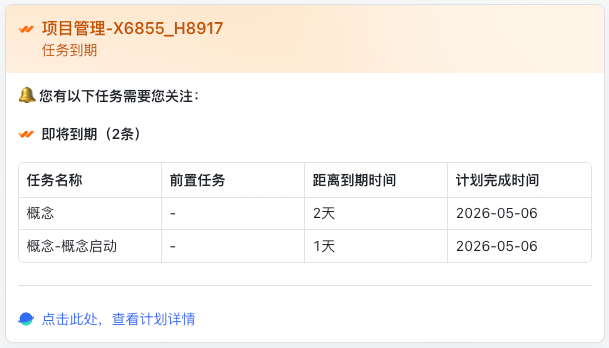

```json
{
    "config": {
        "update_multi": true
    },
    "i18n_elements": {
        "zh_cn": [
            {
                "tag": "markdown",
                "content": "**🔔 您有以下任务需要您关注：** ",
                "text_align": "left",
                "text_size": "normal"
            },
            {
                "tag": "markdown",
                "content": "**即将到期（2条）**",
                "text_align": "left",
                "text_size": "normal",
                "icon": {
                    "tag": "standard_icon",
                    "token": "approval_colorful",
                    "color": "green"
                }
            },
            {
                "tag": "table",
                "columns": [
                    {
                        "data_type": "text",
                        "name": "name",
                        "display_name": "任务名称",
                        "horizontal_align": "left",
                        "width": "auto"
                    },
                    {
                        "data_type": "text",
                        "name": "font",
                        "display_name": "前置任务",
                        "horizontal_align": "left",
                        "width": "auto"
                    },
                    {
                        "data_type": "text",
                        "name": "overtime",
                        "display_name": "距离到期时间",
                        "horizontal_align": "left",
                        "width": "auto"
                    },
                    {
                        "data_type": "text",
                        "name": "end_time",
                        "display_name": "计划完成时间",
                        "horizontal_align": "left",
                        "width": "auto"
                    }
                ],
                "rows": [
                    {
                        "name": "概念",
                        "font": "-",
                        "overtime": "2天",
                        "end_time": "2026-05-06"
                    },
                    {
                        "name": "概念-概念启动",
                        "font": "-",
                        "overtime": "1天",
                        "end_time": "2026-05-06"
                    }
                ],
                "row_height": "low",
                "header_style": {
                    "background_style": "none",
                    "bold": true,
                    "lines": 1
                },
                "page_size": 5
            },
            {
                "tag": "hr"
            },
            {
                "tag": "column_set",
                "horizontal_spacing": "8px",
                "horizontal_align": "left",
                "columns": [
                    {
                        "tag": "column",
                        "width": "weighted",
                        "elements": [
                            {
                                "tag": "markdown",
                                "content": "<a href=''>点击此处，查看计划详情</a>",
                                "text_align": "left",
                                "text_size": "normal",
                                "icon": {
                                    "tag": "standard_icon",
                                    "token": "larkcommunity_colorful",
                                    "color": "green"
                                }
                            }
                        ],
                        "vertical_align": "top",
                        "vertical_spacing": "8px",
                        "weight": 1
                    }
                ],
                "margin": "16px 0px 0px 0px"
            }
        ]
    },
    "i18n_header": {
        "zh_cn": {
            "title": {
                "tag": "plain_text",
                "content": "项目管理-X6855_H8917"
            },
            "subtitle": {
                "tag": "plain_text",
                "content": "任务到期"
            },
            "template": "orange",
            "ud_icon": {
                "tag": "standard_icon",
                "token": "approval_colorful"
            }
        }
    }
}

```

- **任务逾期消息示例**：

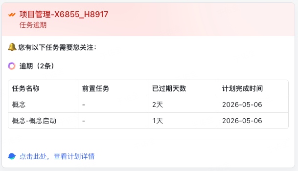

```json
{
    "config": {
        "update_multi": true
    },
    "i18n_elements": {
        "zh_cn": [
            {
                "tag": "markdown",
                "content": "**🔔 您有以下任务需要您关注：** ",
                "text_align": "left",
                "text_size": "normal"
            },
            {
                "tag": "markdown",
                "content": "**逾期（2条）**",
                "text_align": "left",
                "text_size": "normal",
                "icon": {
                    "tag": "standard_icon",
                    "token": "myai_colorful",
                    "color": "green"
                }
            },
            {
                "tag": "table",
                "columns": [
                    {
                        "data_type": "text",
                        "name": "name",
                        "display_name": "任务名称",
                        "horizontal_align": "left",
                        "width": "auto"
                    },
                    {
                        "data_type": "text",
                        "name": "font",
                        "display_name": "前置任务",
                        "horizontal_align": "left",
                        "width": "auto"
                    },
                    {
                        "data_type": "text",
                        "name": "time",
                        "display_name": "已过期天数",
                        "horizontal_align": "left",
                        "width": "auto"
                    },
                    {
                        "data_type": "text",
                        "name": "end_time",
                        "display_name": "计划完成时间",
                        "horizontal_align": "left",
                        "width": "auto"
                    }
                ],
                "rows": [
                    {
                        "name": "概念",
                        "font": "-",
                        "end_time": "2026-05-06",
                        "time": "2天"
                    },
                    {
                        "name": "概念-概念启动",
                        "font": "-",
                        "end_time": "2026-05-06",
                        "time": "1天"
                    }
                ],
                "row_height": "low",
                "header_style": {
                    "background_style": "none",
                    "bold": true,
                    "lines": 1
                },
                "page_size": 5
            },
            {
                "tag": "hr"
            },
            {
                "tag": "column_set",
                "horizontal_spacing": "8px",
                "horizontal_align": "left",
                "columns": [
                    {
                        "tag": "column",
                        "width": "weighted",
                        "elements": [
                            {
                                "tag": "markdown",
                                "content": "<a href=''>点击此处，查看计划详情</a>",
                                "text_align": "left",
                                "text_size": "normal",
                                "icon": {
                                    "tag": "standard_icon",
                                    "token": "larkcommunity_colorful",
                                    "color": "green"
                                }
                            }
                        ],
                        "vertical_align": "top",
                        "vertical_spacing": "8px",
                        "weight": 1
                    }
                ],
                "margin": "16px 0px 0px 0px"
            }
        ]
    },
    "i18n_header": {
        "zh_cn": {
            "title": {
                "tag": "plain_text",
                "content": "项目管理-X6855_H8917"
            },
            "subtitle": {
                "tag": "plain_text",
                "content": "任务逾期"
            },
            "template": "red",
            "ud_icon": {
                "tag": "standard_icon",
                "token": "approval_colorful"
            }
        }
    }
}

```

#### 3.3.3 编辑模式详细操作 2️⃣

##### 进入/退出编辑模式

- **自动进入**：选择修订版时自动进入编辑模式，表格行背景变为浅黄色
- **已发布版本**：不进入全局编辑模式，但实际日期字段可单独点击编辑
- **退出**：发布后自动退出

##### 可编辑字段及操作方式

| 字段 | 编辑控件 | 说明 |
| --- | --- | --- |
| 任务名称 | Input 文本框 | 直接输入修改 |
| 责任人 | Input 文本框 | 直接输入人名 |
| 前置任务 | Input 文本框 | 输入前置任务编号（如 1.1） |
| 计划开始 | DatePicker 日期选择 | 弹出日历选择日期 |
| 计划完成 | DatePicker 日期选择 | 弹出日历选择日期 |
| 预估工期 | Input 数字输入 | 输入天数 |
| 实际开始 | DatePicker（仅已发布版本可编辑） | 点击单元格展开日期选择器 |
| 实际完成 | DatePicker（仅已发布版本可编辑） | 点击单元格展开日期选择器 |

> 🎁 **重要**：修订版中实际开始/实际完成日期为只读，仅已发布版本可点击编辑实际日期。

> ⚠️ **操作日志**：所有修改的操作需要记录，每一条用户操作后的实时保存以及计划的创建发布等

##### 任务增删操作

| 操作 | 入口 | 规则 |
| --- | --- | --- |
| 添加子任务 | 编辑模式下，任务序号左侧的 "+" 按钮 | 一级计划最多支持 2 层（阶段→里程碑），已达最大层级时 "+" 按钮不显示 |
| 删除任务 | 编辑模式下，行右侧的删除按钮 | 需二次确认（Popconfirm），删除时连同子任务一起删除 |
| 拖拽排序 | 编辑模式下，任务序号左侧的拖拽手柄 | 支持同级任务拖拽排序，带子任务整体移动 |

##### 时间约束校验

发布前系统会执行以下三项校验，任一不通过将阻止发布并弹出警告：

**约束 1：父子任务时间约束**

- 子任务的计划开始时间不能早于父任务的计划开始时间
- 子任务的计划完成时间不能晚于父任务的计划完成时间

**约束 2：任务开始和结束时间约束**

- 任务的计划开始时间不能晚于任务的计划完成时间

**约束校验**

- 在甘特图中拖拽修改时间时，即时检查前置任务约束
- 冲突时将错误行的任务使用红色高亮出来，让用户修改，用户点击发布时，如果有错误的任务，会提示“任务校验不通过，无法发布”并自动滚动到第一条不符合要求的任务。

> 📋 **校验时机总结：**
>
> - **发布时**：执行约束1（父子时间），全部通过才能发布，如果有错误的任务，会提示“任务校验不通过，无法发布”并自动滚动到第一条不符合要求的任务
> - **表格编辑时**：实时校验，将错误行的任务使用红色高亮出来

#### 3.3.4 版本对比功能 2️⃣

**入口：** 工具栏始终显示"版本对比"按钮（已发布 / 修订中均可点击），点击弹出版本对比 Modal（宽度 1200px）。

##### 操作流程

1. 点击"版本对比"按钮 → 弹出 Modal
1. 选择**基准版本**和**对比版本**（两个下拉框，中间箭头指示方向）
1. 点击"开始对比" → 系统调用 `compareVersionsForTable()` 对比两个版本的任务差异
1. 结果以带颜色标记的表格展示

##### 对比结果展示

**统计卡片区（顶部）：**

| 统计项 | 颜色 | 说明 |
| --- | --- | --- |
| 变更总计 | 紫色(#6366f1) | 所有变更项数量（新增+修改+删除） |
| 新增 | 绿色(#52c41a) | 新版本新增的任务数 |
| 修改 | 紫色(#6366f1) | 字段有变更的任务数 |
| 删除 | 红色(#ff4d4f) | 新版本中被删除的任务数 |

统计卡片可点击 → 筛选表格只显示该类型的变更。**筛选控制：**

- **"显示未变更项"** 勾选框：默认不勾选（只显示有变更的任务），勾选后显示全部
- **变更类型筛选**：点击统计卡片切换筛选

##### 对比表格列

| 列名 | 宽度 | 说明 |
| --- | --- | --- |
| 序号 | 70 | 任务编号，颜色随变更类型变化 |
| 变更类型 | 80 | 标签：新增(绿)/修改(紫)/删除(红)/未变更(灰) |
| 任务名称 | 160 | 如有修改显示旧值→新值 |
| 责任人 | 80 | 差异对比展示 |
| 前置任务 | 80 | 差异对比展示 |
| 计划开始 | 105 | 差异对比展示 |
| 计划完成 | 105 | 差异对比展示 |
| 预估工期 | 80 | 格式：X天 |
| 实际开始 | 105 | 差异对比展示 |
| 实际完成 | 105 | 差异对比展示 |
| 实际工期 | 80 | 格式：X天 |
| 状态 | 80 | 差异对比展示 |
| 进度 | 70 | 格式：X% |

##### 差异单元格渲染规则

| 变更类型 | 行背景色 | 文字样式 |
| --- | --- | --- |
| 新增 | 浅绿(#f6ffed) | 绿色(#52c41a)，粗体 |
| 删除 | 浅红(#fff2f0) | 红色(#ff4d4f)，删除线，半透明 |
| 修改 | 浅紫(rgba(99,102,241,0.06)) | 旧值：红色删除线 → 新值：紫色粗体 |
| 未变更 | 无 | 灰色(#4b5563) |

> 💡 修改字段 hover 时显示 Tooltip：修改人 + 修改时间。分页设置为每页 15 条。

**版本对比截图：**

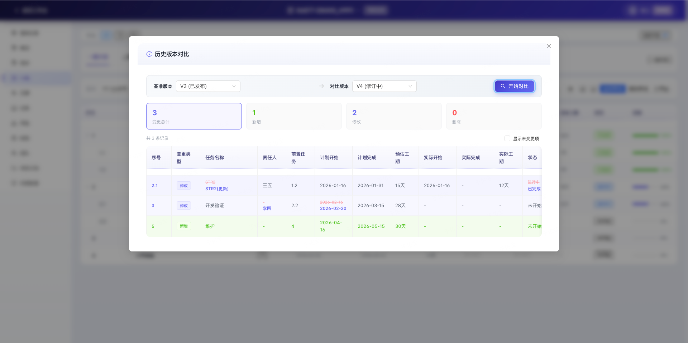

**编辑模式 — 竖版表格截图：**

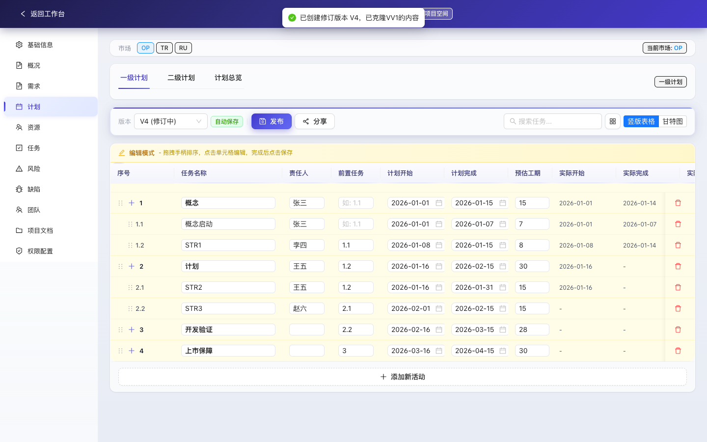

**编辑模式 — 甘特图截图：**

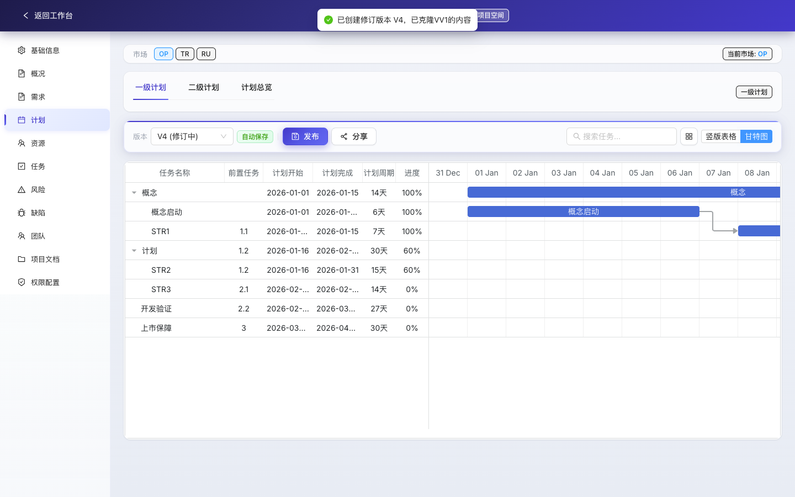

#### 3.3.5 竖版表格视图 2️⃣

**功能描述：** 以传统表格形式展示一级计划任务，支持层级展示（阶段→里程碑）。**表格列配置：**

| 列名 | 说明 | 默认显示 |
| --- | --- | --- |
| 序号 | 任务层级编号（如 1, 1.1, 1.2） | 是 |
| 任务名称 | 阶段或里程碑名称 | 是 |
| 责任人 | 任务负责人 | 是 |
| 前置任务 | 依赖的前置任务编号 | 是 |
| 计划开始 | 计划开始日期 | 是 |
| 计划完成 | 计划完成日期 | 是 |
| 预估工期 | 预估天数 | 是 |
| 实际开始 | 实际开始日期 | 是 |
| 实际完成 | 实际完成日期 | 是 |
| 实际工期 | 实际天数 | 是 |
| 状态 | 已完成/进行中/未开始 | 是 |
| 进度 | 百分比进度条 | 是 |

**交互功能：**

- 搜索：按任务名称、责任人筛选
- 自定义列：弹窗勾选可见列
- 编辑模式：修订版自动进入，可修改所有字段
- 拖拽排序：编辑模式下支持任务拖拽重排**截图如下：**

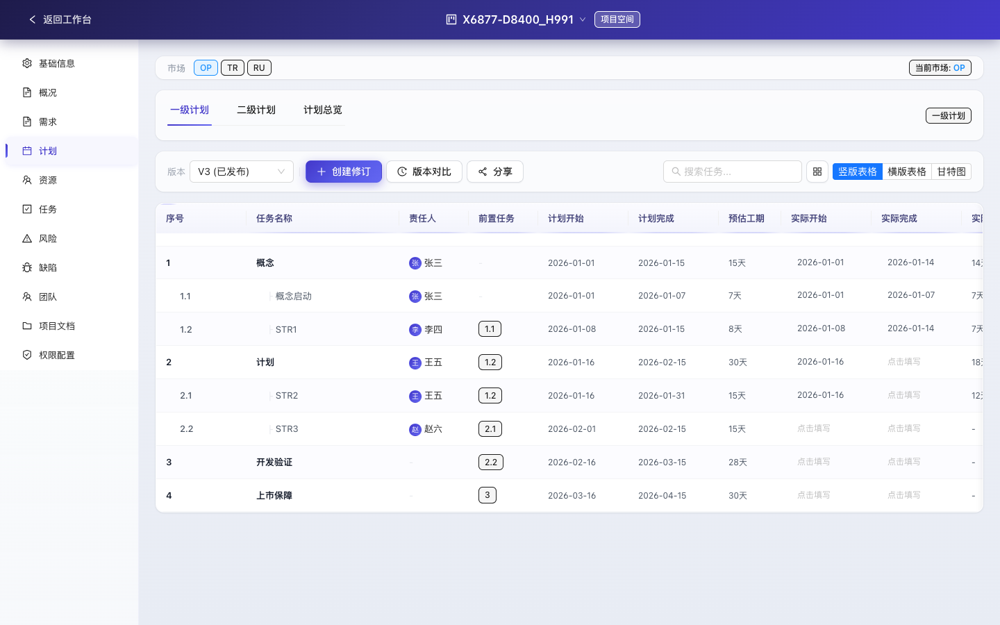

**层级展开/收起：**

- 序号列前为每个父级节点（有子任务的行）渲染 ▼ 箭头图标，点击可单独折叠/展开该节点；叶子节点无图标，保持列对齐
- 工具栏提供 **全部展开** / **全部收起** 两个方形按钮，一键切换当前表格所有父级节点
- 展开状态按 `项目 × 计划层级` 作用域隔离：切换项目、L1/L2 Tab、二级计划下不同计划模板均独立；同一作用域内在 **竖版表格 ↔ 甘特图** 视图间切换时状态保留
- 甘特图视图双向联动：用户在甘特图内点击节点的开/合按钮会同步回表格的折叠状态
- 默认全部展开；编辑模式下仍可折叠/展开

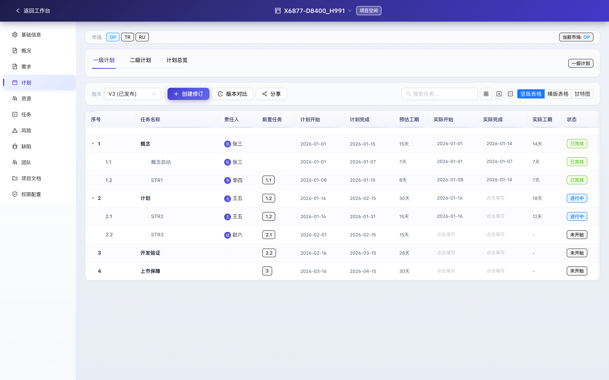

#### 3.3.6 横版表格视图 2️⃣

**功能描述：** 以版本×里程碑矩阵形式展示计划，适合跨版本对比各里程碑的日期变化。**表格结构：**

- **行**：各已发布版本（最老的在上）+ 实际数据行（底部高亮）
- **列**：按阶段分组，每个阶段下展示各里程碑
- **单元格**：显示该版本该里程碑的计划完成日期**特点：**
- 左侧固定列：版本号、开发周期
- 阶段标题彩色区分
- 仅在非编辑模式下可用**截图如下：**

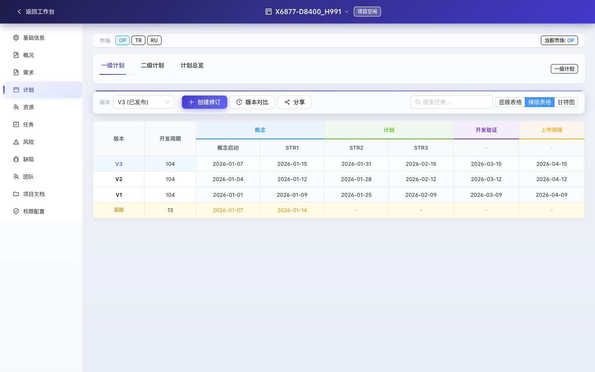

#### 3.3.7 甘特图视图 2️⃣

**功能描述：** 以甘特图形式可视化展示一级计划的时间线，支持任务依赖关系和进度展示。**甘特图功能：**

- **时间刻度**：月/日双层刻度
- **任务条**：显示计划周期，颜色反映进度
- **依赖箭头**：前置任务间的连线
- **树形结构**：阶段→里程碑的父子关系
- **列信息**：任务名称、前置任务、计划开始、计划完成、计划周期、进度
- **编辑模式**：可拖拽调整任务时间**截图如下：**

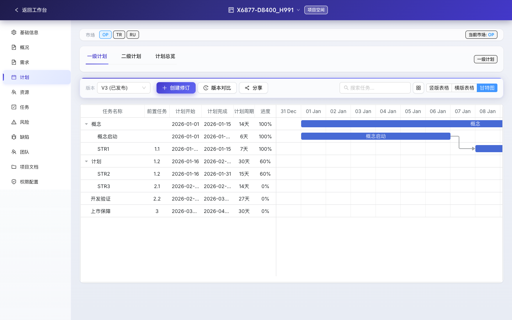

---

#### 3.3.8 导出 Excel 2️⃣

**功能描述：** 一级计划管理支持将当前视图导出为 Excel 文件，方便离线查阅、汇报归档和二次分析。导出入口位于计划工具栏右侧（搜索框与"自定义列"按钮之间），以下载图标按钮形式呈现，点击后下拉菜单提供两项选择：

- **导出当前视图**：根据当前视图状态导出
	- 竖版表格：仅导出当前搜索过滤后的行 + 当前自定义列配置下可见的列
	- 横版表格：按已发布版本倒序导出版本 × 里程碑矩阵，包含"开发周期"与末行"实际"数据
- **导出全部**：忽略搜索与自定义列，导出全部任务 + 全部可配置列（竖版）或全部已发布版本（横版）**支持的视图：** 竖版表格、横版表格。甘特图模式下导出按钮自动隐藏。**文件命名规则：** `项目空间计划_{项目名}_{一级计划|二级计划}_{竖版|横版}_YYYYMMDD_HHmm.xlsx`**横版表格合并表头还原：** 导出的 Excel 文件中，"版本"与"开发周期"列纵向跨 2 行（rowSpan），各阶段（如"版本规划"、"版本开发"）按其所含里程碑数横向合并（colSpan），第 2 行展示各里程碑名称。在 Excel / Numbers / WPS 中打开可完整还原界面上的分组表头结构。**空数据提示：** 若当前视图无可导出数据（例如新项目尚无任务），点击导出按钮不会下载文件，而是在界面顶部提示"暂无可导出数据"。**竖版表格导出截图：**

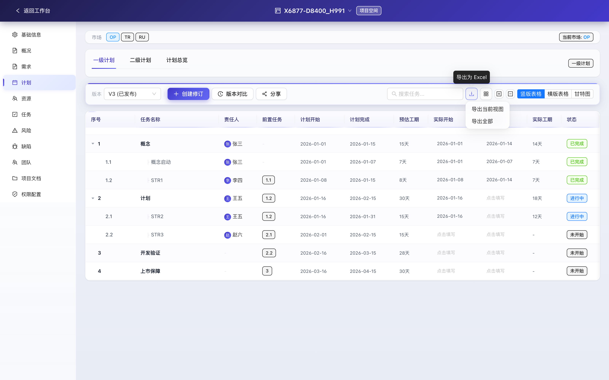

**横版表格导出截图（含合并表头）：**

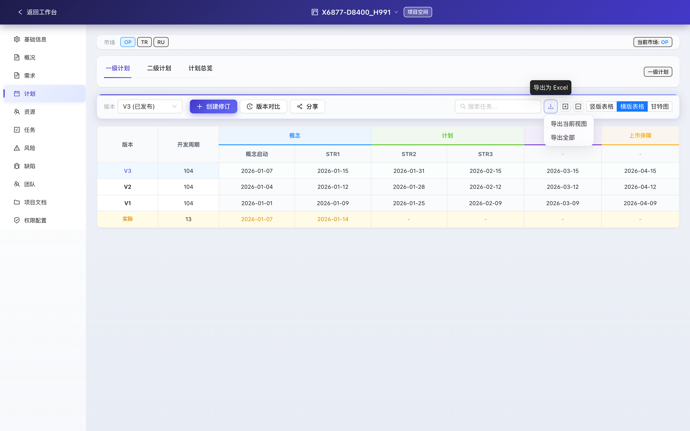

#### 3.3.9 一级计划分享 3️⃣

**功能描述：** 有一级计划查看权限的用户可在一级计划工具栏点击"分享"按钮，复制公开分享链接。打开链接后进入独立的只读页面，展示最新发布的一级计划。

##### 分享按钮

- **位置**：一级计划工具栏，与"创建修订""版本对比"按钮同行
- **条件**：存在至少一个已发布版本
- **行为**：点击即复制链接到剪贴板，显示成功提示

##### 分享页面

**URL格式：** `/share/plan?projectId={id}&level=level1`**页面布局：**

1. **信息栏**：项目类型标签 + 项目名称 · 一级计划 + 版本号 + 已发布标签 + SPM
1. **工具栏**：市场切换（整机项目）+ 搜索 + 列设置 + 视图切换
1. **内容区**：竖版表格 / 横版表格 / 甘特图（只读）**特点：**
- 无需登录，公开访问
- 整机产品项目支持在页面内切换不同市场的计划数据
- 非整机项目不显示市场切换**整机产品项目分享页截图：**

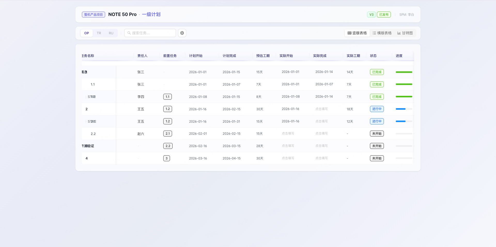

**产品项目分享页截图：**

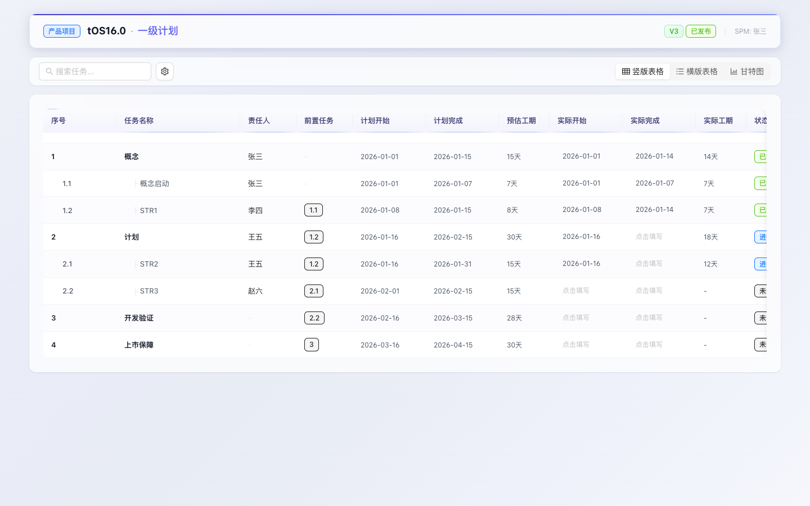

#### 3.3.10 任务时间合法性校验 2️⃣

**功能描述：** 在「修订中」版本下实时校验任务计划时间的合法性，违规字段单元格红色高亮（淡粉底 + 左侧 3px 红条 + Antd DatePicker 原生 status="error" 红边 + 红色日历图标），hover 显示红色 Tooltip 列出该字段的具体违规原因。

**校验规则：**

| 规则 | 具体约束 |
| --- | --- |
| 同一行内 | planStartDate ≤ planEndDate |
| 父子关系 | 子.planStartDate ≥ 父.planStartDate 且 子.planEndDate ≤ 父.planEndDate |

**触发与表现细节：**

- 仅在 `currentVersionData.status === '修订中'` 时启用校验扫描，已发布版本不做该校验。
- 任一边日期为空时跳过该规则（避免编辑过程中临时空值误报）。
- 多级层级（例如 1.1.1）通过 parentId 链传递性自动覆盖：子在父内 + 父在祖父内 → 子在祖父内，无需独立校验跨级。
- 同行 start > end 时 start 和 end 两个格子都标红（不一致需用户决定改哪个）。
- 父子区间违规时，仅标记越界的那一边（例如子.start < 父.start 只标 start，end 正常时不标 end）。
- 单元格 hover Tooltip 列出该字段所有违规原因，逐条以「· 」开头。例如：
	- 计划开始（2026-01-25）不能晚于计划完成（2026-01-15）
	- 计划开始（2026-01-01）不能早于父任务「概念」的计划开始（2026-01-25）

**发布拦截：**

- 点击「发布」按钮时，先扫描完整任务列表 `getInvalidTaskFields(tasks)`：
	- 若不存在违规字段 → 进入正常发布流程（diff 通知 / 状态切换 / 快照保存）。
	- 若存在违规字段 → `message.error("任务校验不通过，无法发布")`，setTimeout 后自动平滑滚动到第一条违规任务行（按数据数组顺序），且**不**改变版本状态。
- 滚动逻辑通过查询 `tr[data-row-key={firstInvalid.id}]` 调用 scrollIntoView。

**适用范围：** 该校验同时作用于 一级计划（项目空间） / 二级计划（项目空间） / 配置中心一级计划模板。三处共享同一份 `getInvalidTaskFields` 实现。

**修订中版本下的违规高亮截图：**

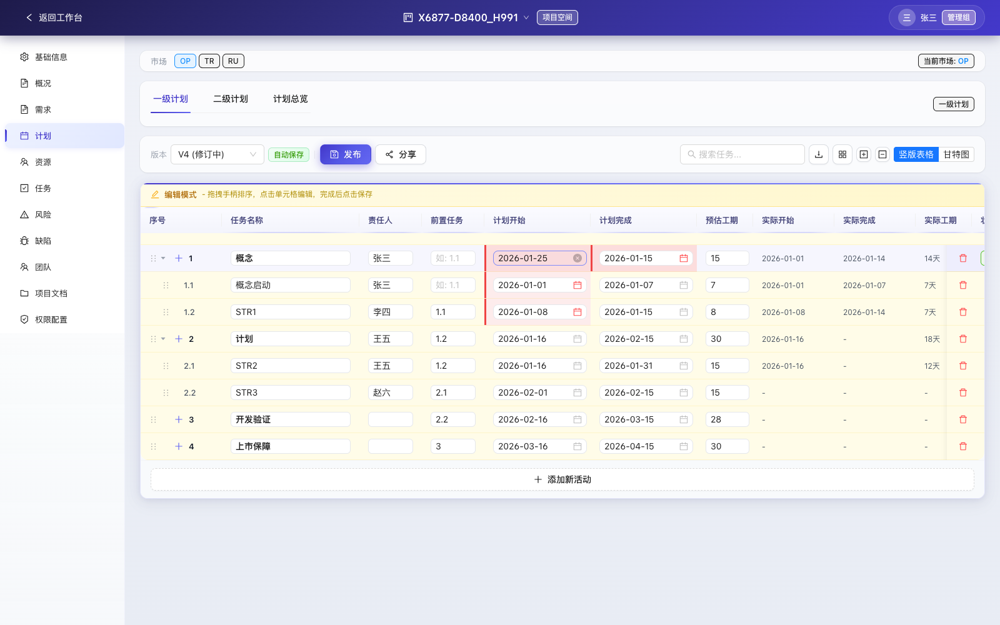

**hover 单元格弹出 Tooltip 显示具体违规原因：**

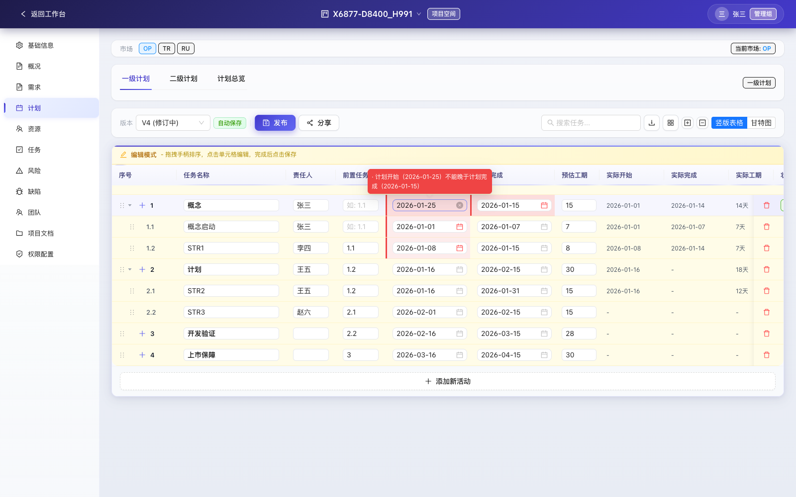

#### 3.3.11 默认版本与行级编辑权限 2️⃣

**功能描述：** 进入项目空间「计划」时，系统按当前用户的「计划编辑权限」与「是否为某条任务的责任人」自动选择默认显示的版本，并控制版本下拉里是否暴露修订中版本、以及行级编辑能力。

**默认版本与版本下拉矩阵：**

| 用户身份 | 是否有修订版 | 默认显示 | 版本下拉 |
| --- | --- | --- | --- |
| 有计划编辑权（一级或二级） | 有 | 修订版 | 全部版本可见，提供「发布」入口 |
| 有计划编辑权 | 无 | 最新已发布 | 全部版本可见，提供「创建修订」入口 |
| 无编辑权 + 是某条任务责任人 | 有 | 修订版 | 全部版本可见，无「创建修订」/「发布」按钮 |
| 无编辑权 + 是某条任务责任人 | 无 | 最新已发布 | 全部版本可见 |
| 无编辑权 + 非任何任务责任人 | 有 / 无 | 最新已发布 | **修订中版本被过滤掉**，无法切到修订版 |

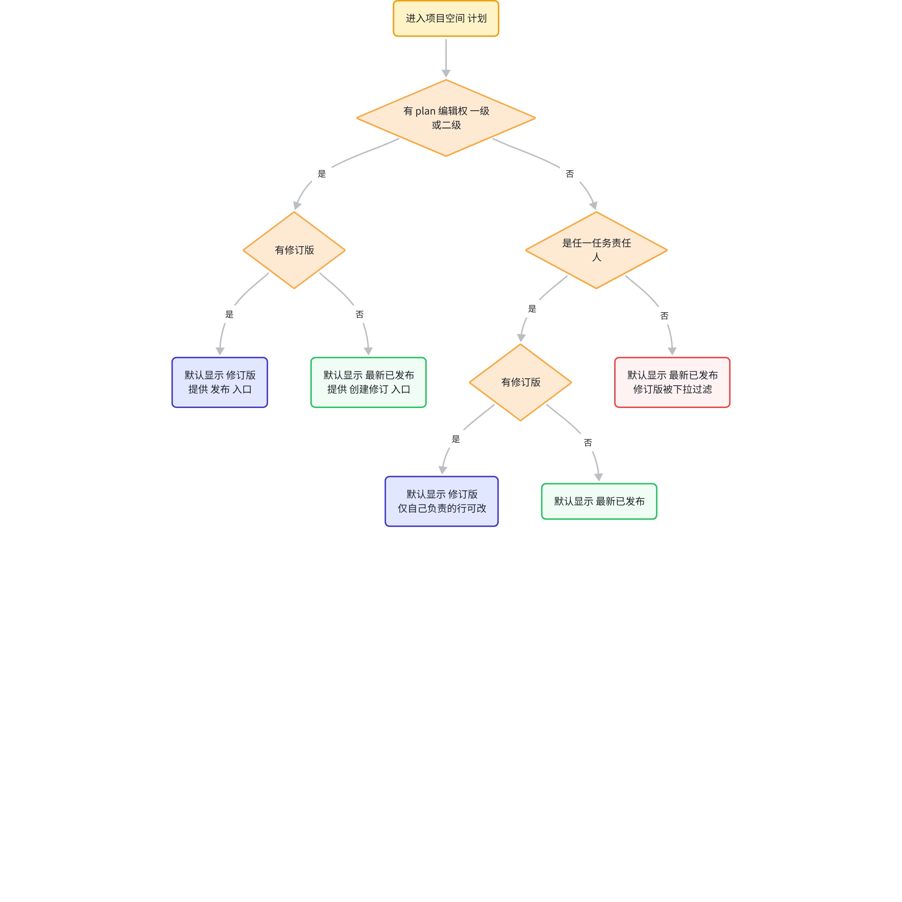

**自动切换逻辑：**

- 触发时机：`activeModule === 'projectSpace' && projectSpaceModule === 'plan'` 且 `projectId × market × planLevel × currentLoginUser` 组合发生变化时。
- 用 ref 锁定到 `(项目 + 市场 + 级别 + 用户)` 的复合 key，避免用户手动切换版本后被覆盖；用户切换登录身份时复合 key 变化会重新评估。
- 责任人判定 `isResponsibleForAnyTask`：扫描当前 effectiveTasks（L1）+ level2PlanTasks（L2 全集）中是否存在 `responsible === currentLoginUser`。

**行级编辑能力分级（仅在编辑模式 + 修订中版本时生效）：**

| 能力档位 | 判定 | 可执行操作 |
| --- | --- | --- |
| canFullyEdit | 编辑模式 + 用户有相应级别（plan:一级计划-编辑 或 plan:二级计划-编辑）的编辑权 | 拖拽排序、添加子项、删除任务、新增一级活动；任意单元格可编辑（含责任人 / 前置任务等结构性字段） |
| isRowEditable | 编辑模式 + 用户为该行的 responsible | 仅本行的「任务名称 / 计划开始 / 计划完成 / 预估工期」可改；责任人 / 前置任务为只读；不能新增 / 删除 / 拖拽任务 |
| 只读 | 已发布版本 或 用户不满足以上两档 | 所有字段只读（已发布版本下"实际开始 / 实际完成"在最新已发布版本上仍可点击编辑） |

**编辑提示横条文案：**

- canFullyEdit：`编辑模式 - 拖拽手柄排序，点击单元格编辑，完成后点击保存`
- 仅 isRowEditable：`编辑模式 - 你只能编辑负责人为自己的行，其他任务为只读`

**为什么责任人字段不允许责任人本人改：** 若允许责任人将自己改成他人，会立即丢失该行编辑权，造成"改一半改不回来"的死锁体验。结构性字段（responsible / predecessor）保留给 canFullyEdit 用户。

**为什么父子时间校验对责任人也生效：** 一致性优先于可操作性。如果父任务范围被超出（自己看不到的格子），对应自己负责的子任务格子会标红，需协调有编辑权的同事修复，避免局部修改产生不可见的隐患。

**无编辑权且非责任人 - 默认显示最新已发布、修订中版本被过滤：**

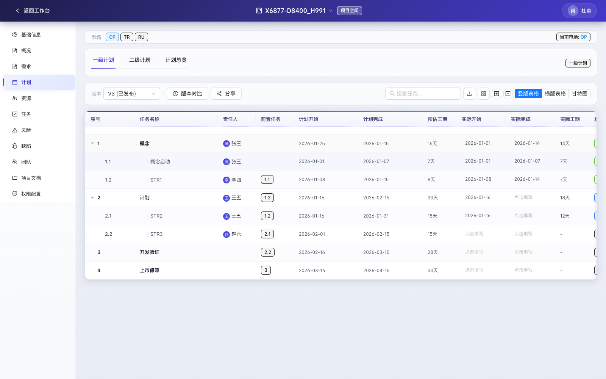

### 3.4 项目路标视图 4️⃣

**功能描述：** 在 Header 导航中切换到"项目路标视图"，以里程碑为列、项目为行的矩阵表格展示所有项目的里程碑日期全景。

#### 3.4.1 项目类型切换

通过顶部 Tab 切换查看不同类型项目的路标：

- **软件产品项目**：展示 tOS 等产品项目的里程碑
- **整机产品项目**：展示整机项目的里程碑，按市场维度展开

> 🎁 V1.0 不包含 MR版本火车视图 Tab，该功能将在后续版本中实现。

#### 3.4.2 表格结构

**软件产品项目项目信息列：**

| 列名 | 默认显示 | 列设置 | 说明 |
| --- | --- | --- | --- |
| 项目名称 | 是 | 固定，不可取消 | 可点击跳转到项目空间 |
| 项目状态 | 是 | 可取消 | 颜色标签 |
| 健康状态 | 否 | 可选择 | 项目健康状态 |
| 当前节点 | 是 | 可取消 | 当前里程碑节点 |
| 品牌 | 否 | 可选择 | TECNO / itel / Infinix 等 |
| 产品线 | 否 | 可选择 | NOTE / SPARK / CAMON 等 |
| 版本类型 | 是 | 可取消 | Full / Slim / Go 等 |
| 芯片平台 | 是 | 可取消 | MTK / QCOM 等 |
| 开发模式 | 是 | 可取消 | ODC / JDM / 自研等 |
| SPM | 是 | 可取消 | 项目负责人 |
| 项目描述 | 否 | 可选择 | 项目说明 |

**整机产品项目项目信息列：**

| 列名 | 默认显示 | 列设置 | 说明 |
| --- | --- | --- | --- |
| tOS版本 | 是 | 可取消 | 关联的 tOS 版本 |
| 品牌 | 是 | 可取消 | TECNO / itel / Infinix 等 |
| 产品线 | 是 | 可取消 | NOTE / SPARK / CAMON 等 |
| 项目名 | 是 | 固定，不可取消 | 可点击跳转到项目空间 |
| 市场 | 是 | 固定，不可取消 | OP / TR / RU 等市场维度 |
| 芯片平台 | 是 | 可取消 | MTK / QCOM 等 |
| 内存 | 是 | 可取消 | 内存配置 |
| 版本类型 | 是 | 可取消 | Full / Slim / Go 等 |
| 合作形式 | 是 | 可取消 | ODC / JDM / 自研等合作形式 |
| 健康状态 | 否 | 可选择 | 项目健康状态 |
| SPM | 是 | 可取消 | 项目负责人 |
| 主板名 | 否 | 可选择 | 主板名称 |
| 市场名 | 否 | 可选择 | 市场销售名称 |
| 当前节点 | 否 | 可选择 | 当前里程碑节点 |
| 产品类型 | 是 | 可取消 | 新品 / 换代等 |
| 安卓版本 | 否 | 可选择 | Android 版本 |
| 研发模式 | 否 | 可选择 | 研发模式 |
| 项目等级 | 否 | 可选择 | 项目等级 |
| 项目描述 | 否 | 可选择 | 项目说明 |
| 芯片型号 | 否 | 可选择 | CPU / SoC 型号 |
| Bom | 否 | 可选择 | BOM 信息 |
| 屏幕 | 否 | 可选择 | 屏幕规格 |
| 屏幕形态 | 否 | 可选择 | 直屏 / 曲屏等 |
| 屏幕类型 | 否 | 可选择 | LCD / AMOLED 等 |
| 前摄像头 | 否 | 可选择 | 前摄配置 |
| 后摄像头 | 否 | 可选择 | 后摄配置 |
| 网络模式 | 否 | 可选择 | 4G / 5G 等 |
| kernel版本 | 否 | 可选择 | Kernel 版本 |
| 灯效 | 否 | 可选择 | 灯效能力 |
| 人脸 | 否 | 可选择 | 人脸识别能力 |
| 音效 | 否 | 可选择 | 音效能力 |
| SIM卡 | 否 | 可选择 | SIM 卡规格 |
| 马达 | 否 | 可选择 | 马达规格 |
| 指纹 | 否 | 可选择 | 指纹方案 |
| 红外 | 否 | 可选择 | 红外能力 |

**动态里程碑列：** 按当前项目类型在配置中心「计划模板配置」中最新已发布模板的二级任务自动聚合生成（如 概念启动、STR1、STR2、STR3...）。聚合规则只取一级计划模板中的二级任务，一级任务不生成路标列；列名按任务名称全匹配，项目行中对应名称任务的计划完成日期展示在该列。模板中勾选「默认路标」的二级任务默认显示在路标视图中，未勾选的二级任务可在列设置中选择显示；默认显示的里程碑列也可在列设置中取消。

#### 3.4.3 工具栏交互

| 功能 | 图标 | 说明 |
| --- | --- | --- |
| 筛选 | 🔍 | 从右侧弹出筛选抽屉，支持按任意项目信息字段或里程碑字段添加条件 |
| 列设置 | ⚙️ | 从右侧弹出列设置抽屉，项目信息字段在前、里程碑信息字段在后 |
| 保存视图 | 💾 | 将当前筛选条件+列配置保存为命名视图，下次可直接加载 |
| 加载视图 | 📋 | 下拉选择已保存的视图，快速切换 |
| 删除视图 | 🗑️ | 删除已保存的自定义视图（二次确认） |
| 基线快照 | 📸 | 保存当前数据为基线版本，用于后续对比 |
| 历史基线 | 📜 | 查看已保存的基线快照列表，可切换查看历史数据 |
| 快照对比 | ⇄ | 从"实时数据"或任意历史快照中任选两个版本进行对比，以单元格内联染色 + 顶部摘要条形式展示差异；至少需要一个快照才可用 |
| 全屏 | ⛶ | 全屏/退出全屏切换 |
| 分页设置 | — | 下拉选择每页显示行数（10/20/50/100） |

#### 3.4.4 交互细节

**表格行交互：**

- 点击项目名称 → 跳转到该项目空间的计划详情
- 整机项目按市场展开为多行（如 X6877-OP、X6877-TR、X6877-RU）
- 日期单元格展示计划完成日期，颜色区分正常/逾期

**筛选抽屉：**
- 点击「筛选」从右侧打开抽屉
- 每条筛选条件由「字段」「类型」「输入值」三部分组成
- 字段下拉包含当前项目类型下所有可用项目信息字段和里程碑字段
- 类型支持：包含 / 不包含 / 等于
- 用户在输入框填写过滤文本，可新增多条条件，也可删除任意条件
- 多条条件之间为 AND 关系；应用后实时刷新表格

**列设置抽屉：**
- 点击「列设置」从右侧打开抽屉
- 字段纵向排列，先展示项目信息字段，再展示里程碑信息字段
- 软件产品项目的「项目名称」固定显示，不在列设置中取消
- 整机产品项目的「项目名」「市场」固定显示，不在列设置中取消
- 其他默认显示字段可取消，非默认字段可选择
- 里程碑字段中，模板勾选「默认路标」的字段显示绿色「默认」标识

**视图管理：**
- 视图包含：筛选条件 + 可见列配置
- 保存到 localStorage，跨会话保留
- 切换视图时自动恢复对应的筛选和列设置

**基线快照：**
- 记录当前时间点的全部里程碑日期数据
- 可命名版本号（如 "V1-2026Q1"）
- 切换到历史基线时表格展示该时间点的数据

**快照对比：**
- 从工具栏 **对比** 按钮进入；无快照时按钮禁用并提示"请先至少创建一个快照"
- 入口 Modal 中可独立选择 **基准版本（旧）** 与 **对比版本（新）**，两者均可从 `实时数据` / 任意历史快照中选择，但不允许相同
- 进入对比模式后，原"快照切换下拉"隐藏、"创建快照"按钮禁用；顶部出现对比摘要条，显示 `基准 → 对比` 版本号、`🟢 新增 N 行 / 🔴 删除 N 行 / 🟠 修改 N 行（共 X 处字段变化）` 统计
- 行级差异：新增行（绿底 + 绿色左边框）、删除行（红底 + 红色左边框 + 删除线）、修改行（白底）
- 单元格级差异：普通字段变化（橙底，显示 `旧 → 新`）；里程碑日期前移（蓝底 + Tooltip `提前 N 天`）；日期后移（红底 + Tooltip `延后 N 天`）
- 里程碑列并集处理：两快照里程碑不同时，取并集展示；只在一侧存在的列在列头加 `新增` / `已删` Tag
- 快照对比使用当前项目类型的最新字段定义：项目信息字段按软件产品项目 / 整机产品项目分别对比，里程碑字段按两版本里程碑列并集对比
- 里程碑字段随配置中心最新已发布模板动态变化；新增或删除的里程碑列在对比模式下保留并标识来源
- 全字段参与对比：项目状态、健康状态、当前节点、品牌、产品线、版本类型、芯片平台、开发模式/研发模式、SPM、项目描述、整机扩展字段和里程碑日期等
- "只看有差异的行" 开关（默认开）：快速聚焦发生变更的行；两版本完全一致时显示 `两个版本无差异` 空态
- 筛选 / 列设置 / 分页在对比模式下仍然生效；所选快照被删除或切换项目类型时自动退出对比模式

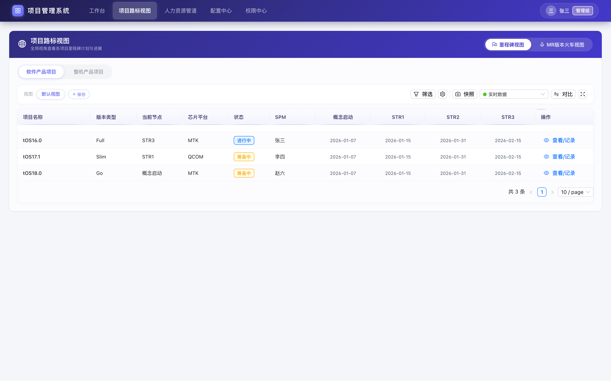

**图 1：** 路标视图工具栏中的"对比"按钮（快照选择下拉右侧）

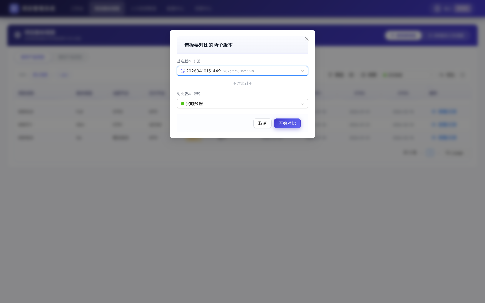

**图 2：** 对比入口 Modal — 分别选择基准版本（旧）和对比版本（新）

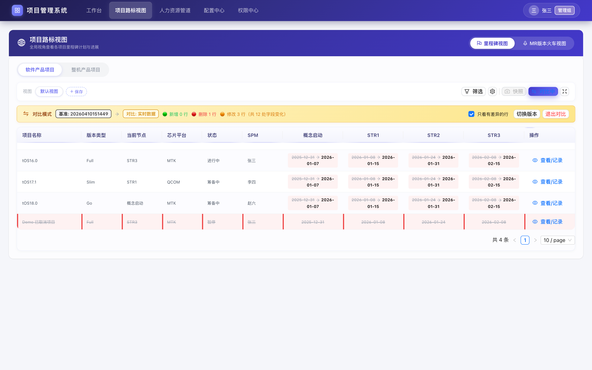

**图 3：** 对比模式激活 — 顶部黄色摘要条显示差异统计，表格内以单元格染色展示里程碑日期变化，底部红色删除行为基准版本中存在但已不存在的项目

**整机产品项目路标视图截图：**

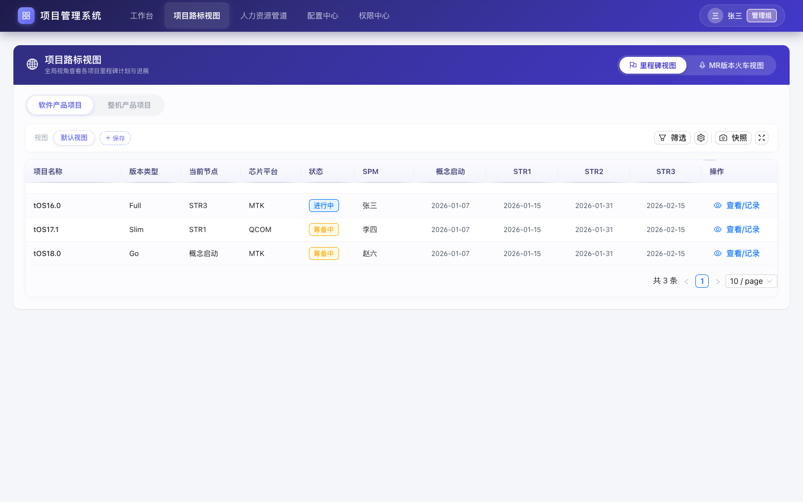

#### 3.4.5 导出 Excel

**功能描述：** 项目路标视图（里程碑视图）支持将当前项目类型 Tab 下的路标数据导出为 Excel 文件。导出入口位于工具栏右侧（"对比"按钮与"全屏"按钮之间），以下载图标按钮形式呈现，点击后下拉菜单提供两项选择：

- **导出当前视图**：按当前筛选条件、列可见性与所选项目类型 Tab（软件产品项目 / 整机产品项目）导出
- **导出全部（当前项目类型）**：忽略筛选与隐藏列，导出当前项目类型下全部项目 × 全部项目信息字段 × 全部动态里程碑日期

**数据维度：** 导出文件包含当前项目类型的项目信息字段 + 动态聚合的里程碑列。软件产品项目和整机产品项目使用各自字段定义；里程碑列来自配置中心最新已发布模板的二级任务。

**文件命名规则：** `里程碑视图_{软件产品项目|整机产品项目}_YYYYMMDD_HHmm.xlsx`

**跨 Tab 限制：** "导出全部"不会跨项目类型 Tab — 只导出当前 Tab 下的项目。若需导出另一类型，请先切换 Tab 再导出。

**空数据提示：** 若当前 Tab 无可导出数据，点击导出不会下载文件，而是提示"暂无可导出数据"。

**截图：**

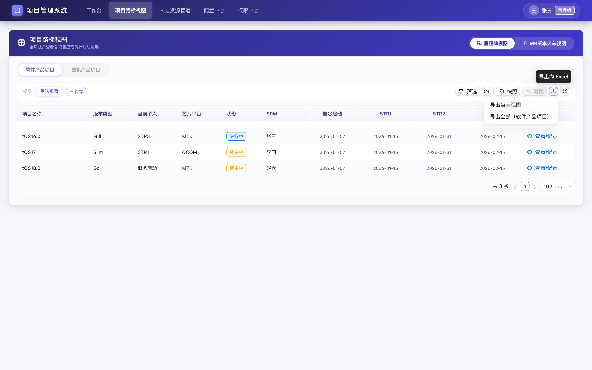

### 3.5 配置中心 — 计划模板配置 2️⃣

**功能描述：** 在 Header 导航切换到"配置中心"，管理各项目类型的计划模板。一级计划模板定义标准阶段和里程碑结构，二级计划模板定义需求开发计划、版本火车计划等里程碑下的执行计划模板；新建项目时会按项目类型套用对应模板。

> 🎁 配置中心当前包含"计划模板配置"。转维材料模板配置暂未开放，但系统级权限中心已预留"转维编辑"权限用于后续扩展。

#### 3.5.1 页面布局

| 区域 | 说明 |
| --- | --- |
| 顶部 Tab | "计划模板配置"（当前可用）/ "转维材料模板配置"（当前不可用） |
| 左侧项目类型边栏 | 可折叠，列出 4 种项目类型，点击切换 |
| 头部信息区 | 显示当前选中的项目类型名 + "计划模板配置" 标签 |
| 计划层级 Tab | "一级计划" / "二级计划" |
| 二级计划类型 | 选择"二级计划"后展示模板类型：1+N MR版本火车计划 / 粉丝版本计划 / 基础体验计划 / WBS计划，并支持添加自定义类型 |
| 工具栏 | 版本选择器 + 操作按钮 + 搜索 + 列设置 |
| 主内容区 | 表格视图 / 甘特图视图 |

#### 3.5.2 项目类型选择（左侧边栏）

- 列出 4 种项目类型：整机产品项目 / 产品项目 / 技术项目 / 能力建设项目
- 点击切换 → 主内容区加载该类型的计划模板
- 边栏可通过按钮折叠/展开（折叠后仅显示图标）
- 使用 sticky 定位，跟随滚动

#### 3.5.3 版本管理

配置中心计划模板的版本管理与项目空间共享同一套底层机制（`VersionData[]` 列表 + `currentVersion` 状态 + `publishedSnapshots` 快照映射），但适用对象是**计划模板**而非**项目实例**。

**版本状态：**

| 状态 | 说明 |
| --- | --- |
| 已发布 | 只读模板。新建项目时按当前项目类型选取「最新已发布」模板克隆任务结构（仅 id / order / parentId / taskName 等结构字段，不带日期 / 工期 / 实际值） |
| 修订中 | 可编辑草稿。每个项目类型同时只能存在一份；自动保存到 publishedSnapshots，但**发布前不会被新建项目使用** |

**版本编号策略：** Vn 自增（V1 → V2 → V3 ...）。创建修订时基于该项目类型下的「最新已发布」编号 +1；若该项目类型从未发布过版本，则创建空白 V1 修订中。

**版本切换：**

- 顶部下拉选择器列出当前项目类型下所有版本（含状态后缀，如 `V3 (已发布)` / `V4 (修订中)`）
- 切换到任一已发布版本进入只读浏览模式
- 切换到修订中版本时自动进入编辑模式（与项目空间一致的 useEffect 监听 currentVersion / isCurrentDraft 触发 setIsEditMode(true)）
- 切换项目类型（左侧边栏）后版本下拉重新加载该类型的版本链；不同项目类型版本互不影响

**操作触发条件：**

| 操作 | 显示条件 | 行为 |
| --- | --- | --- |
| 创建修订 | 当前项目类型下不存在「修订中」版本（hasDraftVersion === false） | 克隆「最新已发布」生成 Vn+1 修订中（无已发布则创建空白 V1）；setCurrentVersion(newId)，UI 自动切换到该版本进入编辑模式 |
| 发布 | 当前选中版本为「修订中」（isCurrentDraft === true） | 先做任务时间合法性校验（同 3.3.10）；通过则将版本状态切换为「已发布」并写入 publishedSnapshots[versionId] = JSON.parse(JSON.stringify(tasks)) |
| 编辑 | 当前选中版本为「修订中」 | 不需要单独的"编辑"按钮，进入修订中即自动进入编辑模式（auto-edit useEffect） |
| 历史版本对比 | 任意版本均显示（含修订中） | 弹出 Modal 选择基准版本 + 对比版本（任意两个版本，含修订中），并排展示新增（绿）/ 删除（红）/ 修改（蓝）/ 未变更行；表头按 `序号 / 变更类型 / 任务名称 / 责任人 / 前置任务 / 计划开始 / 计划完成 / 预估工期 / 状态 / 进度` 列出 |

**与项目空间一级计划版本管理的差异：**

| 对比项 | 配置中心 | 项目空间 |
| --- | --- | --- |
| 版本作用域 | 项目类型级（4 个项目类型独立维护各自版本链） | 项目实例级（每个项目独立版本） |
| 市场维度 | 无（模板与市场无关） | 整机产品项目按市场（OP / TR / RU）独立维护版本和任务数据 |
| 权限准入 | 系统级权限中心控制：计划编辑用于模板修改，计划发布用于模板发布；无对应权限时相关操作禁用 | 有 plan:一级计划-编辑 → canFullyEdit；仅是责任人 → isRowEditable；其他 → 只读（详见 3.3.11） |
| 默认版本选择 | 始终显示当前项目类型下最新版本（不区分用户身份） | 按用户编辑权 + 责任人身份矩阵决定（详见 3.3.11） |
| 实际日期 / 工期 | 不支持（模板本身不含 actualStartDate / actualEndDate / actualDays） | 已发布版本可点击编辑实际日期，自动计算实际工期 |
| 分享链接 | 无 | 已发布版本可复制公开分享链接 |

**任务时间合法性校验：** 与项目空间共享 `getInvalidTaskFields` 同一份实现。修订中模板下违规单元格红框 + 红色 Tooltip，点击「发布」时存在违规则弹出 `任务校验不通过，无法发布` 并滚动到首条违规行。详细规则见 [3.3.10 任务时间合法性校验]。

**版本下拉与历史版本对比按钮（修订中版本同样可用）：**

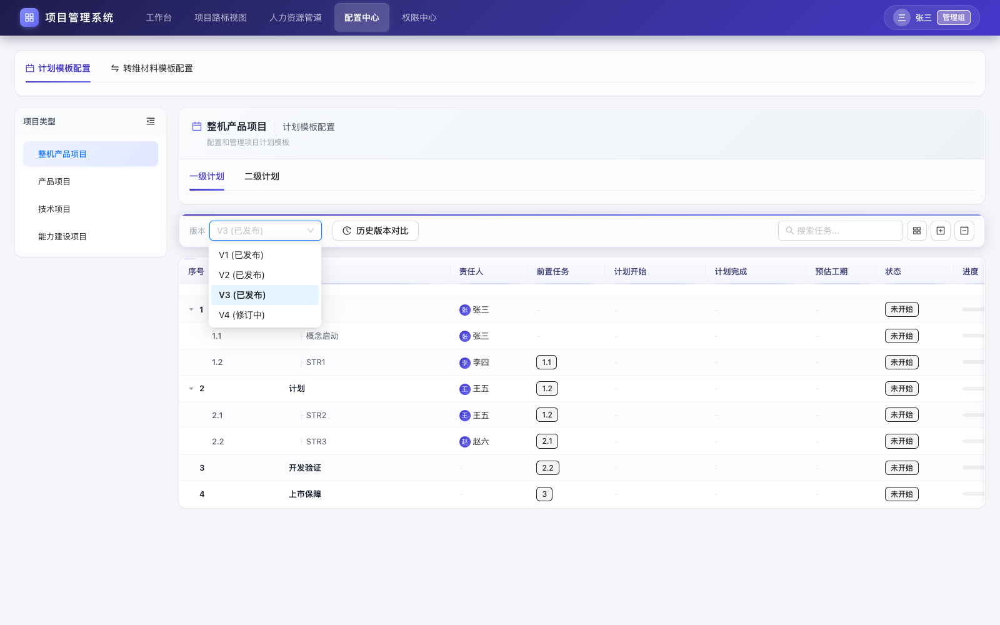

**历史版本对比 Modal — 选择基准 / 对比版本：**

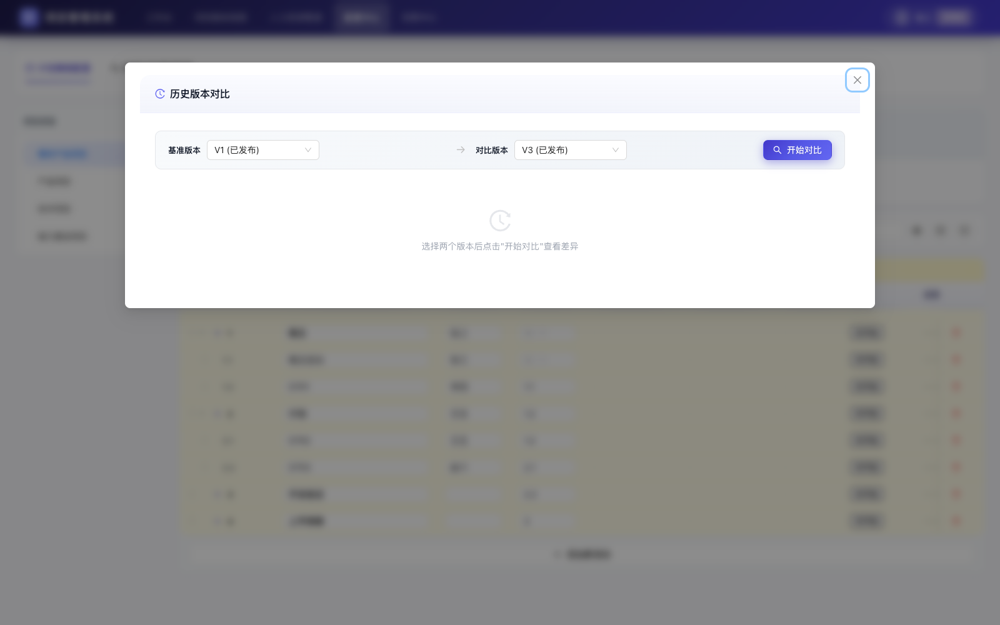

**对比结果（新增 / 修改 / 删除按颜色区分）：**

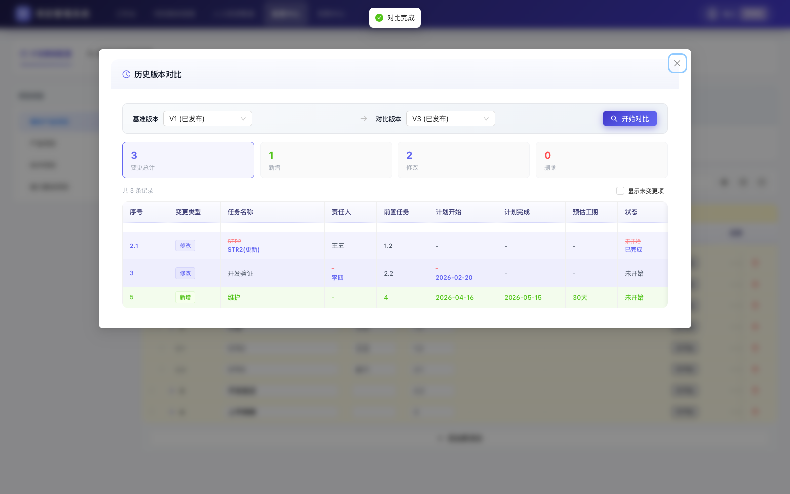

#### 3.5.4 模板编辑

**进入编辑：** 切换到「修订中」版本时自动进入编辑模式（auto-edit useEffect 监听 `currentVersion / isCurrentDraft`），无需单独的「编辑」按钮；已发布版本始终为只读状态。无修订版时工具栏显示「创建修订」按钮，点击后克隆最新已发布版本生成 Vn+1 修订中并自动进入编辑。

**编辑模式视觉提示：**

- 顶部黄色横条："编辑模式 - 拖拽手柄排序，点击单元格编辑，完成后点击保存"
- 工具栏右上角显示 `修订中` 蓝色 Tag + `自动保存` 绿色 Tag
- 整张表格底色变为浅黄（pms-table-edit 黄色态），与已发布版本的灰白态区分
- 任务序号列前出现：① 拖拽手柄（Holder Icon） ② 添加子项 + 按钮（仅顶层任务可见，因为 L1 最多 2 层）

**可编辑字段（点击 / 输入即时落库）：**

| 列 | 编辑控件 | 说明 |
| --- | --- | --- |
| 默认路标 | Checkbox / 绿色勾选图标 | 位于"序号"列之后。仅二级任务可编辑；一级任务不提供该选项。编辑态用 Checkbox 勾选，查看态勾选项显示绿色勾选图标，未勾选显示为空。用于控制项目路标视图里程碑列的默认显示 |
| 任务名称 | Input | 单行文本，自由修改；模板任务名通常用阶段名 / 里程碑名（如 "概念" / "STR1"） |
| 责任人 | Input | 填入默认责任人姓名；新建项目时随模板克隆为初始值，项目实例可再调整 |
| 前置任务 | Input（占位 "如: 1.1"） | 填入前置任务的序号（1.1 / 2.2.1 等），多个用逗号分隔 |
| 计划开始 / 计划完成 | DatePicker | 选择日期（YYYY-MM-DD 格式落库）；违反父子时间约束时单元格红框 + 红色 Tooltip 提示原因（详见 3.3.10） |
| 预估工期 | Input number | 整数天数，如 30。模板可自带预估工期供项目实例参考 |
| 状态 / 进度 / 实际开始 / 实际完成 / 实际工期 | — | **配置中心模板不参与执行态**，这些字段在模板里不可编辑（也不参与新建项目克隆） |

**结构性操作（仅 canFullyEdit，即用户有 plan:一级计划-编辑 权限时可用）：**

| 操作 | 触发与行为 |
| --- | --- |
| 拖拽排序 | 序号列前的 Holder 手柄按住可拖动；同级任务之间排序，子任务跟随父任务整体移动；释放后序号自动重新生成（1 / 1.1 / 1.2 / 2 / ...）；跨层级拖动会被忽略并提示"只能在同级任务之间拖动" |
| 添加子任务 | 序号列前的 + 按钮，仅在「层级 < 最大层级 - 1」时显示（一级计划最大 2 层 → 仅顶层任务有 + 按钮）；点击在该任务下创建一个新的子任务，序号自动续号 |
| 新增一级活动 | 表格底部「+ 添加新活动」按钮，在最后一个一级任务后追加一个新顶层任务（默认名称 "新活动"，序号自动取最大值 + 1） |
| 删除任务 | 每行最右「操作」列的红色删除按钮，弹 Popconfirm 二次确认 `删除 "任务名" 及其子任务？`，确认后递归删除该任务及其所有子任务 |

**自动保存：** 任意单元格修改 / 拖拽 / 添加 / 删除均同步落到 store（整机产品项目按市场写到 marketPlanData，其他类型写到全局 configTasks），无需手动点保存。「自动保存」绿色 Tag 在编辑模式持续显示作为视觉确认。

**发布前校验：** 点击「发布」时执行任务时间合法性校验（同 3.3.10）。通过则切换到「已发布」状态，写入 `publishedSnapshots[versionId]`；不通过则弹出 `任务校验不通过，无法发布` 并滚动到首条违规行。

**编辑模式截图（含拖拽手柄、添加子项 + 按钮、操作列、底部新增按钮）：**

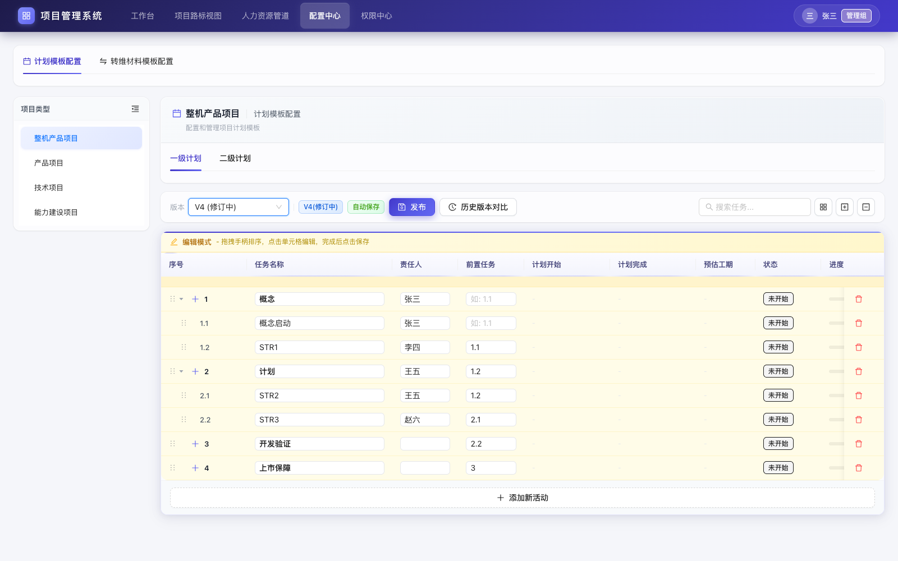

#### 3.5.5 工具栏

| 功能 | 说明 |
| --- | --- |
| 搜索 | 按任务名称/责任人模糊搜索 |
| 列设置 | 弹出 Modal 勾选可见列；表格视图中"默认路标"为默认列 |
| 视图切换 | 竖版表格 / 甘特图（不含横版表格，横版仅在项目空间可用） |
| 全部展开 | 一键展开当前模板所有父级节点（⊞ 图标） |
| 全部收起 | 一键收起当前模板所有父级节点（⊟ 图标） |

**层级展开/收起：** 序号列前为每个父级节点渲染 ▼ 箭头，点击可单独折叠/展开；叶子节点无图标。展开状态按 `项目类型 × 计划层级 × 模板类型` 隔离

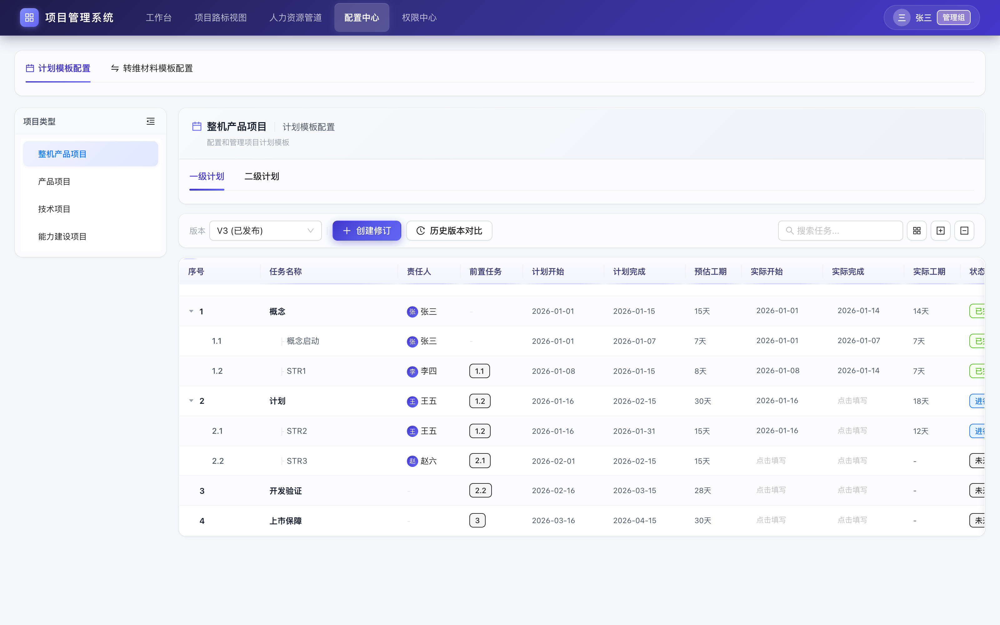

#### 3.5.6 与项目空间一级计划的差异

| 对比项 | 配置中心 | 项目空间 |
| --- | --- | --- |
| 定位 | 模板配置（全局） | 项目实例（单项目） |
| 项目类型选择 | ✅ 左侧边栏切换 | ❌ 固定为当前项目类型 |
| 横版表格视图 | ❌ 不支持 | ✅ 已发布版本可用 |
| 分享按钮 | ❌ 无 | ✅ 有 |
| 市场Tab | ❌ 无 | ✅ 整机项目有 |
| 实际日期编辑 | ❌ 模板无实际日期 | ✅ 已发布版本可编辑 |

**配置中心 — 整机产品项目模板截图：**

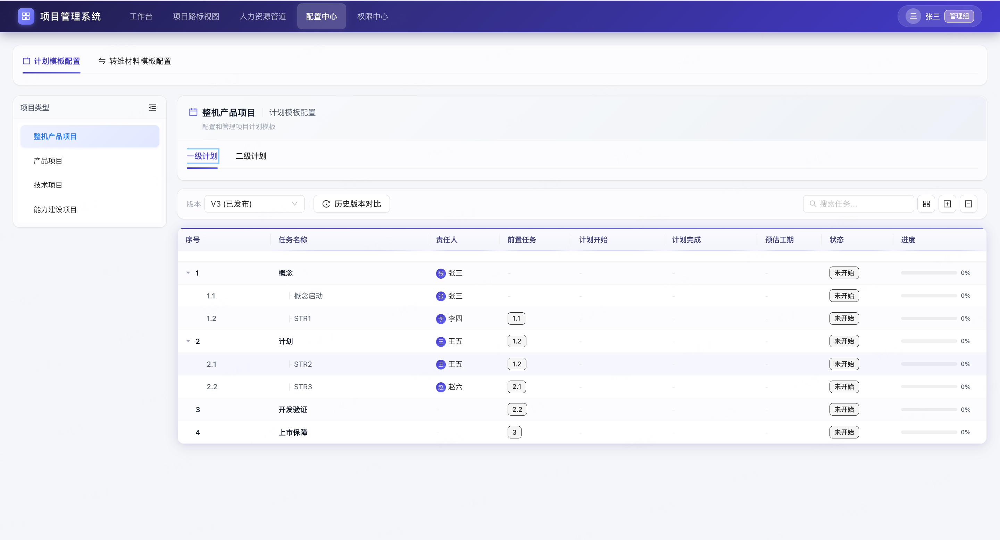

#### 3.5.7 新建项目时的模板克隆机制

**核心定位：** 配置中心的一级计划模板是项目实例的「起点蓝图」。新建项目时按项目类型自动套用对应模板。

**克隆触发：** 创建新项目并指定项目类型时（V1.0 在工作台暂未开放新建入口，本机制为后端约定），系统按下面规则取模板任务结构作为该项目的初始一级计划任务列表。

**克隆来源选取：**

| 场景 | 克隆来源 |
| --- | --- |
| 该项目类型有「已发布」版本 | 取最新已发布版本（versionNo 最大且 status='已发布'）的 publishedSnapshots[versionId] 作为模板 |
| 该项目类型仅有「修订中」版本，无任何已发布 | **不使用修订中模板**；新建项目得到空白一级计划，由项目内的「创建修订」流程自行构建 |

**克隆字段范围：**

| 分类 | 字段 |
| --- | --- |
| ✅ 克隆（结构 + 默认值） | id、order、parentId、taskName、defaultRoadmap、responsible、predecessor、estimatedDays |
| ❌ 不克隆（项目实例独立维护） | planStartDate、planEndDate、actualStartDate、actualEndDate、actualDays、status、progress |
| 说明 | 模板提供"做什么 / 顺序 / 估时 / 默认负责人"，项目实例提供"具体什么时候做 / 实际进度"。模板不带项目实例特有的执行态。 |

**默认路标与项目路标视图联动：** 模板发布后，项目路标视图按当前项目类型的最新已发布一级计划模板读取二级任务，并以任务名称生成里程碑列。二级任务的 `defaultRoadmap=true` 时，该里程碑列在路标视图默认显示；`defaultRoadmap=false` 时默认隐藏但可在列设置中选择显示。一级任务只作为分组/阶段，不参与默认路标设置，也不会生成路标列。

**模板更新对已存在项目的影响：** 模板版本发布后**不回填**已存在的项目实例。每个项目实例的一级计划版本链独立演进。模板的版本对比能力主要服务于**模板维护者评估变更**，不直接驱动项目实例迁移。

**整机产品项目的特殊处理：** 整机产品项目在创建后会按 `markets` 字段（如 OP / TR / RU）独立维护各市场的一级计划版本和任务数据；模板克隆发生一次，每个市场各拿到一份初始拷贝，之后各自独立编辑。

### 3.6 权限中心 4️⃣

权限体系分为两个层级：**系统级权限中心**（Header 导航"权限中心"）和**项目级权限配置**（项目空间侧边栏"权限配置"）。两级权限都必须区分三类能力，避免把"能进入菜单""能看见数据""能执行操作"混为一个权限。

#### 3.6.1 权限模型

| 权限类型 | 控制对象 | 典型场景 | 无权限表现 |
| --- | --- | --- | --- |
| 菜单权限 | 是否展示或允许进入某个模块入口 | Header「项目路标视图」、Header「配置中心」、项目空间「权限配置」 | 菜单隐藏或禁用；直达 URL 时显示无权限页 |
| 数据权限 | 用户能看到哪些项目、市场、记录或字段 | 工作台项目列表、路标视图项目行、项目空间详情数据 | 数据不返回或不渲染；列表为空时显示无权限/空态 |
| 操作权限 | 用户能否执行某个动作 | 编辑、发布、导出、分享、创建基线、角色管理 | 按钮禁用并通过 Tooltip 说明原因；接口二次校验拒绝 |

**权限判定顺序：**

1. 先校验菜单权限：没有模块入口权限时，不展示入口。
2. 再校验数据权限：进入模块后，只展示当前用户有权访问的数据范围。
3. 最后校验操作权限：用户看到数据不代表可以编辑、发布、导出或管理角色。

**旁路规则：** 系统级"管理组"成员拥有全部系统级权限，并旁路项目级权限校验；普通用户必须同时满足项目数据权限和对应操作权限。

#### 3.6.2 系统级权限中心

**入口：** Header 导航栏 → "权限中心"

**定位：** 管理跨项目、跨模块的全局权限，包括项目路标、配置中心和系统权限中心本身。

##### Tab 1：角色配置

| 功能 | 说明 |
| --- | --- |
| 角色列表 | 表格展示所有全局角色，显示角色名称、人员配置、操作按钮 |
| 新增角色 | 点击"新增角色"按钮，弹窗输入角色名称创建 |
| 重命名 | 点击角色行"重命名"，行内编辑角色名称 |
| 删除角色 | 点击"删除"，二次确认后删除（Popconfirm） |
| 人员配置 | 每个角色行内有多选下拉框，从用户列表中选择分配成员 |

**预置固定角色（不可删除、不可重命名）：**

| 角色 | 说明 |
| --- | --- |
| 管理组 | 拥有全部系统级权限，并旁路项目级权限校验 |
| 编辑组 | 默认拥有项目路标查看、编辑、基线权限 |
| 查看组 | 默认仅拥有项目路标查看权限 |

用户可通过"新增角色"添加自定义角色（可删除、可重命名）。

**系统级权限中心 — 角色配置截图：**

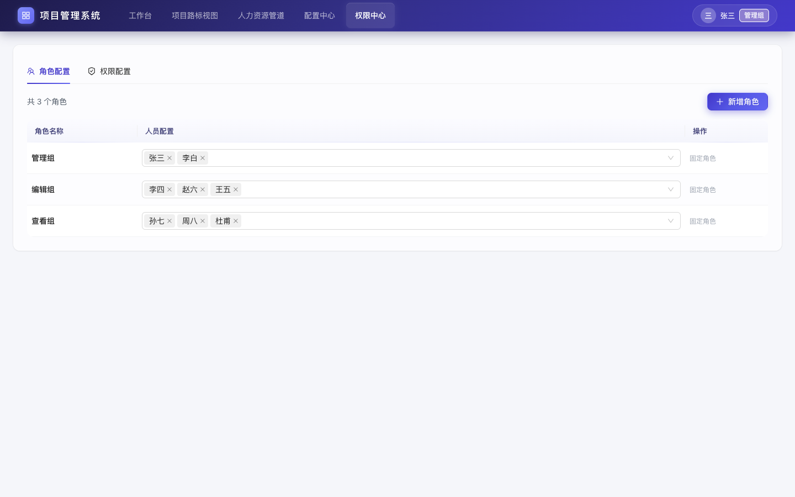

##### Tab 2：权限配置

权限配置采用"权限组 Tab + 权限表格"布局。

- 顶部以 Tab 展示权限组：管理组 / 编辑组 / 查看组 / 自定义角色。
- 切换权限组后，下方只展示当前权限组的权限表。
- 表格左侧为模块名称，右侧横向展示该模块下的权限项。
- 勾选项显示蓝色勾选图标，未勾选项显示红色叉号。

**系统级权限拆分：**

| 模块 | 菜单权限 | 数据权限 | 操作权限 |
| --- | --- | --- | --- |
| 项目路标 | `roadmap:view` 控制是否显示/进入「项目路标视图」 | 复用项目可见范围，只展示用户有权访问的项目行；管理组可看全部项目 | `roadmap:edit` 编辑路标数据；`roadmap:baseline` 创建基线/快照；`roadmap:share` 分享视图；`roadmap:export` 导出 Excel |
| 配置中心 | 当前版本由 `configCenter:planEdit` / `configCenter:planPublish` / `configCenter:transferEdit` 任一权限推导显示入口；后续可独立拆出 `configCenter:view` | 可查看对应项目类型的模板数据；没有任何配置中心权限时不展示配置中心入口 | `configCenter:planEdit` 修改计划模板；`configCenter:planPublish` 发布计划模板；`configCenter:transferEdit` 修改转维材料模板（当前为后续能力预留） |
| 权限中心 | 当前版本由 `permissionCenter:manageRoles` 推导显示入口；后续可独立拆出 `permissionCenter:view` | 可查看系统级角色、成员和权限配置 | `permissionCenter:manageRoles` 对系统级角色进行新增、修改、删除、成员添加和权限调整 |

**系统级预置权限：**

| 权限组 | 菜单权限 | 数据权限 | 操作权限 |
| --- | --- | --- | --- |
| 管理组 | 项目路标、配置中心、权限中心 | 全部项目、全部项目类型模板、全部系统角色配置 | 项目路标全部操作 + 配置中心全部操作 + 系统角色管理 |
| 编辑组 | 项目路标 | 按项目可见范围过滤项目行 | 项目路标编辑、基线 |
| 查看组 | 项目路标 | 按项目可见范围过滤项目行 | 无编辑类操作 |

**系统级权限中心 — 权限配置截图：**

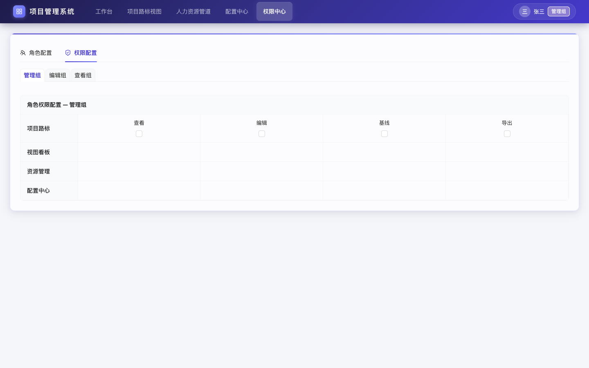

---

#### 3.6.3 项目级权限配置

**入口：** 项目空间 → 侧边栏 → "权限配置"

**定位：** 管理单个项目内的角色、成员、菜单权限、数据权限和操作权限。项目级权限只作用于当前项目，不影响其他项目。

##### Tab 1：角色人员配置

| 功能 | 说明 |
| --- | --- |
| 角色列表 | 表格展示项目内所有角色及其成员 |
| 新增角色 | 弹窗输入角色名称创建自定义角色 |
| 重命名 | 行内编辑角色名称（固定角色不可重命名） |
| 删除角色 | 二次确认后删除（固定角色不可删除） |
| 人员配置 | 多选下拉框选择项目成员 |

**项目数据权限基础规则：**

| 场景 | 数据权限规则 |
| --- | --- |
| 工作台项目列表 | 管理组可见全部项目；普通用户仅可见自己在项目成员或项目角色中的项目 |
| 项目空间直达 | 用户没有该项目数据权限时，不进入项目详情，显示无权限提示 |
| 项目空间页面数据 | 进入项目后仍按模块数据权限控制可见内容，例如基本信息、转维信息、计划与配置、计划数据 |
| 整机项目市场数据 | 当前按项目授权；用户能看项目即能看该项目全部市场。若后续需要市场级隔离，需新增市场数据权限 |
| 字段级数据 | 当前不做字段级脱敏；有对应模块数据权限即可查看该模块内配置展示字段 |

##### Tab 2：权限配置

项目级权限配置采用"角色 Tab + 权限表格"布局。

- 顶部以 Tab 展示项目角色：系统管理员、项目经理、产品经理、软件SE、开发代表、设计师、测试TPM、SQA、开发工程师、测试工程师、管理层、其他、自定义角色。
- 切换角色后，下方只展示当前角色的权限表。
- 权限表左侧展示模块，右侧展示权限项。
- 勾选项显示蓝色勾选图标，未勾选项显示红色叉号。

**项目级权限拆分：**

| 模块 | 菜单权限 | 数据权限 | 操作权限 |
| --- | --- | --- | --- |
| 项目资料 | 拥有任一项目资料数据权限时展示「基础信息」入口 | `basicInfo:查看` 查看基本信息；`basicInfo:transferView` 查看转维信息；`basicInfo:planConfigView` 查看计划与配置信息 | `basicInfo:编辑` 编辑基础信息；`basicInfo:applyTransfer` 发起转维申请 |
| 计划管理 | `plan:一级计划-查看` 或 `plan:二级计划-查看` 控制是否展示计划入口 | 查看一级计划、二级计划、版本、任务和计划总览数据 | `plan:一级计划-编辑` 编辑/创建修订/发布计划；`plan:一级计划-分享` 分享计划；`plan:导入` 导入计划；`plan:导出` 导出计划 |
| 项目权限中心 | 当前版本由 `projectPermission:manageRoles` 推导展示「权限配置」入口；后续可独立拆出 `projectPermission:view` | 查看当前项目的角色、成员和权限配置 | `projectPermission:manageRoles` 对项目角色进行新增、修改、删除、成员添加和权限调整 |

> 说明：当前实现中一级计划的"查看/编辑"权限同时兼容二级计划查看/编辑能力，避免旧权限键失效。若后续需要严格区分一级计划和二级计划，应将 `plan:一级计划-查看/编辑` 与 `plan:二级计划-查看/编辑` 拆成独立配置项。

**预置固定角色（不可删除、不可重命名）：**

| 角色 | 菜单权限 | 数据权限 | 操作权限 |
| --- | --- | --- | --- |
| 系统管理员 | 项目资料、计划管理、项目权限中心 | 当前项目全部数据 | 当前项目全部操作 |
| 项目经理 | 项目资料、计划管理、项目权限中心 | 当前项目全部数据 | 当前项目全部操作 |
| 产品经理 | 项目资料 | 基本信息、转维信息 | 无编辑操作 |
| 软件SE | 项目资料 | 基本信息、转维信息 | 无编辑操作 |
| 开发代表 | 项目资料、计划管理 | 基本信息、转维信息、计划与配置信息、计划数据 | 计划分享、计划导出 |
| 设计师 | 项目资料 | 基本信息、转维信息 | 无编辑操作 |
| 测试TPM | 项目资料、计划管理 | 基本信息、转维信息、计划与配置信息、计划数据 | 计划分享、计划导出 |
| SQA | 项目资料、计划管理 | 基本信息、转维信息、计划与配置信息、计划数据 | 计划分享、计划导出 |
| 开发工程师 | 项目资料 | 基本信息、转维信息 | 无编辑操作 |
| 测试工程师 | 项目资料 | 基本信息、转维信息 | 无编辑操作 |
| 管理层 | 项目资料、计划管理 | 基本信息、转维信息、计划与配置信息、计划数据 | 计划分享、计划导出 |
| 其他 | 项目资料 | 基本信息、转维信息 | 无编辑操作 |

**项目级权限 — 角色人员配置截图：**

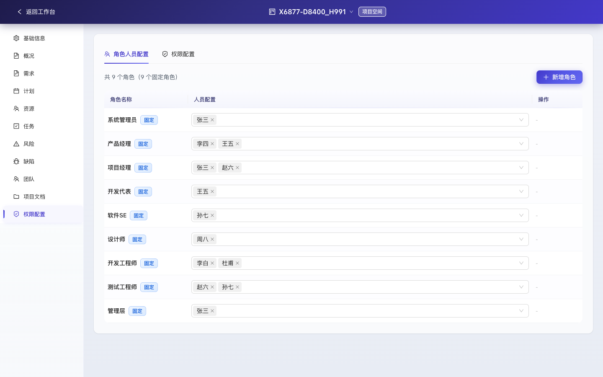

**项目级权限 — 权限配置截图：**

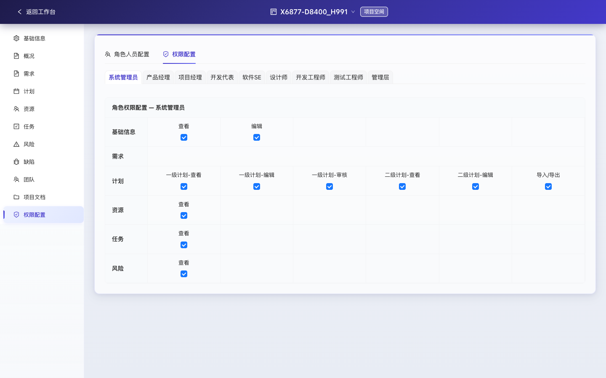

---

#### 3.6.4 两级权限体系对比

| 对比项 | 系统级权限中心 | 项目级权限配置 |
| --- | --- | --- |
| 入口 | Header "权限中心" | 项目空间侧边栏 "权限配置" |
| 管辖范围 | 全局功能：项目路标、配置中心、系统权限中心 | 单项目功能：项目资料、计划管理、项目权限中心 |
| 菜单权限 | 控制 Header 级模块入口 | 控制项目空间内侧边栏菜单入口 |
| 数据权限 | 控制跨项目/跨模板数据可见范围 | 控制当前项目内模块数据可见范围 |
| 操作权限 | 控制全局动作，例如路标导出、模板发布、系统角色管理 | 控制项目内动作，例如基础信息编辑、计划分享导出、项目角色管理 |
| 角色类型 | 3 个固定角色 + 自定义角色 | 12 个固定角色 + 自定义角色 |
| 权限配置布局 | 权限组 Tab + 当前权限组权限表 | 角色 Tab + 当前角色权限表 |
| 角色可删除 | 固定角色不可删除，自定义角色可删除 | 固定角色不可删除，自定义角色可删除 |

#### 3.6.5 UI 级权限闸点

以下列出 V1.0 需要在 UI 上强制校验的主要权限点。前端禁用或隐藏只用于体验优化，后续接入后端后仍需由接口做同样校验。

| 页面/入口 | 校验类型 | 权限点 | 无权限时表现 |
| --- | --- | --- | --- |
| Header「项目路标视图」 | 菜单权限 | `roadmap:view` | 菜单隐藏或禁用；直达时显示无权限 |
| 路标视图项目行 | 数据权限 | 用户可见项目范围 | 不渲染无权项目行 |
| 路标视图编辑动作 | 操作权限 | `roadmap:edit` | 编辑入口禁用 |
| 路标视图创建基线/快照 | 操作权限 | `roadmap:baseline` | 按钮禁用 + Tooltip |
| 路标视图分享 | 操作权限 | `roadmap:share` | 分享按钮禁用 + Tooltip |
| 路标视图导出 | 操作权限 | `roadmap:export` | 导出按钮禁用 + Tooltip |
| Header「配置中心」 | 菜单权限 | 任一配置中心操作权限，后续可拆 `configCenter:view` | 菜单隐藏或禁用 |
| 配置中心计划模板编辑 | 操作权限 | `configCenter:planEdit` | 编辑入口禁用 + Tooltip |
| 配置中心计划模板发布 | 操作权限 | `configCenter:planPublish` | 发布按钮禁用 + Tooltip |
| 配置中心转维模板编辑 | 操作权限 | `configCenter:transferEdit` | 转维模板编辑入口禁用 |
| Header「权限中心」 | 菜单/操作权限 | `permissionCenter:manageRoles` | 菜单隐藏或禁用 |
| 工作台项目列表 | 数据权限 | 项目成员/项目角色归属；管理组旁路 | 无权项目不展示 |
| 项目空间直达 | 数据权限 | 当前用户是否有该项目访问权 | 显示无权限提示，不展示项目详情 |
| 项目空间「基础信息」入口 | 菜单/数据权限 | 任一项目资料数据权限 | 入口隐藏或禁用 |
| 项目空间「基础信息」编辑按钮 | 操作权限 | `basicInfo:编辑` | 按钮禁用 + Tooltip "无基本信息编辑权限" |
| 项目空间「申请转维」按钮 | 操作权限 | `basicInfo:applyTransfer` | 按钮禁用 + Tooltip |
| 项目空间「计划」入口 | 菜单/数据权限 | `plan:一级计划-查看` 或 `plan:二级计划-查看` | 入口隐藏或禁用 |
| 一级计划「创建修订」「编辑」「发布」 | 操作权限 | `plan:一级计划-编辑` | 按钮禁用 + Tooltip "无一级计划编辑权限" |
| 计划分享 | 操作权限 | `plan:一级计划-分享` | 分享按钮禁用 + Tooltip |
| 计划导入 | 操作权限 | `plan:导入` | 导入按钮禁用 + Tooltip |
| 计划导出 | 操作权限 | `plan:导出` | 导出按钮禁用 + Tooltip |
| 项目空间「权限配置」入口 | 菜单/操作权限 | `projectPermission:manageRoles`，后续可拆 `projectPermission:view` | 入口隐藏或禁用 |
| 项目权限角色管理 | 操作权限 | `projectPermission:manageRoles` | 新增、重命名、删除、成员调整、权限调整入口禁用 |

> 🎁 **校验规则：** 普通用户按当前项目内所属角色聚合权限，只要任一角色对该权限项设为 true 即通过；系统级"管理组"成员直接放行。菜单权限只决定入口是否可见，不能替代数据权限；数据权限只决定可见范围，不能替代操作权限。

---

#### 3.6.6 用户切换器（开发辅助）

**功能描述：** 为方便开发阶段测试不同角色的权限效果，系统在主 Header（工作台/路标/配置中心等模式）和项目空间 Header 的右上角内置用户切换下拉。点击头像可快速切换当前登录用户，UI 权限闸点和项目可见范围会立即按新身份刷新。

**能力：**

- 下拉列出所有可选用户，每项标注是否属于"管理组"以及该用户可见的项目数量
- 选中后无需刷新页面，权限校验、项目列表过滤、转维申请人身份等即时生效
- 管理组用户旁路所有项目级权限

> 🎁 **注意：** 该功能为**开发 / 演示辅助工具**，正式环境上线前应下线此入口，或仅对管理员可见。

---

## 四、非功能需求

### 4.1 性能要求

| 指标 | 要求 |
| --- | --- |
| 首屏加载 | ≤ 3秒 |
| 页面切换 | ≤ 500ms |
| 甘特图渲染 | 100个任务 ≤ 1秒 |
| 搜索响应 | ≤ 200ms |

### 4.2 浏览器兼容性

| 浏览器 | 最低版本 |
| --- | --- |
| Chrome | 90+ |
| Firefox | 88+ |
| Safari | 14+ |
| Edge | 90+ |

### 4.3 设计规范

- 所有颜色使用 CSS 变量，支持主题切换扩展
- 间距遵循 4px 倍数体系（4/8/16/24/32/48px）
- 圆角遵循层级体系（6/8/12/16/20px）
- 过渡动画统一使用 cubic-bezier(0.16, 1, 0.3, 1) 缓动

---

## 五、后续版本规划

> 🎁 以下功能计划在后续版本中实现

### V1.1（计划中）

- 二级计划管理（需求开发计划、版本火车计划、自定义计划）
- 计划总览（一级+二级计划融合视图）
- 二级计划配置
- 二级计划分享

### V1.2（计划中）

- 转维模块（转维申请、录入、评审、SQA评审）
- 转维材料配置
- 人力资源管道

### V2.0（规划中）

- AI 智能分析（项目健康度诊断、延期预警）
- 自然语言查询
- 自动报告生成
- CLI 工具集成

---

> 📝 **文档结束** — 本文档将随产品迭代持续更新。如有疑问请联系产品团队。


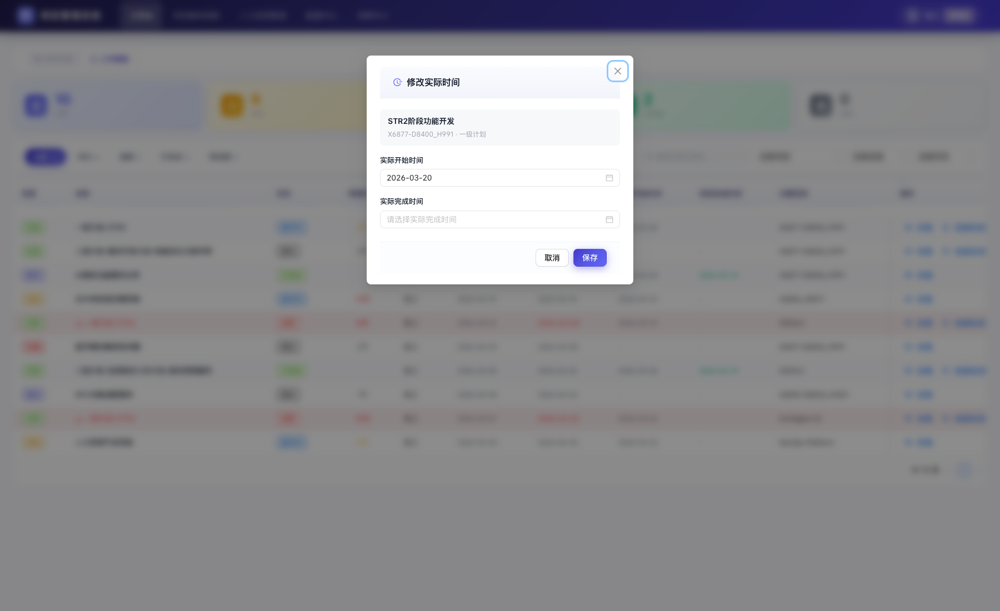
