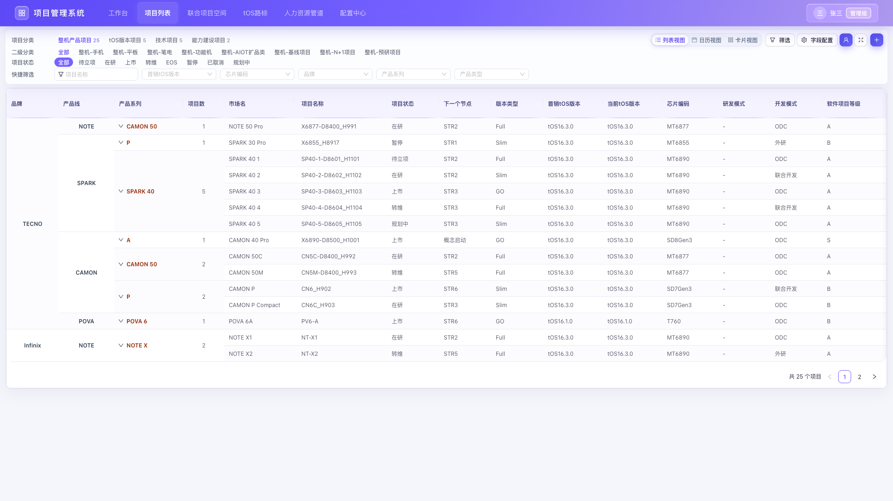
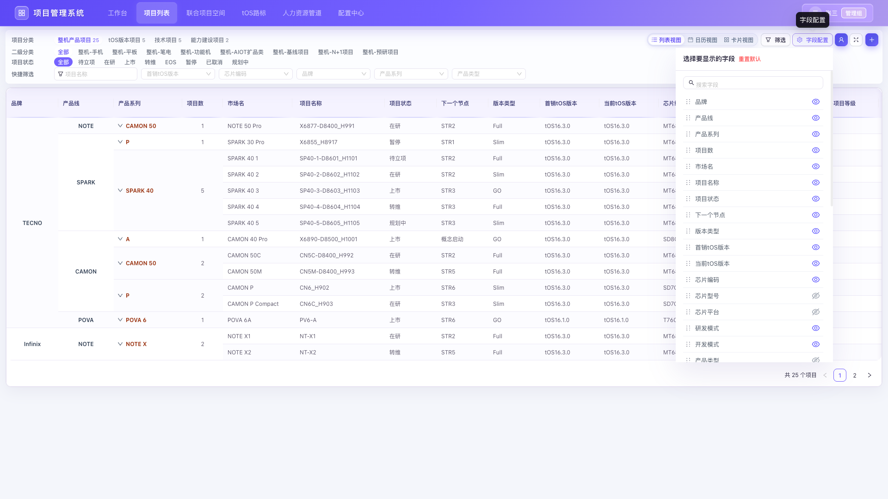
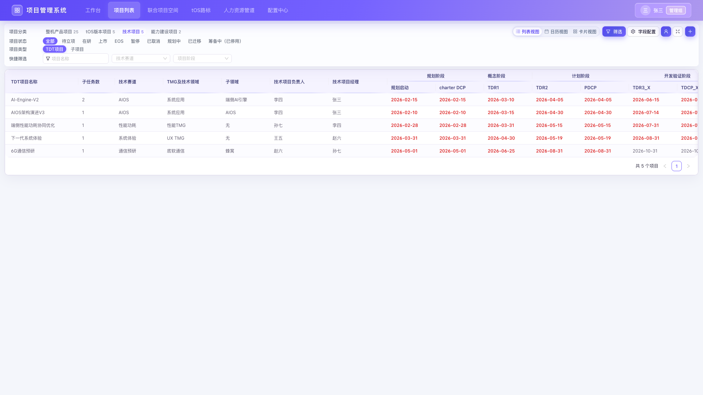
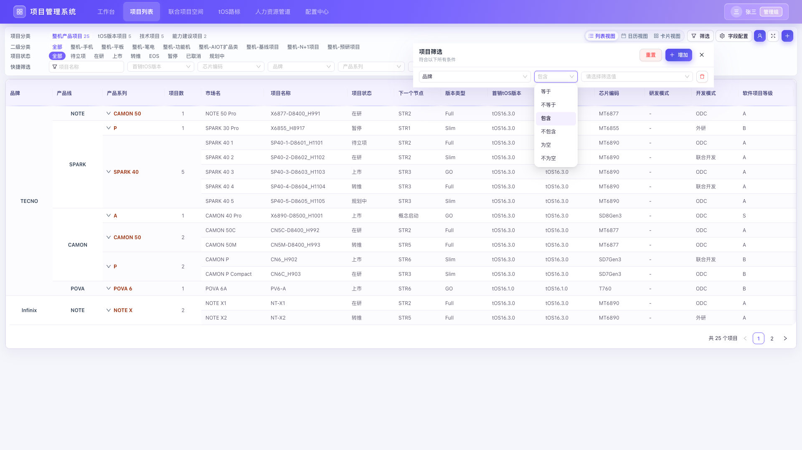
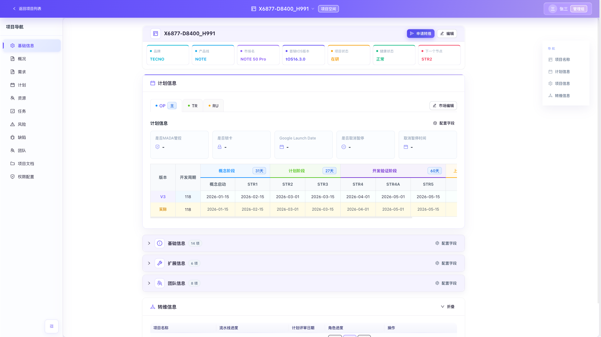
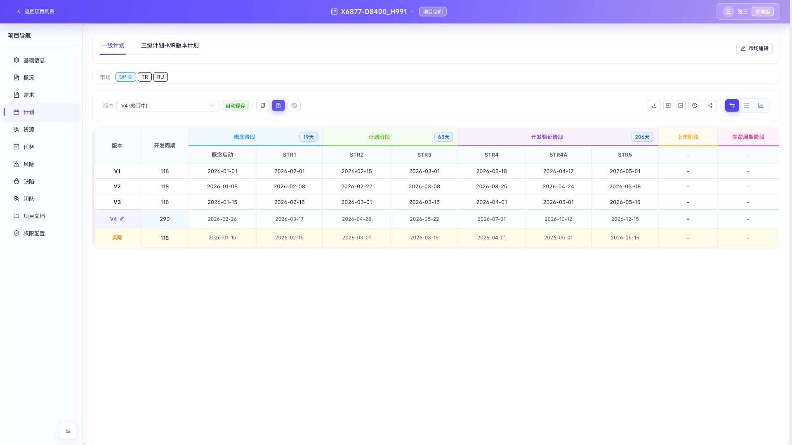
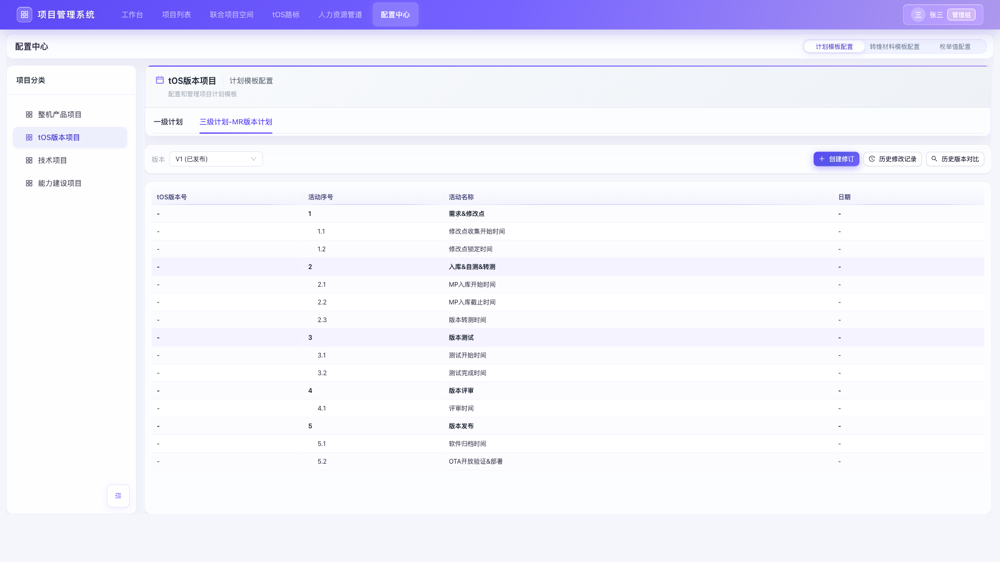
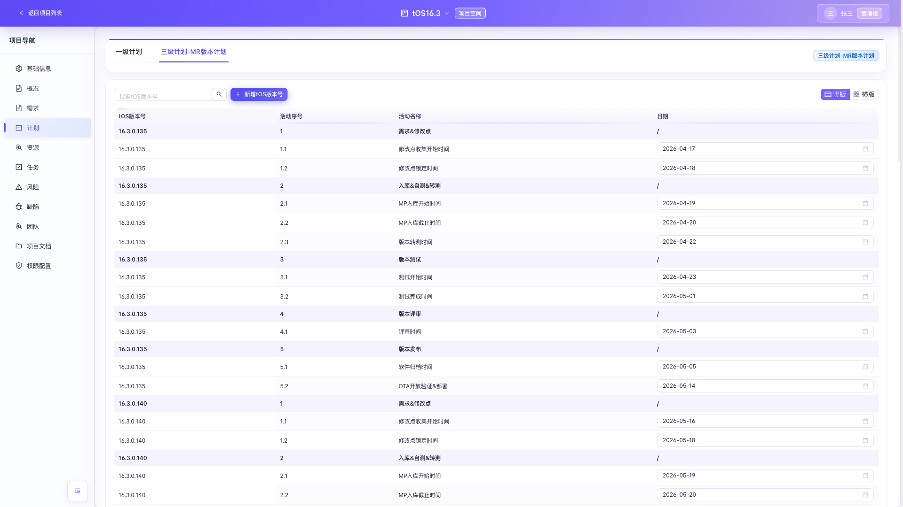
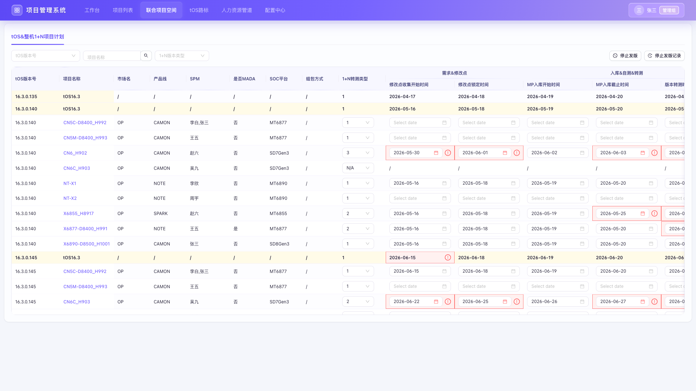
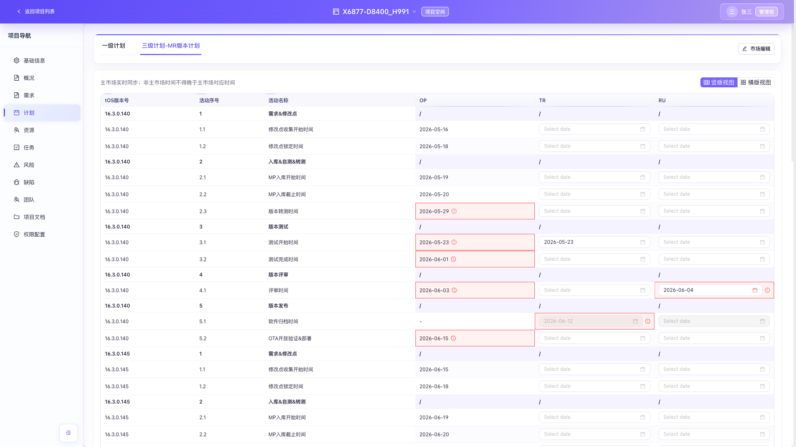

# 项目管理-一级计划+三级计划+配置中心PRD

| 文档信息 | 内容 |
| --- | --- |
| 文档版本 | V1.0 |
| 产品范围 | 项目列表、全局筛选、新建项目、项目空间基础信息、一级计划、三级计划-MR版本计划、配置中心、联合项目空间 |
| 适用项目 | 整机产品项目、tOS版本项目、技术项目（TDT/子项目） |
| 目标读者 | 产品、研发、测试、项目经理、SPM、版本项目经理、系统管理员 |
| 最后更新 | 2026-09-02 |

> 本 PRD 以当前已确认需求、现有前端原型和实机页面为基线。文中“应/必须/禁止”均为验收口径；标记为“待后端接入”的能力，当前由前端 Mock 数据演示。

## 1. 老板口径

本期将一级计划、三级计划-MR版本计划、配置中心模板、项目列表及项目字段管理整合为一套一致的项目管理闭环：模板由配置中心发布，项目空间按权限执行，联合空间聚合 tOS 与整机 1+N 计划；项目列表统一字段顺序、字段配置和筛选规则。目标是减少线下表格维护、避免版本计划口径不一致，并让异常日期可被系统主动识别。

## 2. 背景与目标

### 2.1 背景问题

1. 一级计划、三级计划和项目列表的字段、视图、筛选规则不一致。
2. tOS 与整机 MR 计划分别维护，缺少联合视图和自动回填。
3. 模板、项目版本和修订权限边界不清晰，存在误改一级阶段的风险。
4. 项目列表字段多，缺少按项目类型配置的默认顺序和快捷筛选。
5. 时间规则依赖人工核对，错误数据不能即时定位。

### 2.2 目标

- 建立“配置中心模板 → 项目空间实例 → 联合空间聚合 → 整机市场回填”的闭环。
- 一级计划保持受控修订，禁止新增一级阶段。
- 提供整机/tOS 三级计划的横竖版编辑、日期校验、权限和同步规则。
- 项目列表提供类型化字段矩阵、字段整体拖动、快捷筛选和统一高级筛选。
- 新建项目和项目空间字段按确认顺序展示，删除字段不再显示。

### 2.3 非目标

- 本期不实现真实数据库、审批流、飞书通知和服务端审计接口。
- 本期不新增第二个联合项目空间页签。
- 本期不改变已确认字段的业务含义和枚举来源。

## 3. 用户与权限模型

| 角色 | 一级计划 | tOS三级计划 | 联合1+N计划 | 整机三级计划 | 配置中心 |
| --- | --- | --- | --- | --- | --- |
| 超级管理员/管理组 | 可创建修订、编辑二级活动日期、发布/取消修订；禁止新增一级阶段 | 具备版本项目经理能力 | 可停止任意整机项目发版；可维护全部整机项目1+N类型和日期；tOS行只读 | 可查看及按业务规则维护 | 可创建修订、维护模板、发布 |
| 版本项目经理 | 按项目权限编辑 | 可新增tOS版本号并编辑全部二级活动日期 | tOS行只读 | 查看 | 无默认模板维护权 |
| 整机项目SPM | 按项目权限编辑 | 查看 | 仅可维护本人负责项目1+N类型和日期；可停止本人负责项目发版 | 主市场只读；可维护本人负责的非主市场日期 | 无 |
| 普通项目成员 | 查看；有显式编辑权限时可编辑修订版本 | 查看 | 查看 | 查看 | 查看已发布模板 |

权限通用要求：

1. 所有写操作必须同时满足“当前版本为修订中”和对应权限。
2. `管理组`为全局管理员，可绕过项目级权限，但仍受业务禁止项约束；例如管理员也不能新增一级阶段。
3. 无权限时按钮隐藏或禁用，并显示具体原因；不得只在前端隐藏后仍允许调用写操作。
4. 离开存在未保存草稿的页面时，统一触发离开确认。

## 4. 项目列表

### 4.1 页面结构与快捷筛选

筛选区自上而下固定为：项目分类、二级分类（适用时）、项目状态、技术项目类型（仅技术项目）、快捷筛选、已生效筛选条件。



| 项目类型 | 快捷筛选字段 | 控件与规则 |
| --- | --- | --- |
| 整机产品项目 | 项目名称 | 单行文本，模糊搜索，默认“包含” |
| 整机产品项目 | 首销tOS版本、芯片编码、研发模式 | 可搜索下拉多选，条件写入统一筛选集合 |
| tOS版本项目 | 项目名称 | 单行文本，模糊搜索，默认“包含” |
| 技术项目-TDT | 项目名称、技术赛道、TMG及技术领域 | 名称为文本模糊搜索；其余为可搜索下拉多选 |
| 技术项目-子项目 | 子任务名称、所属TDT项目名称 | 子任务名称为文本模糊搜索；所属TDT项目名称为可搜索下拉多选 |

交互要求：

1. 快捷筛选与高级筛选使用同一条件集合，任一入口修改后另一入口实时同步。
2. 不同筛选条件之间使用 AND；同一个“包含”下拉多选中的多个值使用 OR。
3. 切换项目类型时保留该类型自己的字段偏好，不把另一类型的条件套用到当前列表。
4. 卡片、列表和日历视图使用相同筛选结果。

### 4.2 整机产品项目列表字段

字段配置顺序与列表表头拖动双向联动。所有字段均可隐藏；“里程碑”作为一个整体移动和隐藏，内部阶段及节点顺序不拆分。



| 序号 | 字段 | 默认显示 | 序号 | 字段 | 默认显示 |
| ---: | --- | :---: | ---: | --- | :---: |
| 1 | 品牌 | 是 | 20 | 是否首发项目 | 否 |
| 2 | 产品线 | 是 | 21 | 升级策略 | 否 |
| 3 | 产品系列 | 是 | 22 | 系统类型 | 否 |
| 4 | 项目数 | 是 | 23 | Kernel版本 | 否 |
| 5 | 市场名 | 是 | 24 | 是否大版本升级 | 否 |
| 6 | 项目名称 | 是 | 25 | 机型分类 | 否 |
| 7 | 项目状态 | 是 | 26 | 禁止生产时间 | 否 |
| 8 | 下一个节点 | 是 | 27 | 保密级别 | 否 |
| 9 | 版本类型 | 是 | 28 | 安卓版本 | 否 |
| 10 | 首销tOS版本 | 是 | 29 | 目标市场 | 否 |
| 11 | 当前tOS版本 | 是 | 30 | 内存大小 | 否 |
| 12 | 芯片编码 | 是 | 31 | 起步RAM | 否 |
| 13 | 芯片型号 | 否 | 32 | 是否二段式 | 否 |
| 14 | 芯片平台 | 否 | 33 | 是否外研Mini版本 | 否 |
| 15 | 研发模式 | 是 | 34 | JIRA项目 | 否 |
| 16 | 开发模式 | 是 | 35 | SPM | 是 |
| 17 | 产品类型 | 否 | 36 | SPM部门（二级部门） | 是 |
| 18 | 软件项目等级 | 是 | 37 | 里程碑 | 是 |
| 19 | 健康状态 | 否 |  |  |  |

### 4.3 技术项目列表字段



| 序号 | TDT字段 | 默认显示 | 说明 |
| ---: | --- | :---: | --- |
| 1 | TDT项目名称 | 是 | 点击进入对应TDT项目空间 |
| 2 | 子任务数 | 是 | 统计当前有效子项目数量 |
| 3 | 技术赛道 | 是 | 来源技术项目基础信息 |
| 4 | TMG及技术领域 | 是 | 来源技术项目基础信息 |
| 5 | 子领域 | 是 | 来源技术项目基础信息 |
| 6 | 技术项目负责人 | 是 | 人员字段 |
| 7 | 技术项目经理 | 是 | 人员字段 |
| 8 | 质量代表 | 否 | 人员字段 |
| 9 | 产品代表 | 否 | 人员字段 |
| 10 | 标准化代表 | 否 | 人员字段 |
| 11 | 里程碑 | 是 | 最新已发布计划的直属二级节点，整体移动 |

子项目列表沿用已确认字段顺序；横版计划中不显示“子项目计划”冗余分组行，仅显示一级活动列。

### 4.4 tOS版本项目列表字段

字段配置只显示以下三个单元，全部默认显示且支持隐藏：

| 序号 | 字段 | 默认显示 | 说明 |
| ---: | --- | :---: | --- |
| 1 | tOS版本 | 是 | tOS版本号 |
| 2 | 里程碑 | 是 | 最新已发布一级计划模板的末级节点，整体移动和隐藏 |
| 3 | 版本项目经理 | 是 | 项目版本项目经理 |

### 4.5 表头拖动与列宽调整

1. 鼠标按住表头后进入拖动状态，原表头不即时换位。
2. 使用细蓝色插入线标记落点；松开鼠标后才提交顺序。
3. 拖动里程碑任一表头时，按“里程碑”整块移动。
4. 更新后的顺序立即同步到字段配置；字段配置拖动也同步回列表。
5. 顺序按“用户 + 项目类型 + 列表矩阵版本”存储；本期矩阵升级后使用新版本键，旧偏好不覆盖新默认顺序。
6. 每个末级表头右侧提供8px列宽拖动命中区；悬浮时显示1px蓝色边界，按住拖动时显示贯穿表格的1px蓝线。
7. 列宽拖动只改变当前末级列宽，不触发表头换位；里程碑仍作为一个整体参与顺序拖动和显隐。
8. 列宽限制为80px至600px，并按用户、项目类型和技术项目子类型持久化；刷新后恢复。

## 5. 全系统筛选统一规则



| 字段类型 | 条件 | 值控件 | 语义 |
| --- | --- | --- | --- |
| 文本 | 等于、不等于、包含、不包含、为空、不为空 | 单行文本 | 默认“包含”；为空/不为空不显示值控件 |
| 下拉枚举 | 等于、不等于 | 可搜索单选 | 精确匹配一个枚举值 |
| 下拉枚举 | 包含、不包含 | 可搜索多选 | 包含=命中任一选项；不包含=不命中全部已选项 |
| 下拉枚举 | 为空、不为空 | 无 | 判断字段是否有有效值 |
| 日期 | 等于、不等于、早于、晚于 | 日期选择器 | 日期保持原规则，默认“等于” |

通用限制：

1. 新增文本或下拉条件时默认“包含”，日期默认“等于”。
2. 切换条件时自动转换值形态：单选条件只保留一个值，多选条件保存数组，空值条件清空旧值。
3. 历史 `equalsAny` 条件自动迁移为“包含”，不得导致用户已保存条件失效。
4. 同一筛选面板不得重复添加同一字段；未选择字段或未填写必要值的条件不参与筛选。

## 6. 新建项目与项目空间字段

### 6.1 新建项目通用交互


1. 顶部固定项目名称、项目类型、项目责任人、健康状态。
2. 字段按“基础信息、扩展信息、团队信息/交付物”分组，自上而下解析和展示。
3. 必填项显示红色星号；创建时校验失败定位到第一个错误字段。
4. 项目类型切换后使用对应项目的字段顺序，不保留不适用类型的脏值。
5. 已明确删除的字段不进入新建表单，也不在项目空间显示；“默认显示/不显示”只控制字段配置初始状态，不代表删除。

### 6.2 整机产品项目字段顺序

| 分组 | 新建项目字段顺序 | 关键限制 |
| --- | --- | --- |
| 基础信息 | 首销tOS版本、项目状态、版本类型、软件项目等级、是否首发项目、产品系列、研发模式、开发模式、升级策略、系统类型、Kernel版本、是否大版本升级、机型分类、保密级别 | 首销tOS版本来自统一枚举；研发模式等只读派生字段不可手输 |
| 扩展信息 | 芯片编码、芯片型号、芯片平台、内存大小、起步RAM、是否二段式、是否外研Mini版本、整机PD、PCBA表、出货国家表、关键器件选型表、JIRA项目 | 芯片型号/平台由芯片编码带出；外研或ODC时显示二段式/Mini字段 |
| 团队信息 | SPM、SPP、CMO、软件SE、质量代表、开发代表、测试代表、其他 | SPM必填；人员字段支持人员选择 |

项目空间基础信息按以下顺序展示：

- 核心板块：品牌、产品线、市场名、首销tOS版本、项目状态、健康状态、下一个节点。
- 基础信息：当前tOS版本、版本类型、软件项目等级、是否首发项目、产品系列、研发模式、开发模式、升级策略、系统类型、Kernel版本、是否大版本升级、机型分类、禁止生产时间、保密级别、项目名、安卓版本、主板名、产品类型。
- 扩展信息：芯片编码、芯片型号、芯片平台、内存大小、起步RAM、是否二段式、是否外研Mini版本、JIRA项目、基线名称、整机PD、PCBA表、出货国家表、关键器件选型表。
- 团队信息：SPM、SPP、CMO、软件SE、质量代表、开发代表、测试代表、其他。
- 各市场下不展示计划开始、计划完成、实际开始、实际完成四个字段。

### 6.3 tOS版本项目字段顺序

| 分组 | 字段 | 说明 |
| --- | --- | --- |
| 基础信息 | tOS版本、首发项目、首发项目芯片、适用品牌、适用产品线、适用芯片平台、新品项目清单、老品项目清单 | tOS版本只读；首发项目为多选；关联字段自动汇总 |
| 团队信息 | 版本项目经理、规划代表、SE、测试代表、SQA、CMO、UX、稳定性代表、性能代表、功耗代表、各开发代表 | 前七项为主要必填角色，其余按配置显示 |

### 6.4 技术项目字段顺序

| 分组 | 字段顺序 | 说明 |
| --- | --- | --- |
| 基础信息 | 项目分类、技术赛道、子项目名称、项目状态、TMG及技术领域、子领域、项目价值、项目年份、前置项目 | 项目分类/赛道可由映射带出；前置项目显示在项目年份后 |
| 团队信息 | 技术项目负责人、技术项目经理、测试代表、质量代表、产品代表、标准化代表、其他 | 负责人、项目经理必填 |
| 核心交付物 | 项目KPI文件、概设、Charter报告、PDCP报告、TDCP报告、EDCP报告 | 文件/链接字段 |

项目空间核心板块不显示“TDT和子项目名称”。



## 7. 一级计划

### 7.1 页面与视图



1. 视图切换固定顺序：横版表格、竖版表格、甘特图。
2. 默认进入横版表格；三种视图使用同一版本和同一任务数据。
3. 一级计划去除字段配置按钮。
4. 甘特图去除“前置任务”列；保留日期、层级、进度及时间轴。
5. 整机产品项目的“市场”选择位于一级计划/三级计划页签下方；仅一级计划需要市场切换。
6. tOS版本项目的“类型”选择与整机市场交互一致，位于一级计划页签下方。

### 7.2 版本与修订

| 状态 | 可编辑 | 操作 |
| --- | :---: | --- |
| 已发布 | 否 | 查看、对比、创建修订 |
| 修订中 | 按权限 | 编辑、发布、取消修订、自动保存 |

限制：

1. 同一范围同时只允许一个修订中版本。
2. 初次进入修订中版本必须立即可编辑，不得要求切换版本后再切回。
3. 管理员及任何角色均不能“添加一级阶段”。
4. 一级阶段本身不可直接修改；允许按模板规则维护其下业务节点。
5. 同行计划开始时间不得晚于计划结束时间；子任务日期不得超出父任务日期范围。
6. 发现错误时单元格标红并显示错误提示；存在错误时禁止发布并滚动到首个错误。

### 7.3 MR与tOS业务节点快捷新增

| 项目类型/阶段 | 交互 | 自动值 | 格式限制 |
| --- | --- | --- | --- |
| 整机上市阶段、生命周期阶段 | 点击添加业务节点后直接弹出“输入MR里程碑名称”，取消第一步确认框 | 无MR节点默认MR1；已有MR1则MR2，依次递增 | 仅允许`MR1`、`MR2`…；禁止`MR01` |
| tOS上市迭代阶段、维护阶段 | 点击添加业务节点后直接弹出“输入tOS版本名称” | 无版本时末三位100；已有100则105，依次+5 | 必须符合当前tOS主版本格式及5递增规则 |

弹窗顶部必须展示填写规则，用户确认后才新增节点。

## 8. 配置中心计划模板

### 8.1 页面结构



1. 删除旧配置中心和项目空间中的历史“三级计划”入口。
2. tOS版本项目配置中心增加“三级计划-MR版本计划”页签。
3. 模板版本交互与一级计划一致：已发布、创建修订、修订中、发布、取消修订、版本对比。
4. 创建项目计划实例时，自动读取配置中心最新已发布模板；已有实例不被后续模板发布静默覆盖。

### 8.2 模板字段与限制

| 字段 | 模板已发布 | 模板修订中 | 说明 |
| --- | --- | --- | --- |
| 活动序号 | 只读 | 只读 | 系统生成层级序号 |
| 活动名称 | 只读 | 可修改 | 修订版本唯一允许修改的业务字段 |
| tOS版本 | `-` | `-` | 模板不绑定具体版本 |
| 日期 | `-` | `-` | 模板不维护项目日期 |

默认模板活动：需求&修改点（修改点收集开始、修改点锁定）、入库&自测&转测（MP入库开始、MP入库截止、版本转测）、版本测试（测试开始、测试完成）、版本评审（评审时间）、版本发布（软件归档、OTA开放验证&部署）。

## 9. tOS版本项目三级计划-MR版本计划



### 9.1 新增版本与排序

1. “新增tOS版本号”左侧提供tOS版本号模糊搜索。
2. 可选版本来源于一级计划“上市迭代阶段”和“维护阶段”的tOS版本号。
3. 已添加版本不可再次选择。
4. 新增后自动带出配置中心最新已发布三级计划模板。
5. 系统按tOS版本号语义升序排列，不能使用普通字符串排序。

### 9.2 编辑和日期规则

1. 一级任务日期固定显示`/`，不可编辑。
2. 新增后的所有二级任务日期可编辑；支持竖版与横版切换。
3. 只有版本项目经理和超级管理员可新增版本及修改日期。
4. 修改点收集开始时间不得早于该tOS版本一级计划的计划开始时间。
5. OTA开放验证&部署时间不得晚于该tOS版本一级计划的计划结束时间。
6. 提示必须带边界日期，例如：`修改点收集开始时间不能早于一级计划中的计划开始时间（2026-09-10）`。

## 10. 联合项目空间：tOS&整机1+N项目计划



### 10.1 聚合与自动插入

1. 默认聚合全部tOS版本项目的三级计划，tOS行`1+N转测类型`默认为1且全字段只读。
2. 整机项目读取tOS版本：新品读取首销tOS版本，老品读取当前tOS版本。
3. 当整机tOS版本前两位属于某tOS版本项目，且当前时间已超过其一级计划STR5日期时，计算`STR5+1天`。
4. “tOS版本号时间区间”定义为该版本在三级计划中全部二级活动日期的最早日期至最晚日期。
5. 找到`STR5+1天`所在区间后，从该tOS版本起向后的所有tOS版本插入该整机项目。
6. 自动获取市场名、产品线、SOC平台、SPM；任一市场MADA为是，则项目显示“是”，否则为“否”。
7. 系统按tOS版本号语义升序排列。

### 10.2 筛选与停止发版

顶部左侧：tOS版本号、项目名称、1+N版本类型筛选。顶部右侧：停止发版、停止发版记录。

停止发版规则：

1. 超级管理员可停止表格中任意未停止的整机项目；整机项目SPM仅可停止本人负责项目。
2. Modal选择项目和停止日期。
3. 从停止日期起，修改点收集开始时间晚于该日期的后续tOS版本不再带出该整机项目。
4. 必须记录操作人、操作时间、操作项目、停止日期；历史记录只读查看。

### 10.3 1+N与日期校验

| 字段 | 规则 | 错误提示口径 |
| --- | --- | --- |
| 1+N转测类型 | N/A、1～8；N/A时全部活动日期填`/` | 选择N/A后不可填写日期 |
| 修改点收集/锁定 | 同版本整机必须与tOS项目一致 | 日期应与tOS项目保持一致（显示tOS日期） |
| MP入库截止 | 不晚于同版本tOS项目时间 | 整机产品项目的MP入库截止时间不得晚于tOS项目时间（日期） |
| 版本转测，类型=1 | 等于tOS版本转测时间 | 版本转测时间应等于tOS版本转测时间（日期） |
| 版本转测，类型>1 | 同类型一致；晚于上一1+N类型至少7个自然日；不超过下一tOS测试开始 | 版本转测时间需晚于上一个1+N转测类型至少1周 |
| 测试开始/完成、评审、归档、OTA，类型=1 | 不早于tOS对应活动，可相等；不超过下一tOS版本对应边界 | 显示当前tOS和下一tOS边界日期 |
| 测试开始/完成、评审、归档、OTA，类型>1 | 晚于上一1+N类型至少7个自然日；不超过下一tOS版本对应活动 | 显示上一类型最早允许日期与下一版本最晚日期 |

错误展示：错误单元格红框/浅红底，单元格内显示错误图标；悬浮显示具体原因和边界日期；不再增加表格末尾“错误提示”列。

### 10.4 权限

- tOS行任何角色均不可编辑，数据实时来自tOS项目三级计划。
- 超级管理员可维护所有整机项目的1+N类型和日期。
- 整机项目SPM仅可维护本人负责项目的1+N类型和日期。
- 普通用户只读。

## 11. 整机项目三级计划-MR版本计划



1. 项目空间计划新增“三级计划-MR版本计划”页签。
2. 当联合空间某tOS版本后的该整机项目任一日期被填写时，项目空间自动新增对应tOS版本数据。
3. 支持横版和竖版切换。
4. 主市场实时同步联合空间，日期只读。
5. 非主市场由该项目SPM填写；对应活动日期不得晚于主市场日期。
6. 主市场对应活动无日期时，非主市场禁止填写。
7. 点击联合空间项目名称，直接进入该项目三级计划，便于维护非主市场。

## 12. 数据同步与状态流

```text
配置中心最新已发布模板
        ↓ 新增tOS版本号时实例化
tOS项目三级计划（二级活动日期）
        ↓ 只读聚合
联合项目空间 tOS&整机1+N项目计划
        ↓ 主市场实时同步
整机项目三级计划-MR版本计划
        ↓ SPM补充
整机非主市场日期
```

同步要求：

1. 模板发布只影响之后新建的实例，不覆盖项目已有实例。
2. tOS日期变化后联合空间动态重算所有整机错误状态。
3. 联合空间主市场变更实时回填整机项目；不得形成双向覆盖循环。
4. 停止发版记录不可删除；前端Mock阶段保存在状态层，正式环境需服务端持久化。

## 13. 异常、空态与兼容

| 场景 | 系统行为 |
| --- | --- |
| 配置中心无已发布三级模板 | 禁止新增tOS版本并提示“暂无已发布模板” |
| 一级计划无可用tOS版本 | 新增下拉为空，显示来源说明 |
| 项目没有三级计划数据 | 显示空态，不构造虚假日期 |
| 历史筛选条件使用旧操作符 | 自动迁移，不丢失有效值 |
| 日期只填写一部分 | 未触发依赖规则前不因空值报错；已填写值仍执行边界校验 |
| 无权限写入 | 控件禁用/只读并提示所需角色 |
| 模板/计划存在非法日期 | 禁止发布并定位首个错误 |

## 14. 验收标准

| ID | 验收项 | 通过标准 |
| --- | --- | --- |
| AC-01 | 项目列表快捷筛选 | 各项目类型字段、控件和位置与4.1一致，和高级筛选联动 |
| AC-02 | 整机字段矩阵 | 37个字段顺序和默认显示完全一致，无额外团队字段混入 |
| AC-03 | TDT字段矩阵 | 11个字段单元顺序一致，子任务数准确，代表字段默认隐藏 |
| AC-04 | 里程碑拖动 | 表头和字段配置均以一个“里程碑”单元整体移动 |
| AC-05 | 统一筛选 | 文本/枚举/日期操作符、单多选和默认条件全部符合第5章 |
| AC-06 | 一级计划视图 | 顺序为横、竖、甘特；一级计划无字段配置；初次进入修订中可编辑 |
| AC-07 | 一级阶段限制 | 管理员也无法添加或直接修改一级阶段 |
| AC-08 | 配置中心三级模板 | 仅活动名称可在修订中修改，tOS版本和日期均为`-` |
| AC-09 | tOS三级计划 | 搜索、新增去重、模板带出、语义排序、横竖版和日期边界均生效 |
| AC-10 | 联合空间 | 名称为“tOS&整机1+N项目计划”，tOS只读、整机权限和错误提示正确 |
| AC-11 | 停止发版 | 管理员/本项目SPM权限正确，后续版本不再带出并有不可变记录 |
| AC-12 | 整机三级回填 | 主市场实时只读同步，非主市场受主市场日期上限约束 |
| AC-13 | 新建与项目空间字段 | 字段顺序与第6章一致，删除字段不再显示，默认隐藏仍可配置显示 |
| AC-14 | 构建与浏览器 | TypeScript、生产构建通过；主要页面无阻断性控制台错误 |

## 15. 测试场景

1. 使用超级管理员、版本项目经理、整机SPM、普通成员分别验证同一联合计划单元格权限。
2. 创建包含正常、早于边界、晚于边界、跨下一个tOS版本、N/A和停止发版的Mock数据。
3. 验证同一1+N类型多个整机项目日期不一致时全部相关单元格标红。
4. 在项目列表字段配置中拖动里程碑到首列附近，再从表头拖回，确认双向同步。
5. 对枚举字段逐个切换等于/不等于/包含/不包含/为空/不为空，确认控件单多选随条件变化。
6. 对日期字段验证原有等于/不等于/早于/晚于，确认没有新增文本或枚举的空值条件。
7. 直接进入修订中一级计划，验证横版和甘特图立即可编辑，无需切换版本。
8. 从联合空间点击整机项目名称，验证落到对应项目的三级计划页签和tOS版本。

## 16. 依赖、风险与待后端接入

| 项目 | 说明 |
| --- | --- |
| 模板/计划持久化 | 当前前端Mock；正式环境需版本、快照、发布原子性接口 |
| 权限 | 前端已按角色演示；服务端必须再次鉴权 |
| 自动聚合 | 依赖一级计划STR5、三级计划二级日期和项目tOS版本字段完整 |
| 实时同步 | 正式环境建议事件或版本号防止并发覆盖 |
| 审计 | 停止发版、模板发布、日期修改需记录操作者、前后值、时间和来源 |
| 性能 | 联合空间数据量增长后需服务端分页/虚拟滚动及增量校验 |
