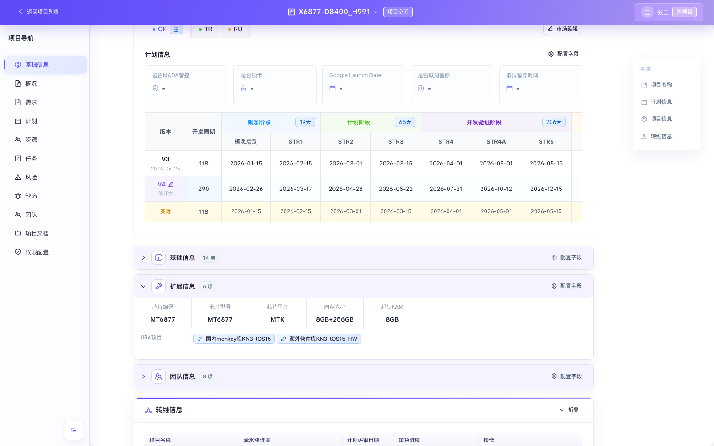

# 项目管理-一级计划+三级计划+配置中心PRD

| 文档信息 | 内容 |
| --- | --- |
| 文档版本 | V1.1 |
| 产品范围 | 项目列表、全局筛选、新建项目、项目空间基础信息、一级计划、三级计划-MR版本计划、配置中心、联合项目空间 |
| 适用项目 | 整机产品项目、tOS版本项目、技术项目（TDT/子项目） |
| 目标读者 | 产品、研发、测试、项目经理、SPM、版本项目经理、系统管理员 |
| 最后更新 | 2026-09-02 |

> 本 PRD 以当前已确认需求、现有前端原型和实机页面为基线。文中“应/必须/禁止”均为验收口径；标记为“待后端接入”的能力，当前由前端 Mock 数据演示。

## 1. 老板口径

本期将一级计划、三级计划-MR版本计划、配置中心模板、项目列表及项目字段管理整合为一套一致的项目管理闭环：模板由配置中心发布，项目空间按权限执行，联合空间聚合 tOS 与整机 1+N 计划；项目列表统一字段顺序、字段配置和筛选规则。目标是减少线下表格维护、避免版本计划口径不一致，并让异常日期可被系统主动识别。

## 2. 背景与目标

### 2.1 背景问题

1. 一级计划、三级计划和项目列表的字段、视图、筛选规则不一致。
2. tOS 与整机 MR 计划分别维护，缺少联合视图和自动回填。
3. 模板、项目版本和修订权限边界不清晰，存在误改一级阶段的风险。
4. 项目列表字段多，缺少按项目类型配置的默认顺序和快捷筛选。
5. 时间规则依赖人工核对，错误数据不能即时定位。
6. JIRA项目在展示、新建和编辑入口中的字段、布局及共库校验不一致。
7. 联合计划缺少安卓版本与芯片型号到组包方式的统一映射，且锁定后的编辑边界不明确。
8. 横版计划缺少已发布版本日期和修订快照，历史停用项目状态仍会干扰筛选。

### 2.2 目标

- 建立“配置中心模板 → 项目空间实例 → 联合空间聚合 → 整机市场回填”的闭环。
- 一级计划保持受控修订，禁止新增一级阶段。
- 提供整机/tOS 三级计划的横竖版编辑、日期校验、权限和同步规则。
- 项目列表提供类型化字段矩阵、字段整体拖动、快捷筛选和统一高级筛选。
- 新建项目和项目空间字段按确认顺序展示，删除字段不再显示。
- 统一JIRA项目六列编辑器及展示末行，保证三个编辑入口执行相同必填与共库联动。
- 配置安卓版本与组包方式映射，在联合计划按芯片编码展示并用锁定状态约束SPM编辑。
- 横版计划展示真实发布日期和只读修订快照，清理各项目类型的停用状态选项与初始Mock。

### 2.3 非目标

- 本期不实现真实数据库、审批流、飞书通知和服务端审计接口。
- 本期不新增第二个联合项目空间页签。
- 本期不改变已确认字段的业务含义和枚举来源。

## 3. 用户与权限模型

| 角色 | 一级计划 | tOS三级计划 | 联合1+N计划 | 整机三级计划 | 配置中心 |
| --- | --- | --- | --- | --- | --- |
| 超级管理员/管理组 | 可创建修订、编辑二级活动日期、发布/取消修订；禁止新增一级阶段 | 具备版本项目经理能力 | tOS行只读；始终可见首列Checkbox并可批量选择全部整机行；若不是对应tOS版本项目经理，不显示锁定/解锁按钮且不可编辑行 | 可查看及按业务规则维护 | 可创建修订、维护模板、发布 |
| 版本项目经理 | 按项目权限编辑 | 可新增tOS版本号并编辑全部二级活动日期 | tOS行只读 | 查看 | 无默认模板维护权 |
| 整机项目SPM | 按项目权限编辑 | 查看 | 仅可编辑本人负责且未锁定项目的1+N类型和日期；不可选择、锁定或解锁 | 主市场只读；可维护本人负责的非主市场日期 | 无 |
| 普通项目成员 | 查看；有显式编辑权限时可编辑修订版本 | 查看 | 查看 | 查看 | 查看已发布模板 |

权限通用要求：

1. 所有写操作必须同时满足“当前版本为修订中”和对应权限。
2. `管理组`为全局管理员，可绕过一般项目级权限，但仍受业务禁止项约束；例如管理员也不能新增一级阶段，且在联合1+N计划中非对应tOS版本项目经理的管理员不能锁定、解锁或编辑整机行。
3. 无权限时按钮隐藏或禁用，并显示具体原因；不得只在前端隐藏后仍允许调用写操作。
4. 离开存在未保存草稿的页面时，统一触发离开确认。

## 4. 项目列表

### 4.1 页面结构与快捷筛选

筛选区自上而下固定为：项目分类、二级分类（适用时）、项目状态、技术项目类型（仅技术项目）、快捷筛选、已生效筛选条件。


| 项目类型 | 快捷筛选字段 | 控件与规则 |
| --- | --- | --- |
| 整机产品项目 | 项目名称 | 单行文本，模糊搜索，默认“包含” |
| 整机产品项目 | 首销tOS版本、芯片编码、研发模式 | 可搜索下拉多选，条件写入统一筛选集合 |
| tOS版本项目 | 项目名称 | 单行文本，模糊搜索，默认“包含” |
| 技术项目-TDT | 项目名称、技术赛道、TMG及技术领域 | 名称为文本模糊搜索；其余为可搜索下拉多选 |
| 技术项目-子项目 | 子任务名称、所属TDT项目名称 | 子任务名称为文本模糊搜索；所属TDT项目名称为可搜索下拉多选 |

交互要求：

1. 快捷筛选与高级筛选使用同一条件集合，任一入口修改后另一入口实时同步。
2. 不同筛选条件之间使用 AND；同一个“包含”下拉多选中的多个值使用 OR。
3. 切换项目类型时保留该类型自己的字段偏好，不把另一类型的条件套用到当前列表。
4. 卡片、列表和日历视图使用相同筛选结果。

### 4.2 整机产品项目列表字段

字段配置顺序与列表表头拖动双向联动。所有字段均可隐藏；“里程碑”作为一个整体移动和隐藏，内部阶段及节点顺序不拆分。


| 序号 | 字段 | 默认显示 | 序号 | 字段 | 默认显示 |
| ---: | --- | :---: | ---: | --- | :---: |
| 1 | 品牌 | 是 | 20 | 是否首发项目 | 否 |
| 2 | 产品线 | 是 | 21 | 升级策略 | 否 |
| 3 | 产品系列 | 是 | 22 | 系统类型 | 否 |
| 4 | 项目数 | 是 | 23 | Kernel版本 | 否 |
| 5 | 市场名 | 是 | 24 | 是否大版本升级 | 否 |
| 6 | 项目名称 | 是 | 25 | 机型分类 | 否 |
| 7 | 项目状态 | 是 | 26 | 禁止生产时间 | 否 |
| 8 | 下一个节点 | 是 | 27 | 保密级别 | 否 |
| 9 | 版本类型 | 是 | 28 | 安卓版本 | 否 |
| 10 | 首销tOS版本 | 是 | 29 | 目标市场 | 否 |
| 11 | 当前tOS版本 | 是 | 30 | 内存大小 | 否 |
| 12 | 芯片编码 | 是 | 31 | 起步RAM | 否 |
| 13 | 芯片型号 | 否 | 32 | 是否二段式 | 否 |
| 14 | 芯片平台 | 否 | 33 | 是否外研Mini版本 | 否 |
| 15 | 研发模式 | 是 | 34 | JIRA项目 | 否 |
| 16 | 开发模式 | 是 | 35 | SPM | 是 |
| 17 | 产品类型 | 否 | 36 | SPM部门（二级部门） | 是 |
| 18 | 软件项目等级 | 是 | 37 | 里程碑 | 是 |
| 19 | 健康状态 | 否 |  |  |  |

### 4.3 技术项目列表字段


| 序号 | TDT字段 | 默认显示 | 说明 |
| ---: | --- | :---: | --- |
| 1 | TDT项目名称 | 是 | 点击进入对应TDT项目空间 |
| 2 | 子任务数 | 是 | 统计当前有效子项目数量 |
| 3 | 技术赛道 | 是 | 来源技术项目基础信息 |
| 4 | TMG及技术领域 | 是 | 来源技术项目基础信息 |
| 5 | 子领域 | 是 | 来源技术项目基础信息 |
| 6 | 技术项目负责人 | 是 | 人员字段 |
| 7 | 技术项目经理 | 是 | 人员字段 |
| 8 | 质量代表 | 否 | 人员字段 |
| 9 | 产品代表 | 否 | 人员字段 |
| 10 | 标准化代表 | 否 | 人员字段 |
| 11 | 里程碑 | 是 | 最新已发布计划的直属二级节点，整体移动 |

子项目列表沿用已确认字段顺序；横版计划中不显示“子项目计划”冗余分组行，仅显示一级活动列。

### 4.4 tOS版本项目列表字段

字段配置只显示以下三个单元，全部默认显示且支持隐藏：

| 序号 | 字段 | 默认显示 | 说明 |
| ---: | --- | :---: | --- |
| 1 | tOS版本 | 是 | tOS版本号 |
| 2 | 里程碑 | 是 | 最新已发布一级计划模板的末级节点，整体移动和隐藏 |
| 3 | 版本项目经理 | 是 | 项目版本项目经理 |

### 4.5 表头拖动与列宽调整

1. 鼠标按住表头后进入拖动状态，原表头不即时换位。
2. 使用细蓝色插入线标记落点；松开鼠标后才提交顺序。
3. 拖动里程碑任一表头时，按“里程碑”整块移动。
4. 更新后的顺序立即同步到字段配置；字段配置拖动也同步回列表。
5. 顺序按“用户 + 项目类型 + 列表矩阵版本”存储；本期矩阵升级后使用新版本键，旧偏好不覆盖新默认顺序。
6. 每个末级表头右侧提供8px列宽拖动命中区；悬浮时显示1px蓝色边界，按住拖动时显示贯穿表格的1px蓝线。
7. 列宽拖动只改变当前末级列宽，不触发表头换位；里程碑仍作为一个整体参与顺序拖动和显隐。
8. 列宽限制为80px至600px，并按用户、项目类型和技术项目子类型持久化；刷新后恢复。

## 5. 全系统筛选统一规则


| 字段类型 | 条件 | 值控件 | 语义 |
| --- | --- | --- | --- |
| 文本 | 等于、不等于、包含、不包含、为空、不为空 | 单行文本 | 默认“包含”；为空/不为空不显示值控件 |
| 下拉枚举 | 等于、不等于 | 可搜索单选 | 精确匹配一个枚举值 |
| 下拉枚举 | 包含、不包含 | 可搜索多选 | 包含=命中任一选项；不包含=不命中全部已选项 |
| 下拉枚举 | 为空、不为空 | 无 | 判断字段是否有有效值 |
| 日期 | 等于、不等于、早于、晚于 | 日期选择器 | 日期保持原规则，默认“等于” |

通用限制：

1. 新增文本或下拉条件时默认“包含”，日期默认“等于”。
2. 切换条件时自动转换值形态：单选条件只保留一个值，多选条件保存数组，空值条件清空旧值。
3. 历史 `equalsAny` 条件自动迁移为“包含”，不得导致用户已保存条件失效。
4. 同一筛选面板不得重复添加同一字段；未选择字段或未填写必要值的条件不参与筛选。

## 6. 新建项目与项目空间字段

### 6.1 新建项目通用交互


1. 顶部固定项目名称、项目类型、项目责任人、健康状态。
2. 字段按“基础信息、扩展信息、团队信息/交付物”分组，自上而下解析和展示。
3. 必填项显示红色星号；创建时校验失败定位到第一个错误字段。
4. 项目类型切换后使用对应项目的字段顺序，不保留不适用类型的脏值。
5. 已明确删除的字段不进入新建表单，也不在项目空间显示；“默认显示/不显示”只控制字段配置初始状态，不代表删除。
6. 项目状态不再从IPM或枚举首项自动带出，必须由用户下拉选择后才能创建。整机读取“项目状态-整机产品项目”（待立项、在研、上市、EOS、转维、已取消、已暂停）；tOS版本/能力建设读取“项目状态-tOS版本项目/能力建设项目”（在研、已完成）；技术项目读取“项目状态-技术项目”（进行中、已完成、暂停、已取消）。

### 6.2 整机产品项目字段顺序

| 分组 | 新建项目字段顺序 | 关键限制 |
| --- | --- | --- |
| 基础信息 | 首销tOS版本、项目状态、版本类型、软件项目等级、是否首发项目、产品系列、研发模式、开发模式、升级策略、系统类型、Kernel版本、是否大版本升级、机型分类、保密级别 | 首销tOS版本来自统一枚举；研发模式等只读派生字段不可手输 |
| 扩展信息 | 芯片编码、芯片型号、芯片平台、内存大小、起步RAM、是否二段式、是否外研Mini版本、整机PD、PCBA表、出货国家表、关键器件选型表、JIRA项目 | 芯片型号/平台由芯片编码带出；外研或ODC时显示二段式/Mini字段 |
| 团队信息 | SPM、SPP、CMO、软件SE、质量代表、开发代表、测试代表、其他 | SPM必填；人员字段支持人员选择 |

项目空间基础信息按以下顺序展示：

- 核心板块：品牌、产品线、市场名、首销tOS版本、项目状态、健康状态、下一个节点。
- 基础信息：当前tOS版本、版本类型、软件项目等级、是否首发项目、产品系列、研发模式、开发模式、升级策略、系统类型、Kernel版本、是否大版本升级、机型分类、禁止生产时间、保密级别、项目名、安卓版本、主板名、产品类型。
- 扩展信息：芯片编码、芯片型号、芯片平台、内存大小、起步RAM、是否二段式、是否外研Mini版本、基线名称、整机PD、PCBA表、出货国家表、关键器件选型表、JIRA项目。JIRA项目固定在最后并独占一整行。
- 团队信息：SPM、SPP、CMO、软件SE、质量代表、开发代表、测试代表、其他。
- 各市场下不展示计划开始、计划完成、实际开始、实际完成四个字段。

#### 6.2.1 JIRA项目展示规则



1. `JIRA项目`固定为整机产品项目“扩展信息”的最后一个字段，并独占最后一整行；字段配置只控制该字段整块显示或隐藏，不拆分控制内部属性。
2. 行内采用左右布局：左侧固定显示标题`JIRA项目`，右侧紧跟可点击的JIRA链接标签；不使用标题在上、内容在下的布局。
3. 多条链接标签从左到右排列，空间不足时自然换行，不截断其他扩展信息。
4. 无JIRA配置时右侧显示`-`；有数据时沿用既有URL生成规则并在新窗口打开。
5. 无`basicInfo:编辑`权限的用户仅可查看链接，不显示任何JIRA增删改入口。

#### 6.2.2 JIRA项目六列编辑器


整机产品项目的新建、项目编辑和项目空间基础信息编辑必须复用同一个六列编辑器、同一数据结构及同一校验逻辑，禁止各入口单独裁剪字段。

| 顺序 | 字段 | 控件 | 必填规则 | 选项与交互 |
| ---: | --- | --- | --- | --- |
| 1 | JIRA服务器 | 下拉 | 新增行后必填 | 使用既有JIRA服务器选项 |
| 2 | JIRA库名 | 可搜索下拉 | 新增行后必填 | 使用既有JIRA项目/库名选项 |
| 3 | 类型 | 下拉 | 新增行后必填 | 选项为`sw`、`monkey` |
| 4 | 共库 | Switch | 布尔值必有 | 控制Affect Projects的启用和必填状态 |
| 5 | Affect Projects | 可搜索下拉 | 共库开启时必填 | 共库关闭时仍显示，但立即清空旧值并禁用 |
| 6 | 操作 | 图标按钮 | 否 | 提供复制、删除，均有Tooltip和可访问名称 |

填写、保存与兼容规则：

1. JIRA项目整体选填；没有任何JIRA行时允许创建或保存项目。用户一旦新增一行，该行的JIRA服务器、JIRA库名、类型必须填写完整。
2. 共库开启且Affect Projects为空时阻止保存，并在对应行提示`共享JIRA项目请填写影响项目`；共库关闭时Affect Projects不参与必填校验。
3. 共库从开启切换为关闭时，立即清空该行已有Affect Projects值并保持控件禁用；再次开启后控件恢复可选，但不恢复旧值。
4. 复制只复制目标行的服务器、库名、类型、共库和Affect Projects当前值，并生成新的唯一行ID；删除只删除目标行，删除最后一行后回到无JIRA配置状态。
5. 保存前统一去除字符串首尾空格并执行行级校验；失败时阻止提交，显示具体缺失字段并将首个错误行滚动到可见区域，不保存半完整数据。
6. 历史数据缺少新字段时按`共库=false、Affect Projects=''`安全迁移；窄屏使用编辑器内部横向滚动，保持六列表头与数据行对齐。

### 6.3 tOS版本项目字段顺序

| 分组 | 字段 | 说明 |
| --- | --- | --- |
| 基础信息 | tOS版本、首发项目、首发项目芯片、适用品牌、适用产品线、适用芯片平台、新品项目清单、老品项目清单 | tOS版本只读；首发项目为多选；关联字段自动汇总 |
| 团队信息 | 版本项目经理、规划代表、SE、测试代表、SQA、CMO、UX、稳定性代表、性能代表、功耗代表、各开发代表 | 前七项为主要必填角色，其余按配置显示 |

### 6.4 技术项目字段顺序

| 分组 | 字段顺序 | 说明 |
| --- | --- | --- |
| 基础信息 | 项目分类、技术赛道、子项目名称、项目状态、TMG及技术领域、子领域、项目价值、项目年份、前置项目 | 项目分类/赛道可由映射带出；前置项目显示在项目年份后 |
| 团队信息 | 技术项目负责人、技术项目经理、测试代表、质量代表、产品代表、标准化代表、其他 | 负责人、项目经理必填 |
| 核心交付物 | 项目KPI文件、概设、Charter报告、PDCP报告、TDCP报告、EDCP报告 | 文件/链接字段 |

项目空间核心板块不显示“TDT和子项目名称”。


### 6.5 项目状态停用值清理与Mock刷新

| 项目类型 | 当前有效状态 |
| --- | --- |
| 整机产品项目 | 待立项、在研、上市、EOS、转维、已取消、已暂停 |
| tOS版本项目、能力建设项目 | 在研、已完成 |
| 技术项目 | 进行中、已完成、暂停、已取消 |

1. 项目状态下拉、项目列表快捷项和当前Mock数据只读取当前项目类型的有效状态枚举，不得出现任何停用值。
2. 全量刷新初始Mock：整机项目的`暂停`改为`已暂停`、`规划中`改为`待立项`；tOS/能力建设项目的旧状态按当前进度改为`在研`或`已完成`；技术项目的`在研、筹备中、EOS、已迁移`等旧状态按当前进度改为`进行中`或`已完成`。
3. 已持久化的历史停用状态在加载时按同一映射迁移为有效状态；迁移前的旧值不得继续显示，也不得生成快捷筛选入口或编辑选项。
4. Mock刷新不得覆盖浏览器中用户新建项目的其他字段；只迁移项目状态值。

## 7. 一级计划

### 7.1 页面与视图


1. 视图切换固定顺序：横版表格、竖版表格、甘特图。
2. 默认进入横版表格；三种视图使用同一版本和同一任务数据。
3. 一级计划去除字段配置按钮。
4. 甘特图去除“前置任务”列；保留日期、层级、进度及时间轴。
5. 整机产品项目的“市场”选择位于一级计划/三级计划页签下方；仅一级计划需要市场切换。
6. tOS版本项目的“类型”选择与整机市场交互一致，位于一级计划页签下方。

### 7.2 版本与修订

| 状态 | 可编辑 | 操作 |
| --- | :---: | --- |
| 已发布 | 否 | 查看、对比、创建修订 |
| 修订中 | 按权限 | 编辑、发布、取消修订、自动保存 |

限制：

1. 同一范围同时只允许一个修订中版本。
2. 初次进入修订中版本必须立即可编辑，不得要求切换版本后再切回。
3. 管理员及任何角色均不能“添加一级阶段”。
4. 一级阶段本身不可直接修改；允许按模板规则维护其下业务节点。
5. 同行计划开始时间不得晚于计划结束时间；子任务日期不得超出父任务日期范围。
6. 发现错误时单元格标红并显示错误提示；存在错误时禁止发布并滚动到首个错误。

### 7.3 横版版本发布日期与基础信息修订行

版本单元格统一使用两行展示：

| 版本状态 | 第一行 | 第二行 | 空值规则 |
| --- | --- | --- | --- |
| 已发布 | `Vxx` | 实际发布日期`YYYY-MM-DD` | 历史版本缺少发布日期时显示`-`，禁止用创建时间或当前日期补造 |
| 修订中 | `Vxx` | `修订中` | 不显示伪造发布日期 |

1. 所有支持一级计划横版视图的项目空间均按上述格式展示；发布修订版本时记录当前发布时间，并按上海业务日期格式化。
2. 计划模块横版视图只增加版本第二行信息，不改变版本排序、修订状态或既有编辑权限。
3. 项目空间基础信息中的一级计划横版视图始终只读，固定按`最新已发布版本 → 修订中版本（存在时） → 实际`展示。
4. 修订中版本必须紧跟最新已发布版本，并读取当前修订快照中的计划日期；即使当前用户有计划编辑权限，该行也不得在基础信息横版中编辑。
5. 没有修订中版本时维持`最新已发布版本 → 实际`两行，不显示空占位行。

### 7.4 MR与tOS业务节点快捷新增

| 项目类型/阶段 | 交互 | 自动值 | 格式限制 |
| --- | --- | --- | --- |
| 整机上市阶段、生命周期阶段 | 点击添加业务节点后直接弹出“输入MR里程碑名称”，取消第一步确认框 | 无MR节点默认MR1；已有MR1则MR2，依次递增 | 仅允许`MR1`、`MR2`…；禁止`MR01` |
| tOS上市迭代阶段、维护阶段 | 点击添加业务节点后直接弹出“输入tOS版本名称” | 无版本时末三位100；已有100则105，依次+5 | 必须符合当前tOS主版本格式及5递增规则 |

弹窗顶部必须展示填写规则，用户确认后才新增节点。

## 8. 配置中心计划模板

### 8.1 页面结构


1. 删除旧配置中心和项目空间中的历史“三级计划”入口。
2. tOS版本项目配置中心增加“三级计划-MR版本计划”页签。
3. 模板版本交互与一级计划一致：已发布、创建修订、修订中、发布、取消修订、版本对比。
4. 创建项目计划实例时，自动读取配置中心最新已发布模板；已有实例不被后续模板发布静默覆盖。

### 8.2 模板字段与限制

| 字段 | 模板已发布 | 模板修订中 | 说明 |
| --- | --- | --- | --- |
| 活动序号 | 只读 | 只读 | 系统生成层级序号 |
| 活动名称 | 只读 | 可修改 | 修订版本唯一允许修改的业务字段 |
| tOS版本 | `-` | `-` | 模板不绑定具体版本 |
| 日期 | `-` | `-` | 模板不维护项目日期 |

默认模板活动：需求&修改点（修改点收集开始、修改点锁定）、入库&自测&转测（MP入库开始、MP入库截止、版本转测）、版本测试（测试开始、测试完成）、版本评审（评审时间）、版本发布（软件归档、OTA开放验证&部署）。

### 8.3 安卓版本与组包方式映射

配置中心“枚举值配置”新增以下两个配置项，并继续复用既有本地持久化、序号、增删改、权限和错误提示机制：

| 配置项 | 类型与列 | 编辑控件/来源 | 校验与兼容 |
| --- | --- | --- | --- |
| 安卓版本 | 单值枚举；`序号 / 安卓版本 / 操作` | 安卓版本为文本输入框 | 去除首尾空格后必填，同名值不可重复；初始不预置未经确认的值 |
| 组包方式 | 映射枚举；`序号 / 安卓版本 / 芯片型号 / 组包方式 / 操作` | 安卓版本从“安卓版本”枚举可搜索单选；芯片型号从“芯片编码/芯片型号/芯片厂商”映射中的芯片型号去重后可搜索单选；组包方式为文本输入框 | 三项均必填；同一`安卓版本 + 芯片型号`组合只能保存一条映射 |

1. 删除被引用的安卓版本或芯片型号后，已保存映射继续显示历史值；新增或编辑映射时只能选择当前有效枚举值。
2. 统一枚举注册表和持久化版本升级时，必须保留用户已有全部枚举数据，仅为新增配置项补充空数组。
3. 映射保存失败时保留当前输入，并在重复组合或具体空字段处展示明确错误，不生成不完整映射。
4. 枚举维护权限沿用配置中心现有权限；无维护权限时只读。

## 9. tOS版本项目三级计划-MR版本计划


### 9.1 新增版本与排序

1. “新增tOS版本号”左侧提供tOS版本号模糊搜索。
2. 可选版本来源于一级计划“上市迭代阶段”和“维护阶段”的tOS版本号。
3. 已添加版本不可再次选择。
4. 新增后自动带出配置中心最新已发布三级计划模板。
5. 系统按tOS版本号语义升序排列，不能使用普通字符串排序。

### 9.2 编辑和日期规则

1. 一级任务日期固定显示`/`，不可编辑。
2. 新增后的所有二级任务日期可编辑；支持竖版与横版切换。
3. 只有版本项目经理和超级管理员可新增版本及修改日期。
4. 修改点收集开始时间不得早于该tOS版本一级计划的计划开始时间。
5. OTA开放验证&部署时间不得晚于该tOS版本一级计划的计划结束时间。
6. 提示必须带边界日期，例如：`修改点收集开始时间不能早于一级计划中的计划开始时间（2026-09-10）`。

## 10. 联合项目空间：tOS&整机1+N项目计划


### 10.1 聚合与自动插入

1. 默认聚合全部tOS版本项目的三级计划，tOS行`1+N转测类型`默认为1且全字段只读。
2. 整机项目读取tOS版本：新品读取首销tOS版本，老品读取当前tOS版本。
3. 当整机tOS版本前两位属于某tOS版本项目，且当前时间已超过其一级计划STR5日期时，计算`STR5+1天`。
4. “tOS版本号时间区间”定义为该版本在三级计划中全部二级活动日期的最早日期至最晚日期。
5. 找到`STR5+1天`所在区间后，从该tOS版本起向后的所有tOS版本插入该整机项目。
6. 自动获取市场名、产品线、芯片编码、芯片型号、安卓版本和SPM；任一市场MADA为是，则项目显示“是”，否则为“否”。
7. 原固定列`SOC平台`统一更名为`芯片编码`，并读取整机项目的芯片编码字段；禁止继续展示或回填SOC平台旧字段。
8. `组包方式`按该整机项目的`安卓版本 + 芯片型号`与配置中心映射精确匹配；匹配前仅去除首尾空格，不做模糊匹配。
9. 项目字段缺失、配置未就绪或无匹配映射时，组包方式显示`/`且不阻断联合计划加载；tOS基准行的芯片编码和组包方式均显示`/`。
10. 组包方式映射只用于联合计划展示，不反写整机项目基础信息；系统按tOS版本号语义升序排列。

### 10.2 筛选与EOS隐藏

顶部保留tOS版本号、项目名称、1+N版本类型筛选；删除“停止发版”和“停止发版记录”按钮、弹窗及操作入口。

EOS隐藏规则：

1. 整机项目状态首次切换为EOS时记录状态切换时间；历史EOS项目无时间时在数据迁移中补记一次。
2. tOS版本“修改点收集开始时间”晚于EOS日期时，该整机项目在对应版本及后续符合条件的版本中隐藏。
3. 修改点收集开始时间等于EOS日期时仍显示；离开EOS状态后不再触发隐藏，再次进入EOS时刷新切换时间。
4. 历史停止发版记录不再参与可见性计算。

### 10.3 Checkbox选择与锁定/解锁

1. Checkbox固定为表格第一列，tOS基准行不可选择。
2. 对应tOS版本项目经理可见Checkbox，但只能选择本人负责的tOS项目下整机行，其他行Checkbox禁用；仅为整机项目SPM或普通成员时不显示Checkbox列。
3. 超级管理员始终可见Checkbox并可选择当前筛选结果中的全部整机行；筛选变化后自动移除已不在结果集中的选择。
4. 筛选区最右侧为批量操作区。未勾选时整区隐藏；勾选后显示`已勾选 xx 个项目`。只有所选行对应的tOS版本项目经理可见`锁定 / 解锁`按钮；超级管理员若不是对应版本项目经理，即使可批量选择全部，也不显示这两个按钮。
5. 锁定和解锁允许混合选择，已处于目标状态的行幂等保持不变。点击按钮后必须二次确认，确认内容逐行列出`tOS版本号 + 项目名称`。
6. 取消确认不修改数据并保留选择；确认成功后更新锁定状态、提示处理数量并清空选择。若确认时权限或数据已变化，仅处理仍存在且当前用户仍为对应版本项目经理的行，并明确提示未处理数量。
7. 锁定唯一键为`整机项目ID + tOS项目ID + tOS版本号`，持久化记录锁定人和锁定时间；刷新后状态保留，失去对应项目/版本的孤立记录不参与展示和权限判断。
8. 已锁定整机行在项目名称左上角显示统一线性锁icon，并提供`已锁定`Tooltip和可访问文本，不得只依赖颜色；tOS基准行不显示锁icon。

### 10.4 1+N与日期校验

| 字段 | 规则 | 错误提示口径 |
| --- | --- | --- |
| 1+N转测类型 | N/A、1～8；N/A时全部活动日期填`/` | 选择N/A后不可填写日期 |
| 修改点收集/锁定 | 同版本整机必须与tOS项目一致 | 日期应与tOS项目保持一致（显示tOS日期） |
| MP入库截止 | 不晚于同版本tOS项目时间 | 整机产品项目的MP入库截止时间不得晚于tOS项目时间（日期） |
| 版本转测，类型=1 | 等于tOS版本转测时间 | 版本转测时间应等于tOS版本转测时间（日期） |
| 版本转测，类型>1 | 同类型一致；晚于上一1+N类型至少7个自然日；不超过下一tOS测试开始 | 版本转测时间需晚于上一个1+N转测类型至少1周 |
| 测试开始/完成、评审、归档、OTA，类型=1 | 不早于tOS对应活动，可相等；不超过下一tOS版本对应边界 | 显示当前tOS和下一tOS边界日期 |
| 测试开始/完成、评审、归档、OTA，类型>1 | 晚于上一1+N类型至少7个自然日；不超过下一tOS版本对应活动 | 显示上一类型最早允许日期与下一版本最晚日期 |

错误展示：错误单元格红框/浅红底，单元格内显示错误图标；悬浮显示具体原因和边界日期；不再增加表格末尾“错误提示”列。

### 10.5 锁定状态与编辑权限

| 行状态 | 整机项目SPM | 对应tOS版本项目经理 | 超级管理员但非对应经理 | 普通用户 |
| --- | --- | --- | --- | --- |
| 未锁定整机行 | 仅本人负责项目可编辑 | 可编辑 | 不可编辑 | 不可编辑 |
| 已锁定整机行 | 不可编辑 | 可编辑 | 不可编辑 | 不可编辑 |
| tOS基准行 | 不可编辑 | 不可编辑 | 不可编辑 | 不可编辑 |

1. “可编辑”同时覆盖`1+N转测类型`及后续日期字段；用户兼具SPM和对应版本项目经理时按对应版本项目经理权限判断。
2. 只有对应tOS版本项目经理可执行锁定或解锁；整机项目SPM、普通用户以及非对应经理的超级管理员均不可执行。
3. 超级管理员的“可批量选择全部”仅用于选择能力和范围检查，不构成锁定、解锁或行编辑授权，不能绕过对应版本项目经理业务边界。

## 11. 整机项目三级计划-MR版本计划


1. 项目空间计划新增“三级计划-MR版本计划”页签。
2. 当联合空间某tOS版本后的该整机项目任一日期被填写时，项目空间自动新增对应tOS版本数据。
3. 支持横版和竖版切换。
4. 主市场实时同步联合空间，日期只读。
5. 非主市场由该项目SPM填写；对应活动日期不得晚于主市场日期。
6. 主市场对应活动无日期时，非主市场禁止填写。
7. 点击联合空间项目名称，直接进入该项目三级计划，便于维护非主市场。

## 12. 数据同步与状态流

```text
配置中心最新已发布模板
        ↓ 新增tOS版本号时实例化
tOS项目三级计划（二级活动日期）
        ↓ 只读聚合
联合项目空间 tOS&整机1+N项目计划
        ↓ 主市场实时同步
整机项目三级计划-MR版本计划
        ↓ SPM补充
整机非主市场日期
```

同步要求：

1. 模板发布只影响之后新建的实例，不覆盖项目已有实例。
2. tOS日期变化后联合空间动态重算所有整机错误状态。
3. 联合空间主市场变更实时回填整机项目；不得形成双向覆盖循环。
4. EOS状态切换时间由项目数据持久化，联合计划仅消费该状态与时间，不维护独立停发记录。
5. 配置中心组包方式映射变化后，联合计划按最新有效映射重新计算展示值，但不修改整机项目基础信息。
6. 锁定记录按整机项目、tOS项目和tOS版本唯一键持久化；筛选、刷新和视图切换不得丢失锁定状态。
7. 一级计划发布动作写入实际发布时间；基础信息横版只读取发布快照和修订快照，不反向修改计划数据。

## 13. 异常、空态与兼容

| 场景 | 系统行为 |
| --- | --- |
| 配置中心无已发布三级模板 | 禁止新增tOS版本并提示“暂无已发布模板” |
| 一级计划无可用tOS版本 | 新增下拉为空，显示来源说明 |
| 项目没有三级计划数据 | 显示空态，不构造虚假日期 |
| 历史筛选条件使用旧操作符 | 自动迁移，不丢失有效值 |
| 日期只填写一部分 | 未触发依赖规则前不因空值报错；已填写值仍执行边界校验 |
| 无权限写入 | 控件禁用/只读并提示所需角色 |
| 模板/计划存在非法日期 | 禁止发布并定位首个错误 |
| JIRA项目没有任何行 | 允许保存，展示态显示`-` |
| JIRA行缺少服务器、库名、类型或共库行缺少Affect Projects | 阻止保存，在对应行展示明确错误并定位首个错误行 |
| 组包方式未匹配或配置未就绪 | 联合计划显示`/`，页面继续加载且不反写项目字段 |
| 组包方式引用的枚举值已删除 | 已保存映射展示历史值；新建/编辑只能选择当前有效值 |
| 锁定确认期间权限或行数据变化 | 只处理仍存在且当前用户仍有权限的行，提示成功数和未处理数 |
| 历史已发布版本缺少发布时间 | `Vxx`第二行显示`-`，不得补造日期 |
| 历史项目包含停用状态 | 加载时映射为当前有效状态；页面、筛选和编辑下拉均不再显示旧值 |

## 14. 验收标准

| ID | 验收项 | 通过标准 |
| --- | --- | --- |
| AC-01 | 项目列表快捷筛选 | 各项目类型字段、控件和位置与4.1一致，和高级筛选联动 |
| AC-02 | 整机字段矩阵 | 37个字段顺序和默认显示完全一致，无额外团队字段混入 |
| AC-03 | TDT字段矩阵 | 11个字段单元顺序一致，子任务数准确，代表字段默认隐藏 |
| AC-04 | 里程碑拖动 | 表头和字段配置均以一个“里程碑”单元整体移动 |
| AC-05 | 统一筛选 | 文本/枚举/日期操作符、单多选和默认条件全部符合第5章 |
| AC-06 | 一级计划视图 | 顺序为横、竖、甘特；一级计划无字段配置；初次进入修订中可编辑 |
| AC-07 | 一级阶段限制 | 管理员也无法添加或直接修改一级阶段 |
| AC-08 | 配置中心三级模板 | 仅活动名称可在修订中修改，tOS版本和日期均为`-` |
| AC-09 | tOS三级计划 | 搜索、新增去重、模板带出、语义排序、横竖版和日期边界均生效 |
| AC-10 | 联合空间 | 名称为“tOS&整机1+N项目计划”，tOS只读、整机权限和错误提示正确 |
| AC-11 | EOS隐藏 | 停发按钮与记录入口消失；EOS日期当天仍显示，晚于EOS日期的版本不再带出 |
| AC-12 | 整机三级回填 | 主市场实时只读同步，非主市场受主市场日期上限约束 |
| AC-13 | 新建与项目空间字段 | 字段顺序与第6章一致，删除字段不再显示，默认隐藏仍可配置显示 |
| AC-14 | 构建与浏览器 | TypeScript、生产构建通过；主要页面无阻断性控制台错误 |
| AC-15 | JIRA展示态 | JIRA项目为扩展信息最后一整行，标题左、内容右，多标签可换行，无数据为`-`且已有标签可点击 |
| AC-16 | JIRA统一编辑器 | 新建、项目编辑、项目空间编辑均严格复用六列顺序；整体可为空，新增行后执行基础必填和共库条件必填；复制/删除与迁移规则生效 |
| AC-17 | 安卓版本与组包方式配置 | 安卓版本为单值枚举；组包方式使用安卓版本枚举、芯片型号枚举和组包方式文本，空值及重复组合均阻止保存 |
| AC-18 | 联合计划字段映射 | 不再显示SOC平台；芯片编码读取项目字段，组包方式按安卓版本+芯片型号精确映射，无结果及tOS基准行显示`/` |
| AC-19 | 联合计划选择与锁定权限 | Checkbox位于首列；未勾选不显示操作区；勾选后数量准确；仅对应版本项目经理可锁定/解锁，非对应经理的超级管理员可全选但无按钮；锁定行权限符合10.5 |
| AC-20 | 锁定确认与标识 | 二次确认逐行包含tOS版本号和项目名；确认后锁icon、持久化和清空选择生效，取消保留选择 |
| AC-21 | 版本发布日期与修订行 | 已发布`Vxx`下显示`YYYY-MM-DD`或`-`，修订版显示“修订中”；基础信息横版按最新发布、修订中、实际排序且全部只读 |
| AC-22 | 项目状态清理 | 各项目类型只出现当前有效状态；初始Mock无停用值；历史旧值加载时迁移且不再显示 |

## 15. 测试场景

1. 在项目空间展开“扩展信息”，验证JIRA项目始终为最后一整行、标题左内容右；分别使用0、1、多条长链接验证`-`、点击、新窗口和自然换行。
2. 分别打开整机项目的新建、项目编辑和项目空间编辑，逐列核对`JIRA服务器 / JIRA库名 / 类型 / 共库 / Affect Projects / 操作`，并验证窄屏内部横向滚动不破坏列对齐。
3. JIRA行测试覆盖：零行直接保存；缺少服务器/库名/类型阻止保存；共库开启但Affect Projects为空阻止保存；关闭共库后旧值立即清空且控件禁用；再次开启不恢复旧值。
4. 复制一条完整JIRA行，确认字段值一致而行ID唯一；分别删除中间行和最后一行，确认只删除目标且最后回到无配置状态；用缺少新字段的历史记录验证安全迁移。
5. 在配置中心新增、编辑、删除安卓版本；在组包方式中验证安卓版本和芯片型号可搜索下拉、组包方式文本输入、三字段必填、重复`安卓版本 + 芯片型号`组合阻止保存及历史引用值保留。
6. 给整机项目准备精确匹配、首尾带空格、缺少安卓版本、缺少芯片型号和无映射五组数据，验证联合计划分别显示映射值或`/`；确认旧列名SOC平台不存在、芯片编码正确，tOS基准行两列均为`/`。
7. 不勾选联合计划整机行时确认筛选区右侧无批量操作区；对应版本项目经理勾选后确认`已勾选 xx 个项目 / 锁定 / 解锁`顺序和数量准确，筛选变化自动剔除结果集外选择。
8. 使用对应tOS版本项目经理执行锁定和解锁，确认弹窗逐行列出`tOS版本号 + 项目名称`；取消后选择保留，确认后选择清空，重复对目标状态操作保持幂等，刷新后锁定状态仍在。
9. 使用整机SPM验证未锁定本人项目可编辑、锁定后不可编辑；使用对应版本项目经理验证锁定前后均可编辑；使用非对应经理的超级管理员验证Checkbox首列和全选可用，但锁定/解锁按钮不显示且行不可编辑；普通成员全程只读。
10. 验证已锁定项目名称左上角出现带`已锁定`提示和可访问文本的锁icon，tOS基准行无锁icon。
11. 在一级计划横版分别检查已发布、历史无发布时间和修订中版本：第二行依次为`YYYY-MM-DD`、`-`和`修订中`；发布新版本后日期使用上海业务日期。
12. 在项目空间基础信息横版制造“有修订中”和“无修订中”两种数据，分别验证`最新已发布 → 修订中 → 实际`和`最新已发布 → 实际`，并确认修订行对所有角色只读。
13. 按整机、tOS、能力建设、技术项目逐类检查项目状态快捷项和编辑下拉；确认初始Mock均为有效状态，历史旧状态加载时映射为有效状态且任何页面不再显示停用值。
14. 创建包含正常、早于边界、晚于边界、跨下一个tOS版本、N/A和EOS隐藏的Mock数据；验证同一1+N类型日期不一致时相关单元格均标红且提示包含边界日期。
15. 使用超级管理员、版本项目经理、整机SPM、普通成员回归tOS行只读、项目跳转、主市场同步、非主市场上限、横竖版切换及EOS隐藏，并确认页面不存在旧发版停止操作入口或记录入口。
16. 在项目列表字段配置中双向拖动里程碑；逐个切换文本/枚举/日期操作符；直接进入修订中一级计划验证横版和甘特图立即可编辑，确保既有能力无回归。

## 16. 依赖、风险与待后端接入

| 项目 | 说明 |
| --- | --- |
| 模板/计划持久化 | 当前前端Mock；正式环境需版本、快照、发布原子性接口 |
| 权限 | 前端已按角色演示；服务端必须再次鉴权 |
| 自动聚合 | 依赖一级计划STR5、三级计划二级日期和项目tOS版本字段完整 |
| 实时同步 | 正式环境建议事件或版本号防止并发覆盖 |
| 审计 | EOS状态切换、模板发布、日期修改、锁定/解锁及映射变更需记录操作者、前后值、时间和来源 |
| 性能 | 联合空间数据量增长后需服务端分页/虚拟滚动及增量校验 |
