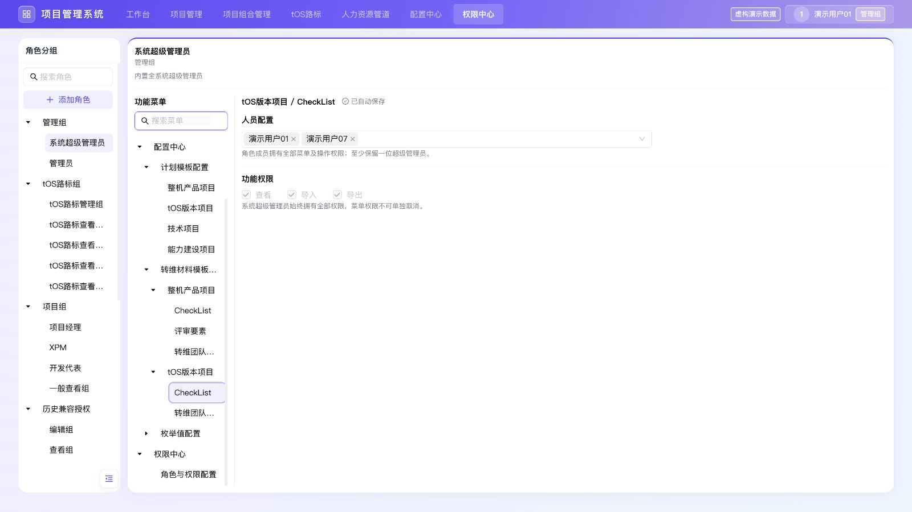

# 权限中心菜单层级与覆盖核对

## 本次调整

- 功能菜单按真实层级展示：`配置中心 → 计划模板配置 → 项目类型`、`配置中心 → 转维材料模板配置 → 项目类型 → CheckList / 评审要素 / 转维团队配置`、`配置中心 → 枚举值配置 → 枚举项`。分组节点可展开收起，叶子节点配置权限。
- 搜索匹配完整路径，保留匹配项的祖先节点并自动展开；清空后恢复用户原有展开状态。
- 人力资源管道相关18个菜单暂不展示（管道内15项、配置中心下3项）。仅调整配置界面展示范围，保留底层菜单注册和已存授权，业务主入口仍可正常进入。
- 保持菜单ID和策略结构不变，已有人员、操作、条件及列配置无需迁移。

## 覆盖结论

对照 `src/app/page.tsx` 主入口、项目管理/组合管理容器、`ProjectRoadmapModule.tsx`、`CONFIG_MENU_GROUPS` 和 `ConfigNavigation.tsx` 的真实导航，当前展示41个权限菜单，未发现遗漏或重复；配置中心34个叶子逐项与业务菜单ID及层级匹配。人力资源管道按本次要求排除，项目空间权限保持原有独立范围。

| 业务范围 | 菜单数 | 已配置权限与现有操作关系 |
| --- | ---: | --- |
| 工作台 | 1 | 查看；待办跳转及项目操作继续检查项目空间权限 |
| 项目管理 | 2 | 项目视图：查看、导出；项目配置：查看、导出、新增、编辑、删除 |
| 项目组合管理 | 1 | 查看、编辑；锁定/解锁等保留原项目角色约束 |
| tOS路标 | 2 | 表单视图与版本演进图分别配置查看、导出、编辑、新增、删除；版本维护归入编辑，历史查看归入查看 |
| 计划模板配置 | 4 | 查看、编辑、发布；创建/取消修订及修订内增删改归入编辑，覆盖当前模板子视图 |
| 转维材料模板配置 | 5 | 3个材料模板支持查看、导入、导出（含下载导入模板）；2个团队配置支持查看、编辑（含角色增删） |
| 枚举值配置 | 25 | 查看、编辑；新增、修改、删除、启停统一使用编辑权限 |
| 权限中心 | 1 | 查看、管理；角色及策略维护使用管理权限 |

核查的是当前可达菜单与现有操作的权限映射，并非将每个按钮拆为独立权限；例如枚举新增/删除仍属于“编辑”。本次未改变这些既有粒度。

## 验证

- 目录核对：通过现有 TypeScript 模块加载器读取业务导航与实际菜单树，比对全部41个叶子ID、唯一性、34个配置菜单完整路径、18个人力相关菜单排除范围；无遗漏、无重复。
- 搜索核对：`转维 tOS CheckList` 仅匹配对应tOS模板；搜索计划模板分类保留4个项目类型；搜索人力资源管道无结果。
- `npx tsc --noEmit --pretty false`：通过。
- `npm run build`、权限中心基础/全局集成回归、侧栏及紧凑布局检查：通过。
- 浏览器：多层转维菜单选中tOS CheckList后，右侧准确显示查看/导入/导出；计划模板显示查看/编辑/发布。配置中心父节点整体收起、搜索自动展开祖先及清空后恢复收起状态均通过。
- 浏览器：390px窄屏深层叶子可选择，页面无横向溢出；人力菜单搜索无结果，原人力资源管道主入口正常进入。最终error日志为空，本地3017已更新。
- 项目行列/导出/撤权、路标隔离以及损坏存储专项回归均通过（`verify-permission-center-projects.mjs`、`verify-permission-center-roadmap.mjs`、`verify-permission-center-corruption.mjs`）。

