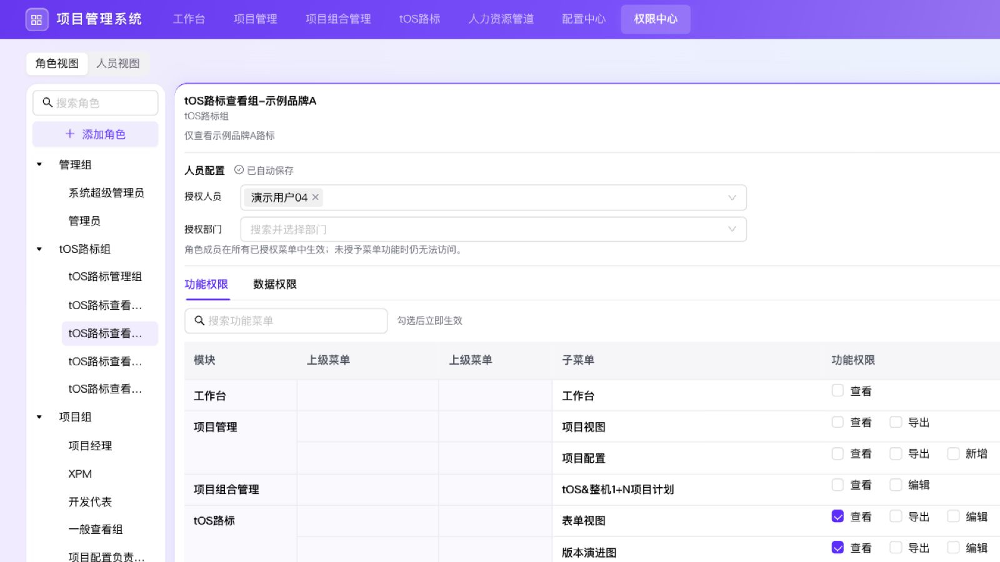

# 权限中心角色与人员视图验收

分支：`codex/feature-permission-config`，本轮基线：`eae0fbf8d5229d5887a356bf8a652b1fae30b84f`。本记录取代此前按菜单配置人员的行为描述。

## 交付范围

- 人员配置提升至角色，分为授权人员与授权部门，即时生效；所有菜单共用该角色的成员范围。
- 角色视图与人员视图沿用项目管理的分段切换样式。人员视图展示直接与部门来源、只读有效功能权限、按来源角色保留完整的数据条件与列范围。
- 功能权限表格覆盖41个当前范围菜单，完整父路径合并单元格；数据权限只显示项目视图、项目配置、路标表单与版本演进图。18个人力相关菜单继续不显示。
- 保留窄侧栏、收起与搜索，移除“角色分组”标题；筛选与列标签沿用原有样式。
- v2角色级授权使用明确的演示角色初始化。有效旧mock权限一次刷新，不显示历史兼容角色；v2配置、项目空间权限和业务数据保留，损坏缓存拒绝授权。

## 自动化及构建

- `npm run verify:full-regression`：**173/173通过，0失败**。原始日志目录：`/var/folders/t_/bxx0q9dj4fd_ylb6wjl6tt5h0000gn/T/pms-full-regression-iNpBij`。汇总归档于 `assets/2026-09-28-role-views-regression.json`。
- 随审查新增 `verify-permission-center-assignee-ui.mjs` 与 `verify-permission-center-inactive-conditions.mjs`，均通过；本轮共覆盖175个独立回归脚本。
- 最终修复后额外复验基础、全局、损坏缓存、角色成员、非活动筛选、赋权重试及表格合并七项专项，最终输出归档于 `assets/2026-09-28-role-views-focused.txt`。
- 最终 `npx tsc --noEmit --pretty false`、`npm run build`、`git diff --check` 通过。构建仅提示已有 Browserslist 数据过期。

## 浏览器实际操作

使用生产构建 `http://localhost:3017/`。所有状态通过页面操作，不注入store或localStorage。

| 场景 | 实际结果 |
|---|---|
| 首次加载刷新旧mock | 旧验收角色和历史兼容组不再出现，管理组/tOS路标组/项目组为明确新初始化角色。 |
| 创建角色 | 分组及名称必填、超管同名被拒；新增验收分组，创建“角色级授权验收”后自动选中。 |
| 角色人员及部门 | 一次设置09与示例测试组；表单勾选导出自动带上查看，演进图单独勾选查看；人员视图09同时拥有两个菜单权限，功能全为只读。 |
| 角色数据范围 | 表单配置品牌等于示例品牌A、可见列tOS版本/品牌/项目名；演进图保持自身全部数据策略，两菜单互不覆盖。必要列不可取消。 |
| 多角色与部门来源 | 人员05显示直接品牌B角色及通过测试部门获得的验收角色；分别展示品牌B全部列、品牌A三列，不将规则误合并。 |
| 草稿保护 | 不完整条件时人员/部门和列设置禁用；切换人员视图弹离开确认，取消保留草稿。 |
| 非活动草稿回读 | 不完整筛选切回全部数据，刷新后角色、成员、两个菜单功能授权仍在；没有误丢策略或锁定管理员。 |
| 真实用户数据及导出 | 切换09，表单仅有品牌A与三列，演进图使用自身授权且导出禁用；真实导出 `tOS路标_20260928_1630.xlsx` 并回读，13行/3列、全部品牌A。 |
| 实时撤权 | 移除09一次，人员视图两个路标菜单全部取消授权，部门保留；再移除部门，05仅剩原品牌B角色，验收角色来源及品牌A范围消失。 |
| 超级管理员保护 | 功能全选且禁用、部门不可选。移除07后尝试移除01，明确拒绝并保留01；已恢复01/07。 |
| 清理与保存 | 本轮验收角色已删除；新增的空验收分组不显示于侧栏。测试未修改源码默认业务数据。 |
| 响应式 | 1600×900与390×843均无页面横向溢出；手机角色搜索选择后自动收起，数据菜单与配置可滚动访问；人员视图搜索/选择可用。测试后恢复默认视口。 |
| 既有业务 | DEMO017项目空间基础信息、项目内角色配置正常；项目管理和配置中心可进入。两个旧模板路由回到统一配置中心。 |
| 运行错误 | 最终验收页、用户预览及旧路由error日志为空。 |

## 审查闭环

领域审查、UI审查及最终集成审查均通过，未关闭发现0项。已修复：

1. 不完整的活动旧筛选条件触发默认权限刷新：严格校验活动条件、必要列及持久化结构，损坏数据继续拒绝授权。
2. 赋权保存失败后的重试绕过筛选草稿保护：保存闭包读取最新草稿状态，按钮同时禁用；真实组件回调回归通过。
3. 切回全部数据后未使用的筛选草稿导致刷新丢权限：保存/回读统一清空非活动条件，v1升级与v2重新加载均验证，活动无效条件仍拒绝授权。

审查原始记录见 [最终审查](2026-09-28-permission-center-role-views-review.md)。

## 预览

当前仍是仓库既有的浏览器本地mock系统，不包含服务端鉴权或数据库授权。最终生产预览保持在3017，本轮仅提交和推送feature分支，不合并或部署。

## 后续人员配置交互调整

以 `2026-09-28-permission-center-assignee-modal.md` 为准：人员配置移入第一项 tab；人员、部门分别通过配置弹窗确认后生效，主界面只读展示。功能权限、数据权限继续按原有方式配置。新增 Mock 用户 SnoopyYu 为系统超级管理员。
