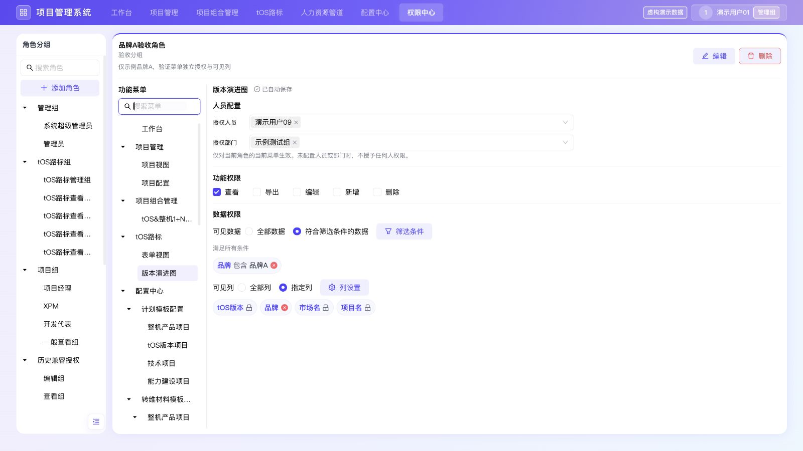

# 权限中心验证记录

> 以下保留前序菜单级授权验收历史；当前角色级授权、角色/人员视图与最终测试见 [角色与人员视图验收](2026-09-28-permission-center-role-views.md)。

分支：`codex/feature-permission-config`。基线：`f531a96071465253038ef8499bdc3cabfe865d3c`。

## 实现范围

Header 在配置中心后增加权限中心。角色组、角色与菜单分别组织为树；角色栏 180px、菜单栏 176px，独立收起至 40px。角色支持选择或新增分组、名称去重、可选范围说明，创建后自动选中。人员/部门按角色和菜单配置，功能、数据条件和可见列即时生效并持久化，无保存按钮。标签复用现有 `pms-active-filter-chip` 样式。

全局权限接入项目视图/配置、组合计划、路标表单/演进、配置中心、HR 与外层导航；项目空间保持独立权限边界。超级管理员使用固定角色标识，最后一名有效成员不可移除。兼容旧授权时保留原有范围，新角色默认无授权。

## 自动化与构建

- `npx tsc --noEmit --pretty false`：最终生产代码通过。
- `npm run build`：最终生产代码通过，8 个静态页面生成成功。仅有仓库既有 Browserslist 数据过期提示，不影响构建。
- `git diff --check`：通过。
- 第一轮完整回归：162/170。8 个失败均为旧导航、旧权限 hook 或原始数据路径的源码断言，与新需求/授权投影冲突；已补充新合同及行为断言，保留有效业务验证。
- 第二轮完整回归（包含新增损坏缓存验证）：169/171；剩余两项分别是路标脚本对旧分类函数的源码断言，以及资源旧格式测试误用新版存储版本号。未修改产品代码，修正测试合同后完整复跑这两个脚本，分别142项断言、9项行为检查全部通过。171个脚本均完成验证，未解决失败为0。完整运行日志目录 `/var/folders/t_/bxx0q9dj4fd_ylb6wjl6tt5h0000gn/T/pms-full-regression-Isuarm`，汇总见 `assets/2026-09-28-permission-center-regression.json`。
- 专项覆盖角色与部门、完整策略并集、导出独立授权、数值/日期条件、坏缓存、旧模型迁移、存储失败、管理权限保护、项目行列隔离、历史快照、分类统计与路标双视图。

## 生产模式浏览器验收

服务为隔离工作树生产构建 `http://localhost:3017`；使用虚构演示数据。通过界面操作验证，不通过注入 Zustand 或 localStorage 构造结果。

| 场景 | 实际结果 |
| --- | --- |
| 新建角色校验 | 分组与名称必填；“系统超级管理员”重复名称被拒绝；下拉新增“验收分组”，创建“品牌A验收角色”后自动选中。 |
| 菜单独立授权 | 表单视图设置人员09与查看/导出后，版本演进图仍为空授权；演进图可另外搜索、选择人员和示例测试部门。 |
| 未完成筛选 | 首次不完整条件时，人员、功能及列控件禁用并提示继续使用上次策略；完成条件后解除限制，不生成全部数据授权。 |
| 即时保存与刷新 | 所有更改无需保存按钮；刷新后角色、人员、条件与可见列回读一致。测试身份按既有机制刷新恢复默认管理员，重新切换09验证限制。 |
| 表单数据与可见列 | 09仅看到示例品牌A，共13条；只有tOS版本、品牌、项目名三列。业务字段配置候选只有获准列。 |
| 导出 | 浏览器实际生成 `tOS路标_20260928_1219.xlsx`；使用项目现有xlsx库回读：13行，3列，品牌全部为示例品牌A，表头准确。IAB下载事件监听未返回，文件已在Downloads生成，最终按文件内容验证。 |
| 即时撤权 | 取消导出后09的导出按钮立即禁用；取消查看后tOS路标入口消失。恢复查看后再次可用。 |
| 演进图 | 独立授权“品牌包含品牌A”；仅对应13个项目，隐藏类型时进入通用分组，芯片/日期值不可见，未授予导出时按钮禁用。 |
| 项目名称授权 | 从09的旧公开项目视图授权移除该用户，再配置仅名称授权：列表和卡片只显示名称；未授权分类计数为0，通过“全部项目”查看41个正式项目；日历不泄露日期。 |
| 项目空间边界 | 09点击无项目角色的tOS17.1卡片，提示无项目空间角色并拒绝进入。外层权限不会授予项目空间权限。 |
| 超管保护 | 超管功能全部选中且不可取消；移除07后尝试移除最后的01，显示“必须保留至少一位超级管理员”且01仍存在；测试后恢复07。 |
| 侧栏与布局 | 双展开、仅角色收起、仅菜单收起、双收起均保持当前选择；实际CSS尺寸1440×900、1280×800、1920×1080无页面横向溢出；390×843窄屏提供选择角色/菜单入口。 |
| 原业务回归 | 管理员成功创建“权限验收预算项目”，项目列表出现且总数58→59；模拟通知明确未发送真实消息。DEMO017项目计划、资源总览和项目内权限配置正常；组合MR计划、计划模板、转维CheckList及HR阶段投入比页面可用。写入边界、转维完整流程及资源细项由自动化覆盖。 |
| 旧独立路由 | level1-template、level2-template访问均回到统一配置中心，正常显示模板。 |
| 运行错误 | 最终生产验收标签及旧路由浏览器error日志为空。 |

## 审查及已修复问题

1. 数值/日期条件采用类型化比较；数值列表运算符与空值行为补充用例。
2. 不完整筛选可能被人员/功能更改绕过：同步草稿保护覆盖控件、提交及重试路径，浏览器与独立复审通过。
3. 合法JSON但结构损坏的权限缓存恢复默认超管：现存损坏状态拒绝授权并保留错误，旧project-only仅版本0–2可迁移；当前/未来/缺失版本一律拒绝。真实读取/写回回归通过。
4. 项目历史跨角色字段泄露：当前项目、每个before/after快照分别检查完整字段权限，通知使用同一过滤结果。
5. 分类统计泄露隐藏字段：逐行校验type/secondaryCategory，隐藏分类项目保留通用入口。
6. 删除不存在功能的目录开关，补齐实际导入/导出独立权限；项目配置负责人迁移不附加旧有范围外的删除/导出。

最终审查记录：`2026-09-28-permission-center-final-review.md`。两项P1、一项P2已关闭，无剩余阻止交付的重要问题。

## 证据与边界

当前仓库为前端模拟系统，本次授权保存在本地浏览器，未接入后端鉴权或数据库；跨角色与坏数据处理在此前提下验证。本轮未推送、合并或部署。测试创建的数据只存在于本地验收站点，未写入源代码默认数据。

## 同日布局调整：功能菜单并入配置模块

按后续反馈，将功能菜单和右侧权限编辑器放入同一张卡片，角色信息作为共同标题。移除菜单独立侧栏及收起入口；176px 内嵌菜单保留搜索和树节点展开收起，左侧角色栏仍可独立收起。本节取代上文“双侧栏独立收起”的布局描述，权限策略逻辑未改动。

- 类型检查、生产构建、`verify-permission-center.mjs`、`verify-collapsible-sidebars.mjs`、`verify-compact-ui-density.mjs` 均通过；本次未重复执行完整171脚本回归。
- 生产模式浏览器确认仅一个独立侧栏，功能菜单和权限编辑器位于同一卡片，菜单侧栏收起/展开及“选择菜单”按钮数量为0。
- 菜单搜索、清空搜索、表单/版本演进视图切换、角色栏展开收起后保留当前菜单均通过；既有角色的人员、筛选标签和可见列正常回读。
- 桌面1600px及窄屏390px无页面横向溢出；窄屏菜单置于卡片内上方，搜索、选择菜单及角色选择均可用，选择角色后自动关闭角色栏。已恢复浏览器默认视口。
- 已重启 `http://localhost:3017` 提供最新生产构建，验收页面最终error日志为空。

## 同日范围与菜单层级调整

人力资源管道相关菜单暂不在权限中心展示，配置中心改为多层树。41个当前范围内菜单核对结果、18个人力相关菜单排除范围及本次验证见 [菜单层级与覆盖核对](2026-09-28-permission-center-menu-audit.md)。

## 同日人员配置拆分

“人员配置”改为上下两行独立多选框：“授权人员”仅选择人员，“授权部门”仅选择部门，均支持搜索、即时生效。两项分别更新原策略的users/departments字段，并保留另一项的最新值；已有数据无需迁移。系统超级管理员沿用原成员模型，授权人员可配置，授权部门禁用并明确提示按人员授权，至少一位超级管理员的保护继续保留。

- 类型检查、生产构建、权限中心基础/全局集成回归及紧凑布局检查均通过。
- 浏览器使用既有“品牌A验收角色”：表单视图添加人员08及示例测试组，再移除08，刷新后人员09与示例测试组分别正确回读；移除部门后人员09仍保留。测试结束已将表单视图恢复为原有人员09、无部门。
- 切到未授权的项目配置时两个选择框均为空，切回原版本演进图时原人员09/示例测试组正确回读；功能、数据条件与可见列保持不变。
- 添加一条未完成筛选时两个选择框同时禁用；删除该未完成条件后同时恢复可用，原有效条件保留。
- 390px窄屏两行均可完整显示，无横向溢出。最终浏览器error日志为空，本地3017已更新。

