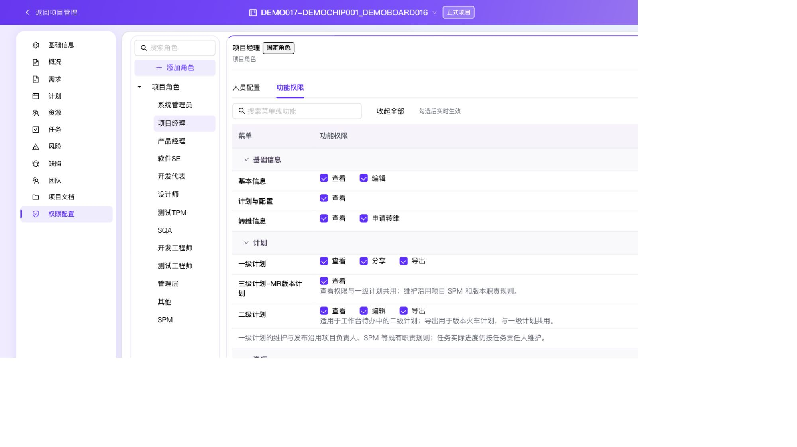

# 项目空间权限角色视图验收

分支：`codex/feature-permission-config`。基线：`1d8fd174d0f8822faef9e3570cbfc58ee074905f`。

## 实现范围

项目空间使用与全局权限中心一致的分组角色树、角色资料弹窗、人员/部门选择弹窗，右侧只有人员配置与功能权限。角色树可搜索和收起；新增角色自动选中；确认后的成员显示为只读标签。

功能权限改为菜单/操作两列，支持分组展开、收起全部和搜索；不再按固定操作列填充空单元格。目录按项目类型和属性显示实际可用的基础信息、计划、资源、角色管理操作。技术计划单独提供导入；MR 计划查看与一级计划共用权限。工作台待办中的二级版本火车计划导出接入共享计划导出权限，按钮和执行时都校验。

授权部门的直属成员继承项目角色，参与项目列表/入口、功能按钮和角色管理校验，撤销实时生效。部门不回写项目团队成员，也不取代一级计划/MR 的既有负责人职责。技术项目固定角色及整机 SPM 的直接人员继续从团队/基础信息同步；tOS 固定角色直接人员保留双向同步。固定角色不能改名/删除。自定义角色重命名原子保留授权，特殊对象键名称被拒绝，存储失败保留原配置。

## 自动验证

- `npm run verify:full-regression`：179/179 通过。完整清单见 `assets/2026-09-28-project-permission-regression.json`。
- 新增 `verify-project-plan-export-permission.mjs`：通过，覆盖未授权、执行前撤权和授权下载；连同上述共 180 个独立检查。
- 最终变更后复跑部门继承、功能目录、组件交互、导出权限、tOS 类型集成、列设置、浮动面板检查，全部通过。
- `npx tsc --noEmit`、`npm run build`：通过。构建仅有已有 caniuse-lite 数据过旧提示。
- 新增行为回归覆盖部门继承/撤销、跨项目隔离、管理权限、角色重名/固定角色约束、自身角色改名、持久化失败、保留同步字段、弹窗取消/确认/失败重试、来源只读、两列表操作、折叠搜索。
- 原有角色同步、权限矩阵的旧 UI 结构断言已更新为新界面对应合同；原权限默认值和同步行为断言保留。

## 浏览器验收（localhost:3017）

- 整机 DEMO017 项目：角色树与两个页签正确；SPM 直接成员不可编辑，授权部门可配置。
- 新建临时分组/角色并填写范围后自动选中；重复“项目经理”被拦截；成功改名后授权保留。
- 部门选择后取消，原授权不变；确认后只读展示。给临时角色授权示例底软组和基础信息编辑/角色管理后，普通演示用户08获得编辑及管理权限；该用户给自身角色改名成功；移除部门后编辑器立即卸载、权限导航禁用、基础信息编辑禁用。
- 人员弹窗搜索演示用户06，确认后显示只读标签。刷新后角色名、人员与勾选权限仍在；本次临时角色已删除，未修改原有角色授权。
- 编辑角色草稿取消时触发离开确认，确认离开后丢弃未生效输入。
- 技术项目 DEMO-TECH-V2：固定团队成员只读、技术计划包含导入/导出、无转维和二级计划配置。
- tOS16.1：19 个固定角色、人员配置按钮正常可用；团队双向同步由域回归验证。
- 预算项目“示例整机-粉丝试用单国”：仅资源与权限配置，未出现基础信息/计划。
- 窄屏在收起外层项目导航后，角色抽屉可打开、选择后关闭；权限行改为菜单名在上、操作在下，避免菜单文字竖排。原项目 Header 的窄屏布局不在本次修改范围。
- 功能分组收起后搜索 MR 会展开匹配项；清空搜索可恢复全部。
- 最终页面运行时 warning/error 日志为空；预览保持启动。

独立域审查和最终代码复核通过。两轮发现的特殊名称持久化问题与版本火车计划导出遗漏均已修复并复核。

## 边界

这是现有浏览器本地持久化的 mock 权限实现，没有接入服务端身份认证/授权。能力建设和路标项目的目录范围经自动化测试覆盖；手工页面验证覆盖上述整机、技术、tOS 和预算项目。截图为原生浏览器截图，右下白边为当前截图接口的缩放表现。

