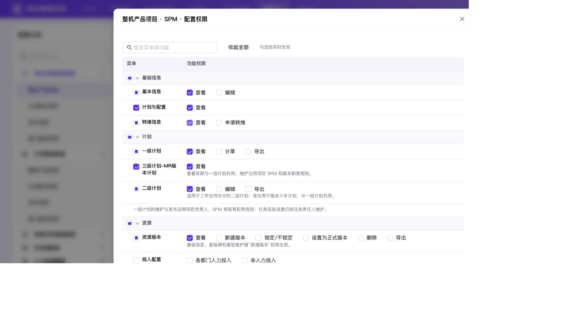
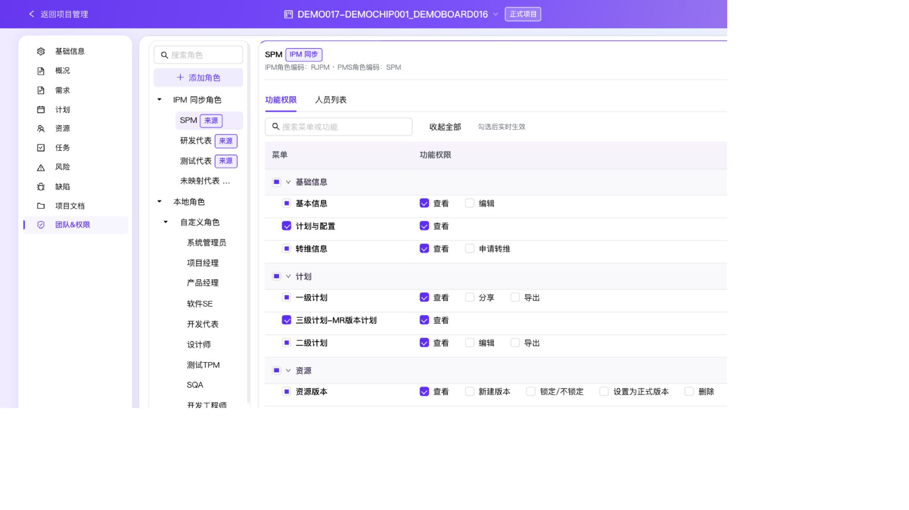

# 权限批量复选框验收

范围：权限中心、项目空间团队&权限、角色权限配置模板的父级和叶子菜单。移除“全选 / 取消权限”文字按钮，改为标题前复选框；提示统一为“全选 / 取消全选”。

复选框按完整目录计算未选、半选、全选状态；搜索不改变批量范围；折叠仍由独立标题按钮处理，授权沿用原有原子操作及禁用规则。

验证通过：

- `verify-project-permission-ui.mjs`：项目/模板与全局父子节点的三态、全选、取消全选、搜索完整子树、只读、超级管理员及草稿禁用。
- `verify-permission-center-matrix.mjs`、`verify-team-role-template-ui.mjs`。
- `npx tsc --noEmit`、`npm run build`、`git diff --check`。
- localhost:3017 真实模板 Modal：搜索基本信息后父级全选包含隐藏转维子项；取消叶子后父级半选；父级从全选取消后所有子项清空；折叠独立工作。临时勾选已恢复默认只读模板。
- 浏览器 error/warn 为 0；独立代码审查无阻断问题。

本次仅复测受影响的交互与构建。完整权限实现的上一轮 188 项回归与修复复测记录见 `2026-09-29-role-templates-team-permissions.md`。

## 项目空间层级显示修复

项目空间通用表格的单元格 padding 覆盖了功能表格的层级缩进。通过单元格局部的现有样式变量修正覆盖，并仅在项目空间将菜单列宽调整为 260px；移除功能表格内的行级和分组说明文案。

- 最新构建后的 localhost:3017 验证：父级复选框 x=478.71，子级 x=496.72，子级向右缩进 18px；菜单列宽 260px，长菜单名称完整显示，说明文案不再显示。
- `verify-project-permission-ui.mjs`、`verify-team-role-template-ui.mjs`、`npm run build`、构建后 `npx tsc --noEmit`、`git diff --check` 通过。
- 浏览器 error/warn 为 0，独立代码审查通过；本次不改变权限计算或存储逻辑。

## 小屏阅读与菜单分隔优化

菜单文字统一为 600 字重，项目菜单列宽为 280px；功能列左留白从 12px 调整为 28px，表头与选项对齐，菜单列增加浅色竖线。父级保留浅底色，子行增加轻量悬停/焦点反馈。窄屏纵向布局中，功能选项统一缩进并以竖线区分菜单。

- 浏览器实际 CSS 视口 1280、1025、700px 检查通过：权限表及页面无横向溢出，功能选项自然换行；700px 采用纵向布局，菜单字重及缩进分隔正确。
- 权限中心、项目空间、模板 Modal 均验证共用样式；项目搜索正常，全局超级管理员功能复选框保持只读，浏览器 error/warn 为 0。
- `verify-project-permission-ui.mjs`、`verify-team-role-template-ui.mjs`、`verify-permission-center-matrix.mjs`、`npm run build`、构建后 `npx tsc --noEmit` 通过。
