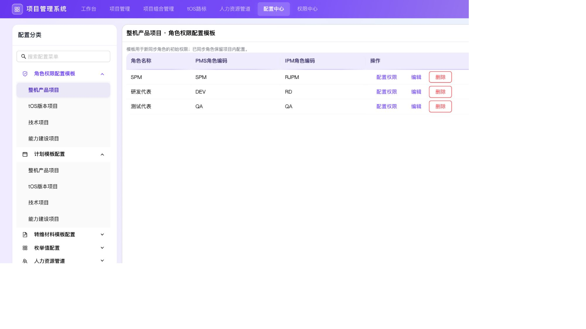
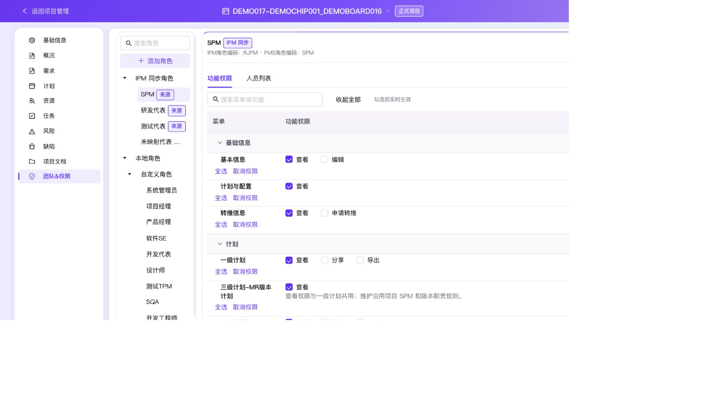

# 角色权限模板与团队权限验收

日期：2026-09-29。分支：`codex/feature-permission-config`。最终产品修复：`bfcbfe2`；测试适配：`910bce2`。预览：<http://localhost:3017/>。

## 交付与审查

- 配置中心四类独立角色模板，字段顺序为：角色名称 / PMS角色编码 / IPM角色编码 / 操作。角色名称即 PMS 名称。
- 项目空间统一为“团队&权限”：来源角色受保护，人员只读；本地角色保留分组与人员、部门配置。功能权限优先展示。
- 全局、项目和模板复用分层功能权限，父子节点支持全选、取消权限，搜索不缩小父级操作范围。
- 同步成员仅按来源角色权限并集生效，本地角色及部门不能提升权限；系统超级管理员保持全权。
- 两轮审查发现并修复：技术项目导入的本地职责回退、资源操作旧上下文，以及来源变化重渲染后旧人员弹窗继续提交。最后一项已用实际 TSX handler 复现并验证修复后零写入；最终复审批准。

## 自动化验证

- 全量执行 `npm run verify:full-regression`：188 项，首次 186 通过。两项失败为旧源码契约断言和 React mock 缺失 `useRef`，不是放宽权限断言；适配后分别复测退出码 0，最终 188 项全部有通过证据。
- 两项复测：`verify-project-role-sync.mjs`、`verify-resource-activation-interactions.mjs`。前者保留 canonical 职责同步及越权拒绝、增加本地人员分配不改 canonical 职责断言；后者保留四类资源 × 三类预算真实 store/callback 的选择、激活、刷新、恢复、编辑保护和锁定断言。
- `verify-team-role-template-ui.mjs` 在最终修复后另行通过，包含来源变化后重渲染、旧人员/部门及角色表单拒绝提交。
- 最终树 `npx tsc --noEmit`、`npm run build`、`git diff --check` 通过。构建仅提示现有 Browserslist 数据过期。
- 未重复运行第二轮完整套件；保留首次原始结果与针对性复测证据，避免掩盖失败历史。详见 [回归结果](assets/2026-09-29-role-permissions-regression.json)、[构建日志](assets/2026-09-29-role-permissions-build.txt)、[角色复测](assets/2026-09-29-role-sync-retest.txt)、[资源复测](assets/2026-09-29-resource-activation-retest.txt)。

## 浏览器流程

通过真实界面操作，未注入应用 store 或修改浏览器存储：

| 流程 | 观察结果 |
| --- | --- |
| 模板映射 | 三字段必填、重复编码拒绝、空白裁剪；创建临时模板只出现在整机类型，其余三类型独立 |
| 权限弹窗 | 标题含项目类型与角色；基础信息父级全选覆盖全部子项，取消基本信息仅清该叶；关闭重开保持即时保存结果 |
| 一次性初始化 | 将整机 SPM 模板“基本信息：编辑”设为选中，返回已有项目来源 SPM 仍未选中；模板变更保持且已恢复 |
| 统一入口 | 原独立团队入口移除；功能权限默认首 tab，切角色回到功能权限；来源角色无编辑/删除按钮 |
| 来源成员 | SPM 一人、测试角色空状态；tOS 测试角色显示 E011 和 E110；工号搜索 E110 得到唯一成员，七列信息齐全 |
| 本地人员/部门 | 同名本地 SPM 与来源 SPM 可独立选择；人员、部门分别弹窗，确认后页面只读标签显示，配置后可再次打开修改 |
| 实际授权链路 | 给演示用户10额外本地 SPM（已有基本信息编辑权）；来源授权编辑后真实编辑按钮可用且打开表单；来源撤权后按钮禁用，额外本地权限不能提升 |
| 只读访问 | 演示用户10可查看团队权限，权限勾选控件不可编辑 |
| 全局批量授权 | 临时无人员角色搜索“项目视图”后全选父级“项目管理”；清搜索后项目配置所有子权限也选中；取消项目视图保留项目配置 |
| 超级管理员 | 默认管理员可管理全部配置；内置角色人员列表包含 SnoopyYu |
| 最终构建 | 重启 3017、刷新后复查分组层级和模板标题，撤销状态保持；桌面 1600 和窄屏 700 CSS px 无外层横向溢出，侧栏可收起 |
| 运行时 | 最终浏览器采集 error / warn 均为 0 |

所有临时 QA 角色、模板均已删除；演示用户10的临时本地分配、部门分配、来源和模板编辑权限均已恢复。项目基本信息编辑表单只验证打开并取消，未提交对现有项目字段的修改。

权限存储异常、来源重绑/移除、跨项目上下文、同名不同工号授权、多来源角色并集、部门继承、技术/资源/导入导出/转维操作约束主要由真实 store 与 handler 脚本验证；不把这些声明为逐项浏览器手工覆盖。当前仍是 Mock 数据，未接入真实 IPM 或验证生产后端授权。

浏览器数值证据：[结果](assets/2026-09-29-role-permissions-browser.json)。截图采集后端会在右/下补白，DOM 宽度测量无外层溢出。

